# Data Engineering - Fundamentals
- [Youtube Link: Data Engineer Bootcamp](https://www.youtube.com/watch?v=ol9_NnC9-cc)

## Stages - DE Lifecycle

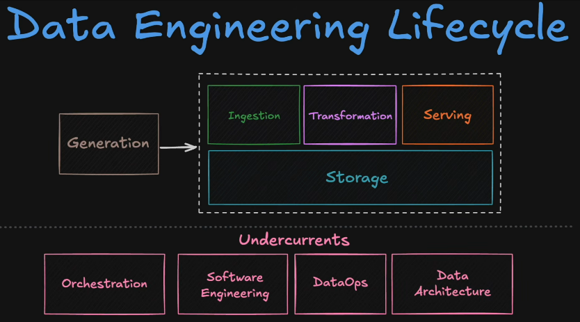

 

### Storage

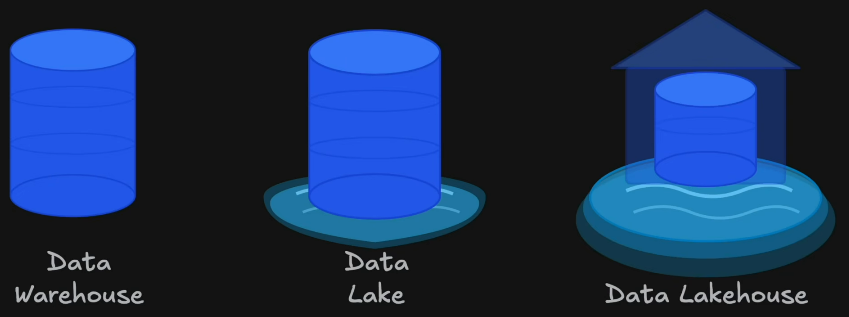

#### Data Warehouse
- This supports **Structured Data Only** - CSV, XLS, TXT, from other SQL database
- The data are cleaned before going into the warehouse, or it will be cleaned while in the warehouse.
- These data are great used by Analytics, but not much by Data Science, as Data Science rely more on UNstructured or raw data.

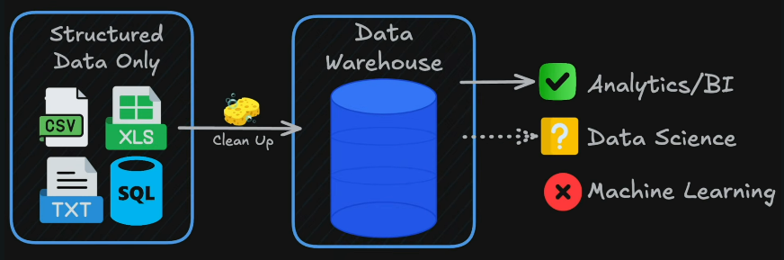

#### Data Lake
- This takes any type of data, **Structured or Unstructured Data** - CSV, XLS, TXT / MOV, PNG, JSON
- You dump it all raw and figure out how to use it later (aka as the YOLO approach).
- This is harder for Analytics.
- This is really great for data science and machine learning because this is great for building models.

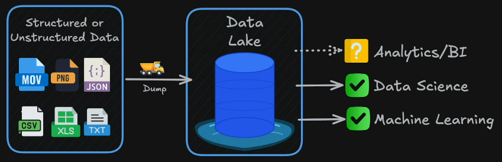

#### Data Lakehouse
- This a combination of **Data Warehouse + Data Lake**.
- This also takes any type, Structured or Unstructured.
- We then dump it into the **Data Lake**, and then from there, we clean up to get our structured data in our **Warehouse**.
- So this has the best of all worlds that **Analytics/BI can connect to the Warehouse**, and then **Data Science & Machine Learning can connect to the Lake**.

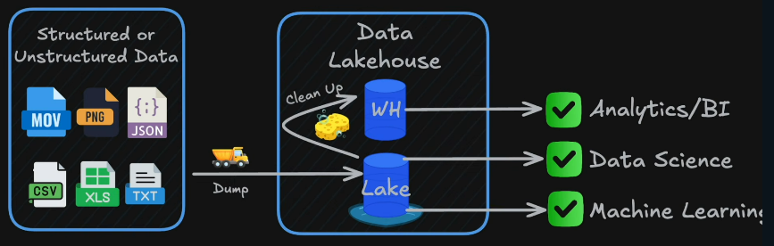

#### Cloud Platforms - Google Cloud 
(Note: AWS & Azure have equivalent services at every stage as well)

- Warehouse Example:

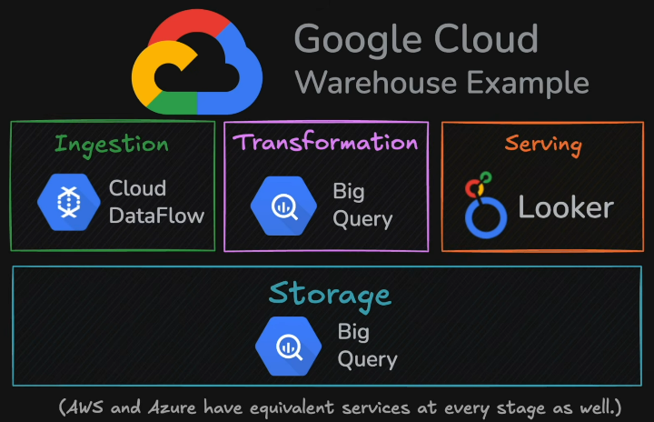

- Lakehouse example:

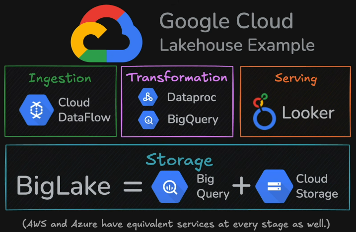

- With a cloud provider, you're putting this all together.
- But some people don't want to build a fully customized solution. That's where **data platforms** come in.

#### Data Platforms - Snowflake and Databricks
- They don't compete with cloud providers, as these data platforms run on top of cloud providers.

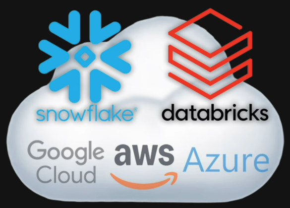

- For example, using Databricks , it's going to be a completely different approach, because Databricks is a **unified platform**. Which means in this, you don't manage the different storage tiers, clusters, or servers. **You focus just on the data**.

- If you can build a pipeline by putting together the different services from a cloud provider, you're going to be more than capable to jump over to a platform and use their tool to also build out a data pipeline.

 

### Ingestion
#### Where our data is generated and how we can ingest it in to our storage layer?
- For this, it's important to understand there's two types of systems. Our **source systems**, or where our data is generated, and then **analytical systems**, where that data is piped to.

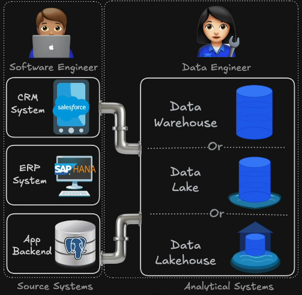

#### Two flavors in how you ingest your data
1. **Batch** - getting it in scheduled chunks.
    - Example: 
        - Having it run at scheduled intervals, such as at three o'clock, six o'clock, nine o'clock, and so on.
        - You could even do daily, hourly, or every 15 minutes, whatever the business needs.
    - This is the **most popular flavor of loading in data**, is it's not only simple to use, but also most people need data only on a daily, weekly, or monthly basis.
    - Tools:
        - **Fivetran** - provides some pre-built connectors to connect to a host of different sources. This is a no-code soultion, but there's not always a connector to get the data that you need.
        - **Python** - harder than fivetran as you need to code the whole solution yourself, but customizable. 

2. **Streaming** - This moves data continuously as events happen. Every click, every transaction flows immediately. This type of ingest is **built for speed, where every second or minute matter.** But this is harder to build, to debug and also they're more expensive.
    - Tools:
        - **Kafka** - This tool is open source and free, so if you wanted to, you could go download it. And it was originally built by LinkedIn to handle their massive real-time data feeds.

 

### Transformation
- The whole purpose of data modeling is figuring out just how much and how far you should denormalize tables to make it useful for analysis.

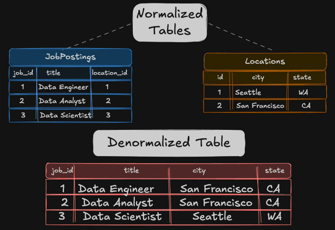

#### Two major types of databases
**Important Note**: You need to pick the correct database based on your use case.

1. **OLTP or online transaction processing**
    - Popular options like **Postgres** and **MySQL** are designed around this.
    - They handle thousands to millions of read, writes, updates, and deletes per second. However, they're **slow at scanning and aggregating large data sets**.

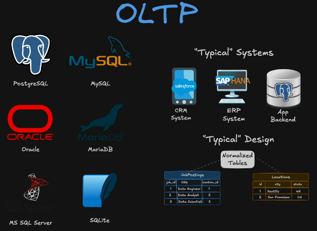

2. **OLAP databases or online analytical processing**
    - Is built for analyzing data. It's **blazingly fast** at scanning and aggregating large sets of data.

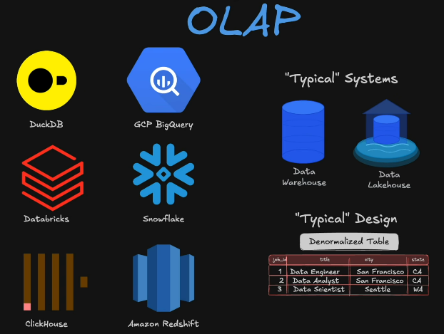

#### Design Patterns for Denormalizing Tables
- The most popular is the **Star Schema**

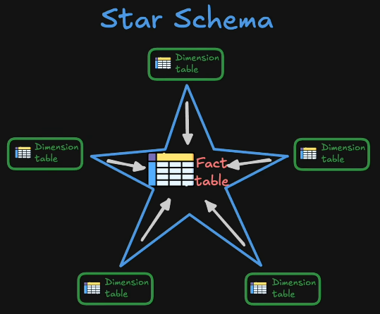

- Other popular design patterns:

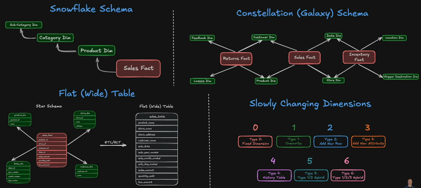

#### 'Source System to Analytical System' could be broken to LAYERS
- **Medallion Architecture** - the most popular and the industry standard.

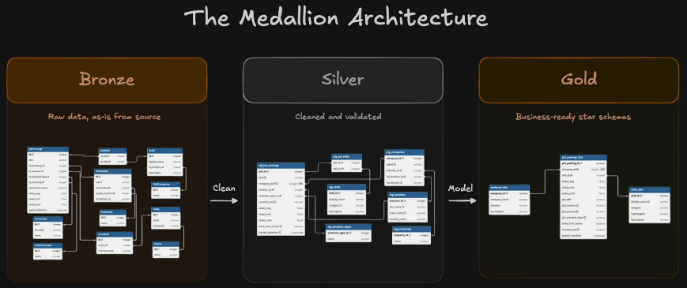

#### Tools that are used to do these 'transformations'
- **Two Main Options**
    - **SQL** 
        - commonly operates on either a **data warehouse** or a **data lake house**
        - we don't have to worry about data size
        - is great when working with structured data

    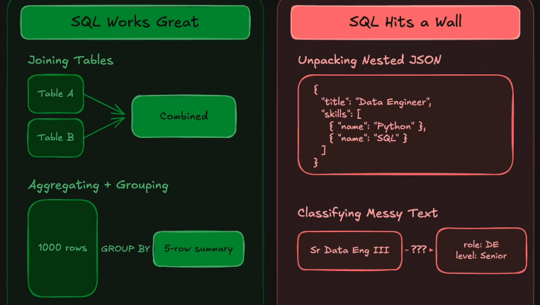

    - **Python**
        -  it's great at unpacking nested data, but even better at things like AI and machine learning.

- To help SQL and Python out, there's **two popular tools** used for these. **dbt** for SQL, and **Apache Spark** for Python.

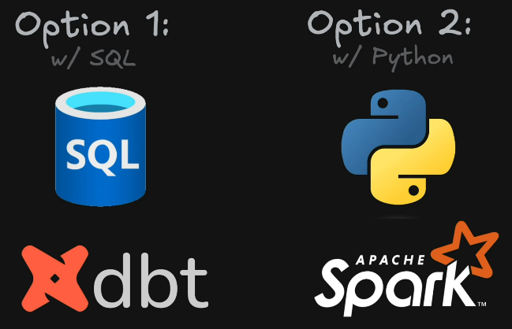

 

### Serving
- There are **three main areas** where this is delivered. **Business intelligence and analytics**, **machine learning and artificial intelligence**, and **reverse ETL**.

#### Business intelligence and analytics

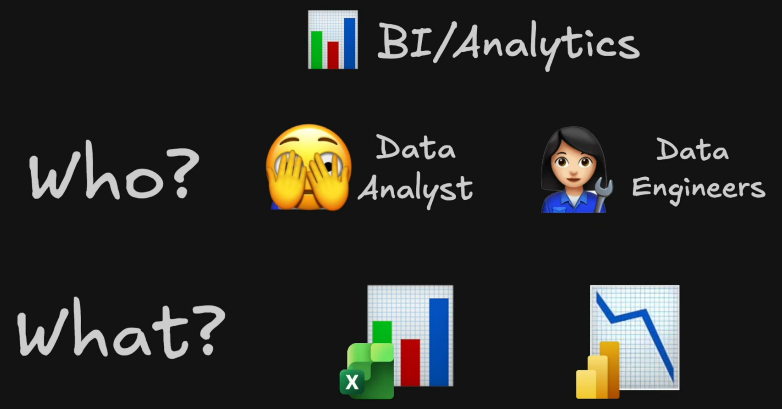

#### Machine learning and artificial intelligence

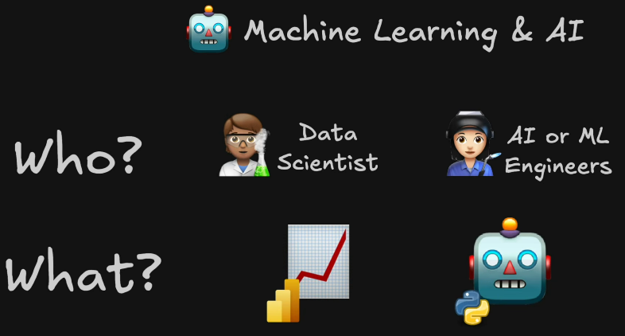

#### Reverse ETL

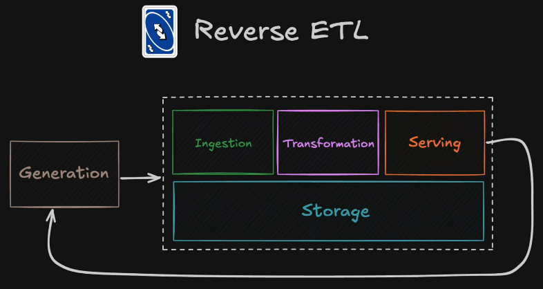

 
 

## Undercurrents - DE Lifecycle

### Orchestration

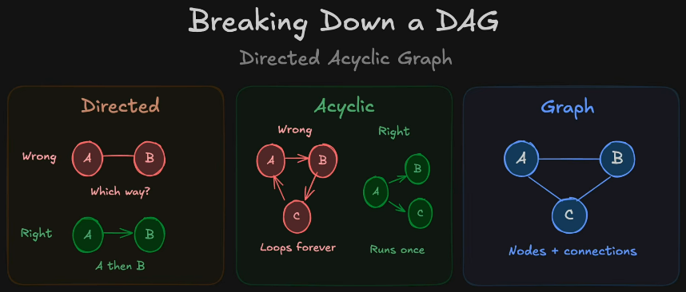

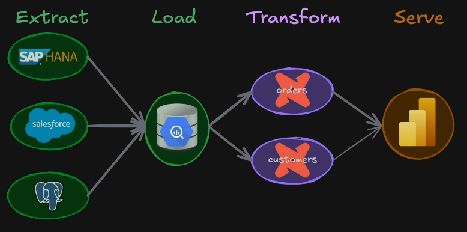

- **Airflow** - is the most popular tool for Orchestration. It is an open source option that allows you to write your DAGs in Python. It is required to be running 24-7, which is expensive.

### Software Engineering

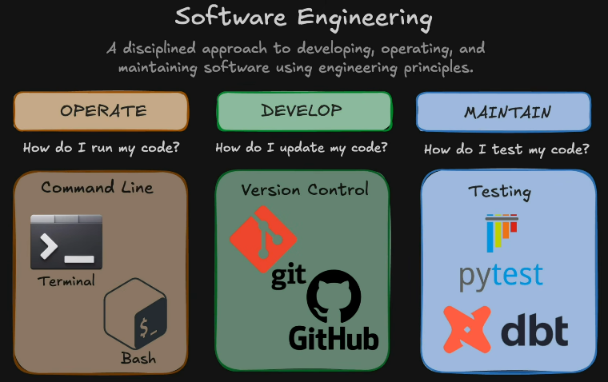

### DataOps

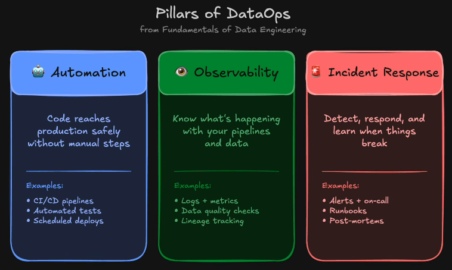

### Data Architecture

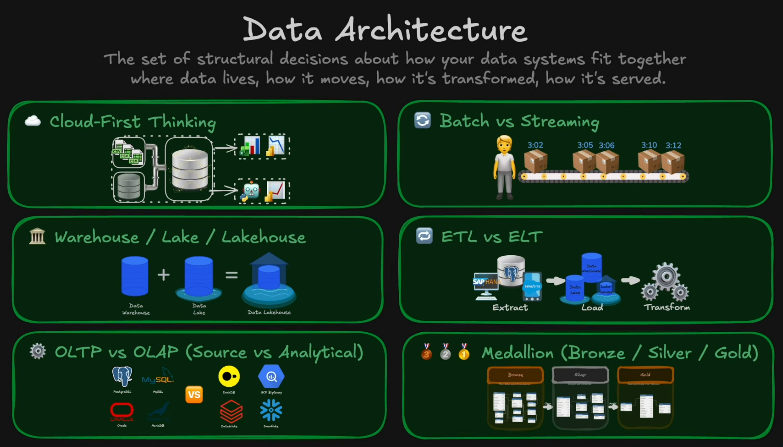

 
 

## Top DE Skills to Focus

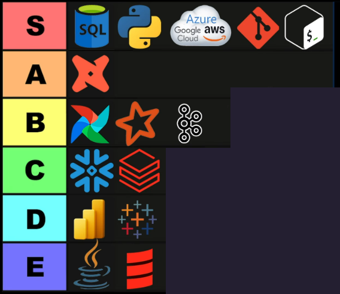