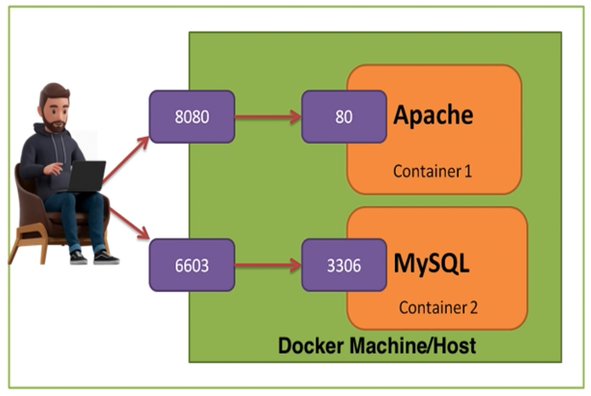

# Docker for Absolute Beginners – Hands-On DevOps

## Introduction

### What is Docker?
- is a set of platform as a service products that use **OS-level virtualization** to deliver software in packages called **containers**.
- a platform for building, running, and shipping applications.
- tool to create an **image which will have all the dependencies required** to run your tests/app.

### Why we need Docker?
- when we build the application in one system and try to run it in another system or machine, it might not work, because in real time the application will have many dependencies & configurations.
- **To overcome these issues we introduce docker.**
    - Where we just need to run some docker command and tell docker to run the application.
    - Then docker will automatically download all the dependencies & configuration and install the application and run in an isolated environment called **container**.

### What is Container?
- are isolated from one another and bundle their own software, libraries, and configuration files.
- they can communicate with each other through well-defined channels
- contains independent services which can be shipped to any cluster. Example: API Testing FW, UI Automation FW image, etc.
- **2 Types of Docker Container**
    - **linux container**
        - works on windows, mac, linux
        - size: few MBs only
    - **windows container**
        - works on windows only
        - size: in GBs

### What is Docker Image?
- includes everything needed **to run a piece of software** (code, runtime, libraries, dependencies)

### What is Docker file?
- is a **text file that contains a set of instructions** on how to build a Docker Image.
- think of it like a recipe or a set of steps needed to create a specific environment for running your application.

### Dockerfile > Docker Image > Docker Container
- **Docker File:** A text file that has instructions.
- **Docker Image:** A packaged environment with everything needed to run an application.
- **Docker Container:** A running instance of a docker image.


### What is Kubernetes?
- is **a system for managing containerized applications** across a cluster of nodes.
- in simple terms, you have a group of machines (e.g.VMs) and containerized applications (e.g. Dockerized applications), and Kubernetes will help you to easily manage those apps across those machines.


### Docker Terminology


<br>
<br>
<br>

## Crash Course

### Docker Flow Diagram
- - Using **Dockerfile** we can create an Image and push to docker Hub, where anyone can pull the image & create a container and execute the tests. 


- **Docker-compose.yml** will have all the instructions to the docker that from where to pull the images and on which network we have to run and communicate between images, etc.


<br>

### Docker Important Commands


#### Practical - Docker Pull
- Go to https://hub.docker.com/ then search for 'hello-world'
- Click the first result
- Copy the command `docker pull hello-world`
- Go to your terminal:
```bash
# To pull a basic docker image
docker pull hello-world

# To check your current available images
docker images

# To create a container from the 'hello-world' image
docker run hello-world  

# To see all of your containers, even the stopped ones
docker ps -a

# Since the hello-world container is stopped, you can delete it by
docker system prune -a
```

#### Practical - Creating Ubuntu Linux Machine using Docker
- Run: `docker run -it ubuntu bash`, this will automatically pull the ubuntu image.
- After that, you will be automatically inside the ubuntu made by docker. You can run linux commands to test.
- Create a file or a new folder, `mkdir test`
- Run `exit` to exit the ubuntu (this will also stop its container)
- Now that you're back in your terminal, run `docker ps -a` to see the ubuntu container.
- Run again `docker run -it ubuntu bash`, notice that the 'test' folder that you created earlier is not there anymore. It is because **docker creates a fresh brand new container** whenever you run that command.

<br>

### What is Docker Port Mapping?
- Docker can also run virtual machine, which means **a machine inside a machine**.
- So to identify a 'Machine' and 'App' inside a machine, we need to map the **port**. If we will not map the port we can't identify an app hence can't execute.



- Example: 
    - `docker run -p 8081:80 nginx` (-p means port)
    - this will map the local port 8081 with 80 port of nginx
    - You can run now this locally by `http://localhost:8081`