# Docker for Absolute Beginners – Hands-On DevOps

## Introduction

### What is Docker?
- is a set of platform as a service products that use **OS-level virtualization** to deliver software in packages called **containers**.
- a platform for building, running, and shipping applications.
- tool to create an **image which will have all the dependencies required** to run your tests/app.

### Why we need Docker?
- when we build the application in one system and try to run it in another system or machine, it might not work, because in real time the application will have many dependencies & configurations.
- **To overcome these issues we introduce docker.**
    - Where we just need to run some docker command and tell docker to run the application.
    - Then docker will automatically download all the dependencies & configuration and install the application and run in an isolated environment called **container**.

### What is Container?
- are isolated from one another and bundle their own software, libraries, and configuration files.
- they can communicate with each other through well-defined channels
- contains independent services which can be shipped to any cluster. Example: API Testing FW, UI Automation FW image, etc.
- **2 Types of Docker Container**
    - **linux container**
        - works on windows, mac, linux
        - size: few MBs only
    - **windows container**
        - works on windows only
        - size: in GBs

### What is Docker Image?
- includes everything needed **to run a piece of software** (code, runtime, libraries, dependencies)

### What is Docker file?
- is a **text file that contains a set of instructions** on how to build a Docker Image.
- think of it like a recipe or a set of steps needed to create a specific environment for running your application.

### Dockerfile > Docker Image > Docker Container
- **Docker File:** A text file that has instructions.
- **Docker Image:** A packaged environment with everything needed to run an application.
- **Docker Container:** A running instance of a docker image.

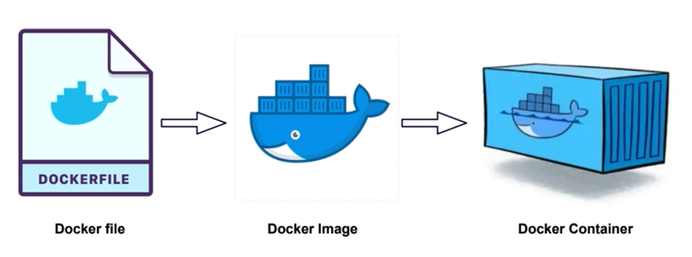

### What is Kubernetes?
- is **a system for managing containerized applications** across a cluster of nodes.
- in simple terms, you have a group of machines (e.g.VMs) and containerized applications (e.g. Dockerized applications), and Kubernetes will help you to easily manage those apps across those machines.

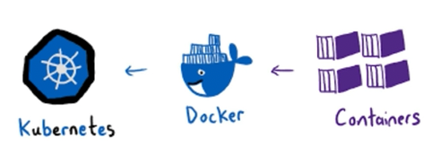

### Docker Terminology

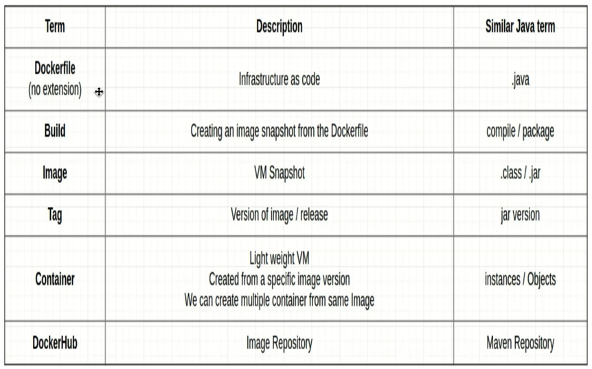

<br>
<br>
<br>

## Crash Course

### Docker Flow Diagram
- - Using **Dockerfile** we can create an Image and push to docker Hub, where anyone can pull the image & create a container and execute the tests. 

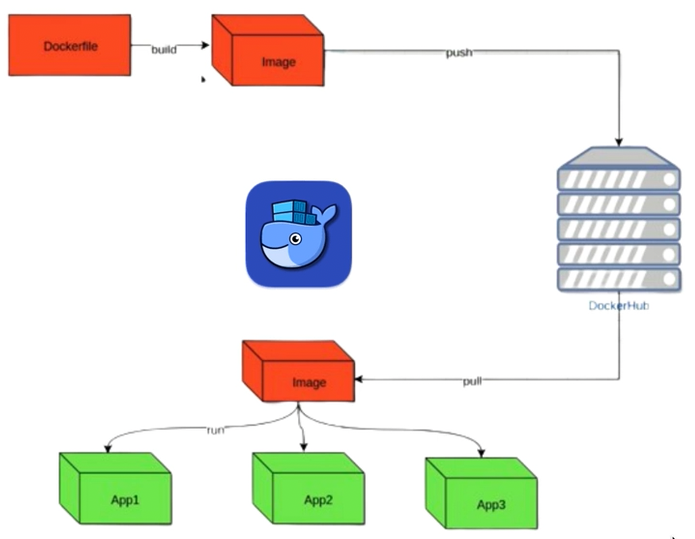

- **Docker-compose.yml** will have all the instructions to the docker that from where to pull the images and on which network we have to run and communicate between images, etc.

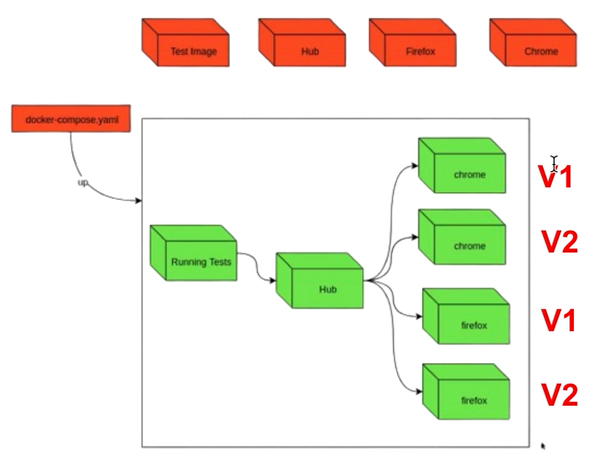

<br>

### Docker Important Commands

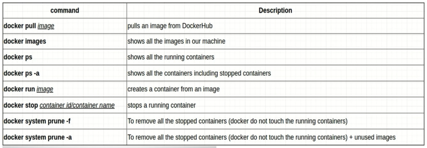

#### Practical - Docker Pull
- Go to https://hub.docker.com/ then search for 'hello-world'
- Click the first result.
- Copy the command `docker pull hello-world`
- Go to your terminal:
```bash
# To pull a basic docker image
docker pull hello-world

# To check your current available images
docker images

# To create a container from the 'hello-world' image
docker run hello-world  

# To see all of your containers, even the stopped ones
docker ps -a

# Since the hello-world container is stopped, you can delete it by
docker system prune -a
```

#### Practical - Creating Ubuntu Linux Machine using Docker
- Run: `docker run -it ubuntu bash`, this will automatically pull the ubuntu image.
- After that, you will be automatically inside the ubuntu made by docker. You can run linux commands to test.
- Create a file or a new folder, `mkdir test`
- Run `exit` to exit the ubuntu (this will also stop its container)
- Now that you're back in your terminal, run `docker ps -a` to see the ubuntu container.
- Run again `docker run -it ubuntu bash`, notice that the 'test' folder that you created earlier is not there anymore. It is because **docker creates a fresh brand new container** whenever you run that command.

<br>

### What is Docker Port Mapping?
- Docker can also run virtual machine, which means **a machine inside a machine**.
- So to identify a 'Machine' and 'App' inside a machine, we need to map the **port**. If we will not map the port we can't identify an app hence can't execute.

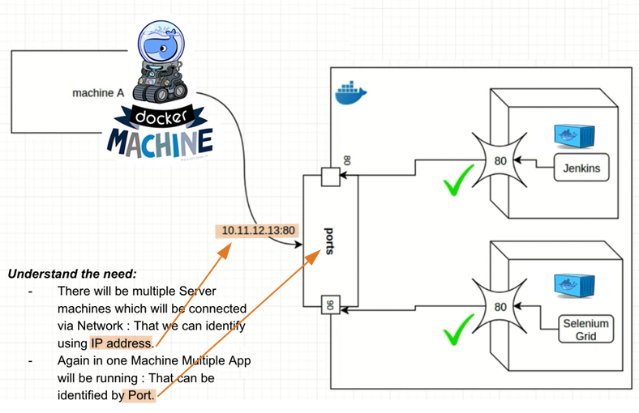

- Example (Not related to the image above):
    - `docker run -p 8081:80 nginx` (-p means port)
    - this will map the **host(or external) port 8081** with **container(or internal) port 80** for nginx
    - You can run now this locally by `http://localhost:8081`

#### Practical - Port Mapping
- Go to https://hub.docker.com/ then search for 'nginx'
- Click the result 'nginx: Docker Official Image'
- Run this command: `docker run -p 8080:80 nginx` 

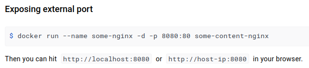

- In terminal, press `ctrl + c` to exit.

<br>

### Volume Mapping Concepts

- **WITHOUT Volume Mapping**: if we run anything inside the container then **results will also be published inside the container only** and we can't see the reports, etc.

- **WITH Volume Mapping**: we can **create a tunnel between host and container** so that we can share anything across.

- **Note**: Before going through volume mapping please check the docker settings. `Settings > Resources > File Sharing`, then change the directory path that will be used for volume mapping. Example: /User/MyName/workspace

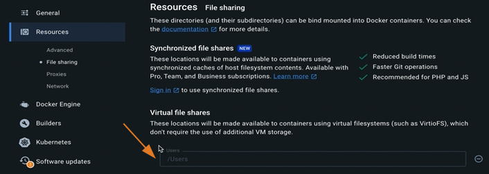

- **Volume Mapping Syntax**: `docker run -it -v /Users/MyName/practice_volume_mapping:/TestResults ubuntu`
    - flags:
        - `-it` - interactive mode
        - `-v` - volume mapping
        - `/Users/MyName/practice_volume_mapping` - the path in your host machine
        - `/TestResults` - assign any folder name, this will be the volume mapping path that will be created in your container
        - `:` - separator of the local path and container path
        - `ubuntu` - container name

<br>

### Docker Network Concepts
- Let's say we have 2 running containers, nginx and ubuntu.

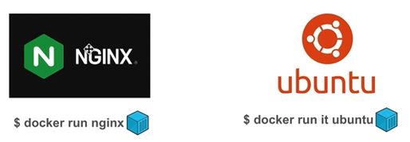

- **WITHOUT network**, both containers will be running in isolation and can't communicate with each other.

- **WITH network**, both containers can identify each other and can commnicate through this network.

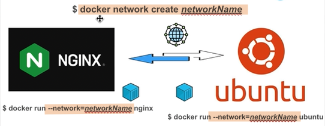

#### Practical - WITHOUT network

```bash
# Pull 2 images:
docker pull nginx
docker pull alpine

# Run nginx in 'background mode' by using `-d` flag, and name your container using the `--name=` flag
docker run -d --name=my-nginx nginx

# Then run alpine in 'interactive mode' by using `-it` flag
docker run -it --name=my-alpine alpine

# Now that you're inside the alpine container, ping nginx
ping my-nginx
# you'll get "ping: bad address 'nginx'"
# because it can't connect, due to non-existing network

# exit alpine container
exit 

# Delete the containers that you created, since alpine is not running when you exited it
docker rm my-alpine
# You can't delete a container if it still running, so stop nginx first
docker stop my-nginx
docker rm my-nginx
```

#### Practical - WITH network

```bash
# Create first the network
docker network create my-network

# Run nginx in 'background mode' by using `-d` flag and use `--network` flag to use the network that you just created
docker run -d --network=my-network --name=my-nginx nginx

# Then run alpine in 'interactive mode' by using `-it` flag with the `--network` flag
docker run -it --network=my-network --name=my-alpine alpine

# Now that you're inside the alpine container, ping nginx
ping my-nginx
# Notice that you can ping nginx, which means you can connect to it by the network that you created
# press ctrl + c to stop pinging

# Connect to nginx
wget my-nginx # to get the 'index.html'
```

<br>
<br>
<br>

## Build & Run Docker Image using Dockerfile

### Setup Editor for building the Dockerfile
- Create a folder (example: simple_data) and open it using your editor (example: VS Code)
- Open terminal inside the your editor.
- For you to have an idea with what we are building, run the following:
    - `docker run -it alpine`
    - Inside the alpine container, run `date`
    - This is what we are building, a simple application using docker image, that shows the current date.

### Creating a Simple Docker Image using Dockerfile

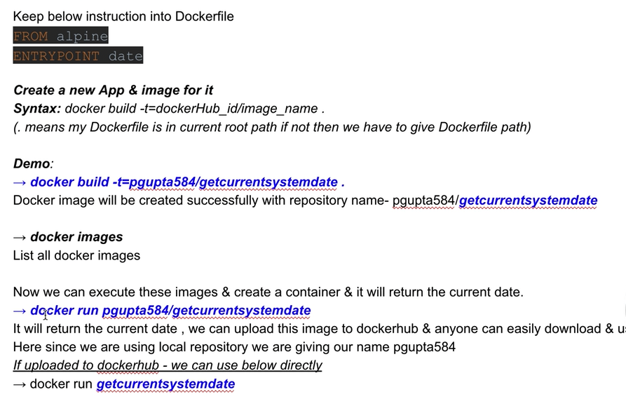

**Example:**
- Inside the simple_date folder, create a 'Dockerfile'
```Dockerfile
FROM alpine
ENTRYPOINT date 
```
- If you haven't logged in to your Docker Hub account yet, log in by running `docker login -u <your-username>`
- To build the docker image using the Dockerfile that you created within the same folder, run `docker build -t=<username>/<nameofyourimage> .`. Example: `docker build -t=jaysonssdev/getcurrentsystemdate .` **Note:** Dot (.) means the Dockerfile is in the same folder.
- Check your newly created image by running: `docker images`
- You can run it by running `docker run jaysonssdev/getcurrentsystemdate`

### Pushing Image to Docker Hub

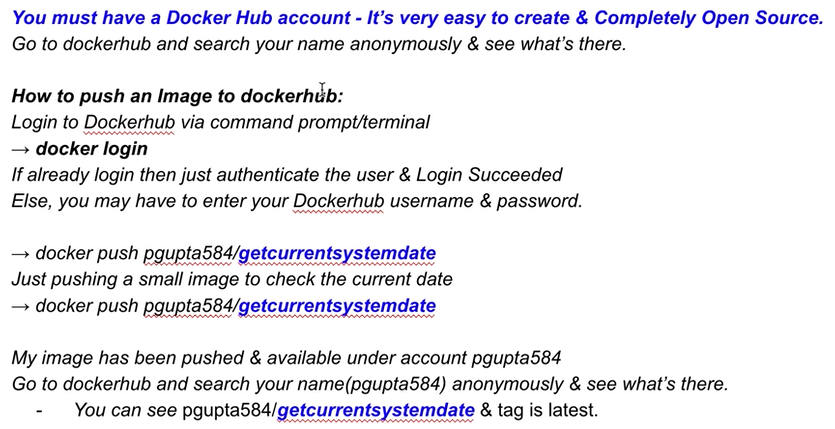

**Example:**
- Make sure you're logged in earlier when you ran: `docker login -u <your-username>`. You only need to do this once.
- To push your image, run: `docker push jaysonssdev/getcurrentsystemdate`
- Check you docker hub account. If successful, you should see your new repository there.

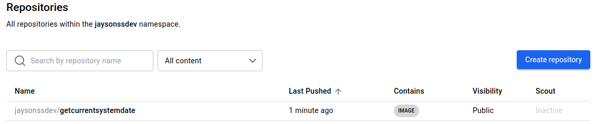

### Update Release Version (tag) of your Images to Docker Hub

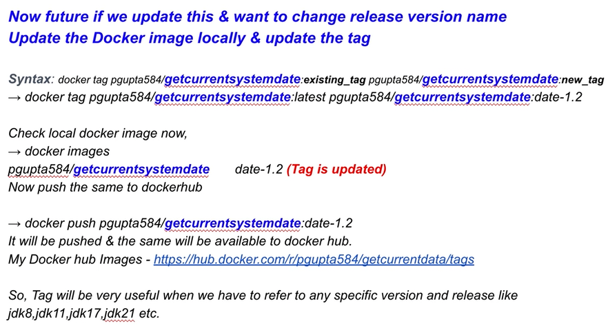

**Example:**
- Example you want to update the 'getcurrentsystemdate' that you created. Update the Dockerfile to:
```Dockerfile
FROM alpine
ENTRYPOINT echo "Current date is --> $(date)"
```
- Build this image again with the new tag: `docker build -t=jaysonssdev/getcurrentsystemdate:v2 .`. Note: We added `:v2` tag here.
- Run `docker images` to see your newly created docker image with the tag 'v2'.
- You can run this docker image: `docker run jaysonssdev/getcurrentsystemdate:v2`
- To push this image: `docker push jaysonssdev/getcurrentsystemdate:v2`
- Notice that you still have 1 repository for the image 'getcurrentsystemdate', but there are 2 versions (tags):

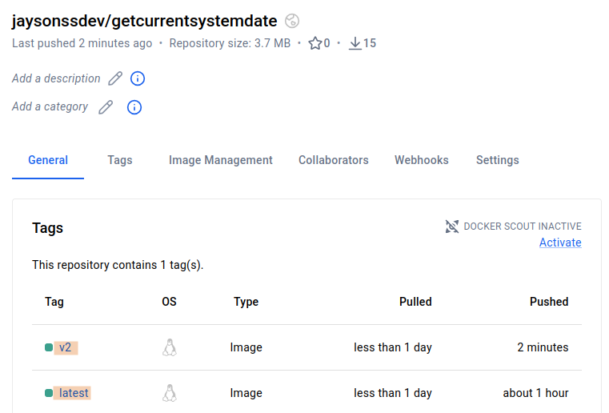

### Create Java or Python based Docker Image
#### Example 1: Java
- 'Dockerfile':
```Dockerfile
# This is the image that you get in docker hub
FROM alpine

# This is the java that you will install in the alpine
RUN apk add openjdk17

# This is to fix the path of javac to make it executable
ENV PATH=$PATH:/usr/lib/jvm/java-17-openjdk/bin/javac

# This is to set the working directory
WORKDIR /app

# Add a file to be copied from the host to the container
# In this example, 'HelloWorld.java' is in the same folder with the 'Dockerfile', and it will be copied to the /app directory that you set with WORKDIR
ADD HelloWorld.java HelloWorld.java

# Commands to execute the app
ENTRYPOINT javac HelloWorld.java && java HelloWorld
```
- Build the image by running: `docker build -t=jaysonssdev/hellojava:v1 .`

- Check your current docker images: `docker images`

- To run the image: `docker run jaysonssdev/hellojava:v1`

#### Example 2: Python
- 'hello.py': (Should be the same directory with the 'Dockerfile')
```py
print("Hello Python from the container!!")
```
- 'Dockerfile':
```Dockerfile
FROM alpine
RUN apk add --no-cache python3
WORKDIR /app
ADD hello.py hello.py
ENTRYPOINT python3 hello.py
```
- `docker build -t=jaysonssdev/hellopython:v1 .`
- `docker images`
- `docker run jaysonssdev/hellopython:v1`

<br>

### Passing Environment Variable to Docker
- 'cube.py' - this is a simple python file that takes a number (argument) and multiply it 3 times to itself (cube).
```py
import sys

# Get the argument from the command line
input_arg = sys.argv[1]

# Convert the text input into a number
number = float(input_arg)

# Check if the number is actually a whole integer
if number.is_integer():
    number = int(number)

# Calculate the cube
cube = number**3

# Print the final result
print(f"Number is: {number}. Its cube is: {cube}")
```
- to run this in your terminal: `python3 cube.py 2`, and the result will be "Number is: 2. Its cube is: 8"

- 'Dockerfile' - now let us turn this cube.py into a docker image.
```Dockerfile
# Specifying a version prevents your image from breaking when Alpine updates.
FROM alpine:3.20

# Install python3
RUN apk add --no-cache python3

# Set the working directory
WORKDIR /app

# Copy the script into the container
COPY cube.py .

# The bracket syntax allows the container to accept arguments at runtime.
ENTRYPOINT ["python3", "cube.py"]
```
- `docker build -t jaysonssdev/cube-app:v1 .`
- `docker run jaysonssdev/cube-app:v1 3`
- The result will be "Number is: 3. Its cube is: 27".

<br>

### Checking Docker Container Logs
```bash
# Check the list of your containers
# And also to see the container ID or the container name
docker ps -a

# To check the logs
docker logs <container ID>
# or
docker logs <container name>
```

<br>
<br>
<br>

## Build & Run Docker Image using docker-compose

### Docker Compose
- is a tool that helps you **define and manage multi-container Docker**
- allows you to define all your containers in a single YAML configuration file (`docker-compose.yml`), making it easier to start, stop, and manage them all together.
- it's a simple way to create a container, network, port/volume mapping & passing environment variable in a declarative way.
- Example: Imagine you have a basic application with 2 components:
    - a **web server** (e.g., a simple Nginx or Python Flask app)
    - a **database** (e.g., MySQL)
    - Instead of running each container separately, Docker Compose allows you to set both up in one file.
- **Basic Commands:** - Note: You should run these commands in the same directory as the 'docker-compose.yaml' file.
    - `docker-compose up` - Start the containers.
    - `docker-compose down` - Stop and remove the containers.

<br>

### Creating a 'docker-compose.yaml' file

#### Template:
```yaml
version: "3"
services:
[service-name]:
image: [image-name]
container_name: [some-name]
entrypoint: ["command to invoke"]
depends_on:
- [any-other-service]
working_dir: /a/b/c
environment:
- KEY1=value1
- KEY2=value2
ports:
- 80:80
- 1234:1234
- 8080:3344
volumes:
- ./relative-path/host-path1:/a/b/c
- /absolute-path/host-path234:/c/d/e
```

#### Example 1: simple 'docker-compose.yaml'
```yaml
version: "3"
services:
    cubefinder: # you can name the [service-name] whatever you want   
        image: jaysonssdev/hellopython:v1  # better if you already 'push' this image to docker hub
```
- To create a container for this 'docker-compose.yaml' and to provide a 'project name' with the use of `-p` flag: `docker-compose -p mypython up`
- To stop and remove: `docker-compose -p mypython down`

#### Example 2: Providing port to be opened on browser
```yaml
version: "3"
services:
    nginx:
        image: nginx
        ports:
            - 8080:80
```
- `docker-compose up`
- Then you can open your browser, 'localhost:8080'
- Press `ctrl + c` to exit the container
- To stop the container: `docker-compose down`
- To stop the image: `docker stop nginx`
- To delete the image: `docker rm nginx`

#### Example 3: Using 'depends_on'
```yaml
version: "3"
services:
    nginx1:
        image: nginx
        ports:
            - 8085:80
    alpine1:
        image: alpine
        entrypoint: "ping nginx1"
        depends_on:
            - nginx1 # means don't start pinging unless the 'nginx1' image has started
```
- `docker-compose up`
- you can now see 'alpine1' pinging 'nginx1'
- docker-compose created a default network that's why 'alpine1' can ping 'nginx1'.
- You can see this default network by `docker network ls`

#### Example 4: Using `-d` flag to run the servers on the background
- Using 'Example 3', you can run the nginx and the alpine on the background by: `docker-compose up -d`
- Now that they are both running on the background, you can't see the 'alpine1' pinging 'nginx1'.
- To see both of their logs, run: `docker-compose logs`
- To see a s specific server, run: `docker -compose logs nginx1` or `docker-compose logs alpine1`

#### Example 5: Volume Mapping
```yaml
version: "3"
services:
    nginx1:
        image: nginx
        ports:
            - 8085:80
    alpine1:
        image: alpine
        entrypoint: "wget http://nginx1" # this command is to download the 'index.html' of nginx
        depends_on:
            - nginx1
        working_dir: /app # folder where the index.html will be downloaded to
        volumes:
            - ./results:/app # this means it will create a shared folder 'results' in your current folder in vs code
```
- `docker-compose up`
- the 'results' folder has been created and the 'index.html' is inside

<br>

### Why Dev/QA teams love Docker for Deployment

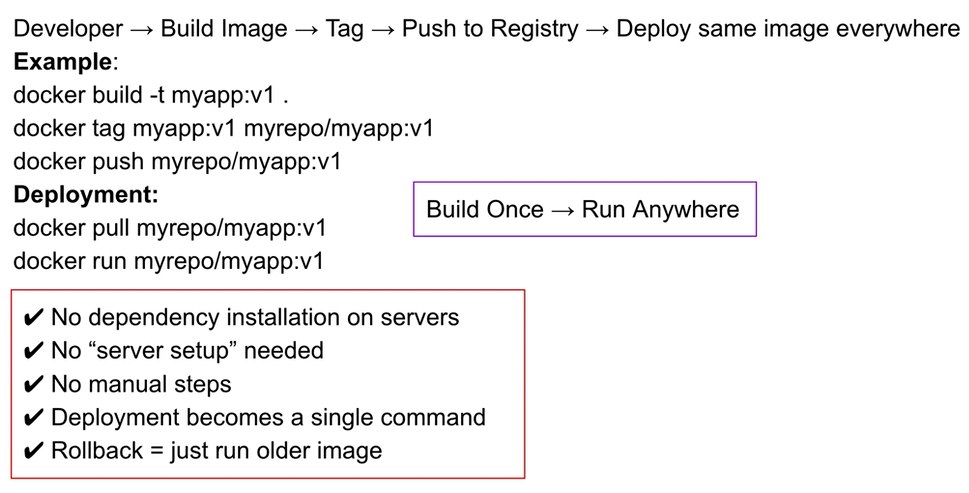

### Understanding Docker Infrastructure - For Dev/DevOps

#### Developer Workflow

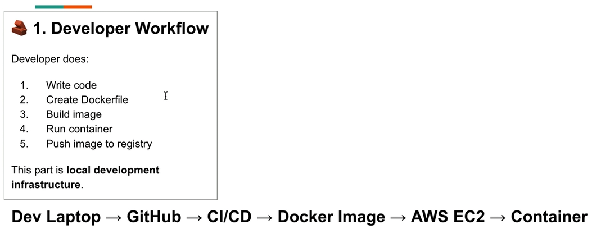

- **Simple Explanation:**

1. **Developer writes code** on their laptop.
2. They **push code to GitHub**, which stores it.
3. **CI/CD robot wakes up**, checks the code, builds a Docker image.
4. **Docker Image is created** - a full package of your app.
5. AWS EC2 **downloads the image**.
6. It **runs the image as a container**, and your app is live.

- **One line summary:**
Code -> stored -> auto-built -> packaged -> run on server.

<br>

#### Simple Kubernetes Flow


- **Simple Explanation:**

1. Developer **builds a Docker Image** of the app.
2. **Kubernetes takes the image** and decides where to run it.
3. Kubernetes creates **Pods** (small boxes/rooms).
4. Pods contain **containers running your app**.
5. Kubernetes **keeps everything alive**, restarts if needed, scales up/down.

- **One line summary:**
Image -> Kubernetes -> Pods -> your app runs automatically and reliably.