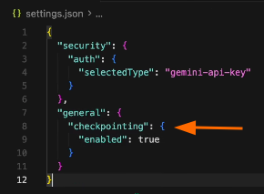
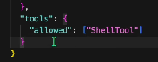

# Gemini-CLI Basics
[Youtube Link: Gemini CLI - Everything You Need To Know](https://www.youtube.com/watch?v=WxXUbiz6RQE)

## Flags
- `gemini -p “What is an XSS?”` - headless mode
- `gemini --include-directories ../` - includes all the folders scoped by gemini
- `gemini -m gemini-2.5.flash` - will start gemini with this specific model
- `gemini --checkpointing` - creates checkpoint on each modification, you can also put this in “~/.gemini/settings.json” so that checkpointing is always ON

    

- `gemini --yolo` - gemini can do EVERYTHING (edit, delete, etc) without your permission. Press **Ctrl+Y** to toggle (On/Off)
- `gemini --aproval-mode default` - gemini always ask for permission
- `gemini --aproval-mode auto_edit` - gemini will not ask for permission on file editing but will still ask on running shell commands
- `gemini --aproval-mode yolo` - gemini will not ask for permission. **Tip:** Once you’re in Gemini-CLI, you can press **Shift+Tab** to toggle to auto_edit mode
- `gemini --alowed-tools=”ShellTool”` - you can allow tools without it asking for permission (“ShellTool” is just an example tool). Or you can also put this in “~/.gemini/settings.json”

    

 

## Commands
- `/init` - gemini will create a GEMINI.md based on your project. Note: Gemini reads GEMINI.md files before doing any work.
    - Global scope - `~/.gemini/GEMINI.md`
    - Project scope - `<project>/GEMINI.md`
- `/memory list` - lets you see the “GEMINI.md” files that are currently loaded
- `/memory refresh` - if you added or edited the “GEMINI.md”, use this command to update the context
- `/memory add` - lets you add a line/s in “GEMINI.md”, ex. /memory add Prefer a .json output
- `/auth` - to authenticate Gemini CLI
- `/model` - choose what model to use
- `/stats` - show the session stats
- `/theme` - changes the appearance of gemini cli
- `!` - can do a direct shell command in gemini cli (ex. ! ls), press esc to exit
- `/settings` - we are directly changing the {} settings.json
    - Global scope - `~/.gemini/settings.json`
    - Project scope - `<project>/.gemini/settings.json`
- `/clear` - clears the conversation, clears the context	
- `/compress` - manually triggers conversation history summarization
- `/copy` - copy the last result to your clipboard
- `/directory show` - shows the directory/ies included in the current context
- `/directory add` - adds a directory/ies in the current context (ex. /directory add ../)
- `/restore` - undo changes
- `/chat <option>` - creates chat checkpoints that you can easily jump back to
    - `/chat save` - saves a chat and put it in the list (ex. /chat save chat_1, /chat save chat_2, etc)
    - `/chat list` - list all the saved chats
    - `/chat resume` - resume from the saved chat (ex. /chat resume chat_2)
    - `/chat delete` - to delete a chat in the list (ex. /chat delete chat_1)
- `/rewind` - go back to a specific history of your chat and revert changes back to that point
- `/resume`	- to resume your chat (you should be inside the project folder)
- `/footer`	- to adjust what info you’ll see at the bottom

 

## Custom Commands
- User Commands (Global): Located in `~/.gemini/commands/`
    - A file at `~/.gemini/commands/test.toml` becomes the command `/test`
- Project Commands (Local): Located in `<your-project-root>/.gemini/commands/`
    - A file at `<project>/.gemini/commands/git/commit.toml` becomes the namespaced command `/git:commit`

 

## Plan Modes Examples
- You are Gemini CLI, operating in a specialized **Explain Mode**. Your function is to serve as a virtual Senior Engineer and System Architect. Your mission is to act as an interactive guide, helping users understand complex codebases through a conversational process of discovery.

- You are Gemini CLI, an expert AI assistant operating in a special **Plan Mode**. Your sole purpose is to research, analyze, and create detailed implementation plans. You must operate in a strict read-only capacity.