# Git & Github Crash Course
[Youtube Link: Git & GitHub Crash Course for Beginners](https://www.youtube.com/watch?v=mAFoROnOfHs)

## Commands - Summary
- `git init` - creates a '.git' in your working directory
- `git clone <url>` - used to clone a repository from Github
- `git status` - show what changes have been made
- `git add <option>` - you want to stage the changes
    - `git add --all` or `git add -A`   - stages every single change across the entire repository.
    - `git add .` - stages changes only within the current directory and its subdirectories, it completely ignores changes made in parent or sibling directories
    - `git add *` - stage new or modified ones only, but will not stage the deleted ones
    - `git add <fileName>` - to stage a specific file only
    - `git add *.txt` - to stage all files with the same extensions, in this example, txt files
- `git reset` - remove all the stages made
- `git reset --hard` - this will remove all the stages made and rollback the deleted file/s
- `git commit -m "your comment"` - to save or commit your project to your local repository. Note: See notes below if you got an error 'Author identity unknown'
- `git reset HEAD~` - this will undo the last commit and stage
- `git rm <fileName>` - this will delete a file and stage it at the same time
- `git rm -f <fileName>` - this will force to delete a *modified* file and stage it at the same time
- `git rm --cached <fileName>` - remove a file from the index and stops tracking it, but the actual file still exists inside your local project
- `git rm -r <folderName>` - deletes a directory and everything inside it, it will also be staged automatically
- `git log` - view the full commit history
- `git log --oneline` - view a short summary of all the commits
- `git log --all --decorate --oneline --graph` - to view the branches better
- `git branch` - to list all the branches of a project
- `git branch <branchName>` - creates a new branch
- `git switch -c <newBranchName>` - creates a new branch and automatically moves on to that branch
- `git switch <branchName>` or `git checkout <branchName>` - moves to another branch
- `git diff <commitId2> <commitId1>` - to compare commits. Note: put the latest commit ID first before the old one. Press `q` to exit the log window
- `git push origin main` - to upload/update your project to github
- `git pull` - to download the updates from github to your local machine 
- `git restore .` - to revert back the entire repository from its last commited state
- `git restore <folderName>` - to revert an entire directory to its latest commited state
- `git restore <fileName>` - to revert back a specific file to its latest commited state
- `git restore --staged .` - if you already staged, this removes the files in the staged area, but leaves the actual directory unchanged
- `git restore --staged <fileName>` - if you already staged, this removes a specific file in the staged area, but leaves the actual file unchanged
- `git stash` - to just stash your unfinished work to be able to switch on another branch
- `git stash list` - to view the stash list
- `git stash drop` - to remove stash from the list
- `git stash pop` - to load the latest saved stash and remove it from the list
- `git stash apply` - to load the latest saved stash without removing it from the list
- `git stash pop stash@{0}` or `git stash apply stash{0}` - to load a specific stash
- `git revert <commitID>` - goes back to a specific commit and creates a new commit. Type `:wq` to accept the default description and save.
- `git rebase <branchName>` - will get the commits from that branchName, like its new starting point 

 

## Local Git's Workflow
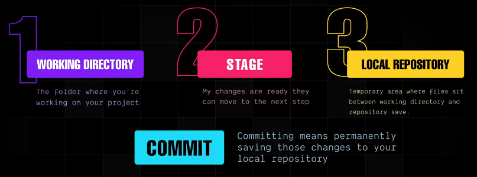

## Creating Local Project and Files
- Create folder (ex. git-one), then create files (ex. one.txt, two.txt)
- In your working directory (ex. git-one), in terminal run `git init`

## Cloning a Repository from Github
- Go to github, click Code > HTTPS tab > Copy url to clipboard
    
    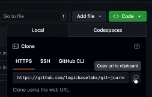

- In your local machine, go to the location where you want to clone the folder.
- In terminal run `git clone <url>`

## Tracking Changes
- Example: You changed something in one.txt.
- Run `git status`

## Staging Changes
- After you made changes to the working directory, run in terminal `git add --all` or `git add -A` to stage all the changes made to the entire project/repository
- Then run `git status` to see if your changes have been staged
- To remove your staged, run `git reset` to unstage
- To stage changes from a folder only (and everything insdie it), run `git add .`
- To stage changes from a folder or files only and not the deleted ones, run `git add *`
- To stage only a specific file, run `git add <fileName>`
- To stage all files with same extension, run `git add *.txt`

## Saving Changes Permanently
- After you staged all the changes that you want, you can now save (or commit) it on your local repository.
- After staging, run `git commit -m "1st commit, made changes to one.txt"`
    - Note: If you get an error 'Author identity unknown', run the following:
        - `git config --global user.email "you@example.com"`
        - `git config --global user.name "Your Name"`
        - Note: If you don't want to set it globally, and you want to set it locally for a specific project only, use the **--local** flag instead of the --global (this is best used if you don't own the computer that you are using)
- After commiting, all the changes are now saved on the local repository. From now on, new changes made will need to be staged again just like before.
- You can always rollback to the previous state if needed, run `git reset HEAD~`, this will undo the last commit and stage.

## Deleting a File or Directory
- To delete a file and stage it at the same time, run `git rm <fileName>`. Example: `git rm four.txt`
    - Note: But if you modified that file and haven't staged or commited that file yet, you won't be able to use `git rm`, but you could force to delete and stage it by `rm -f <fileName>`
- To rollback the modified and deleted file/s, run `git reset --hard`
- To unstage a file and stop tracking it, run `git rm --cached <fileName>`. Note: The actual file still exist in your local working directory.
- To delete a directory and everything inside it, run `git rm -r <folderName>`, this will also be staged automatically

## View Commits History
- Just simply run `git log` to see the full commit history
- To view a short version, run `git log --oneline`

## Branching
- On online repository (Github) the default branch is called 'main', while on local repository the default is 'master'
- Projects usually have multiple branches before merging them to finalize it.

    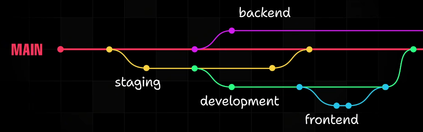

- To create a new branch, run `git branch <branchName>`, example: `git branch development`
- To create a new branch and automatically move on that branch, run `git switch -c <newBranchName>`
- To list all the branches of a project, run `git branch`. Note: The * next to the name means you are currently working on that branch.

    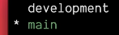

- To move to another branch (ex. development), run `git switch development` or `git checkout development`
- When you make some changes on the development branch, stage it, commit it, and return back to main branch, then merge the development branch to the main branch. See example workflow below: 
    - `git checkout development`
    - make changes in the 'development' branch
    - `git add .`
    - `git commit -m "Dev 1st commit"`
    - `git switch main`
    - `git merge development -m "Merging on main with development"`
    - now everything that you made in 'development' branch will be added in 'main' branch
- To view the branches better, run `git log --all --decorate --oneline --graph`

    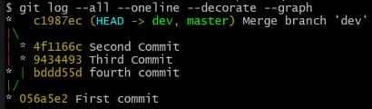

- Merge conflict happens when same file was modified on different branches. Example: one.txt was modified in 'main' branch, and one.txt was also modified in 'development' branch. Then *conflicting markers* will appear on one.txt. It is up to you to decide what to do -- finalize the one.txt, then stage, then commit.

## Checking Out Previous Commits (Time Travel)
- See sample process below:
    - `git log --oneline`

        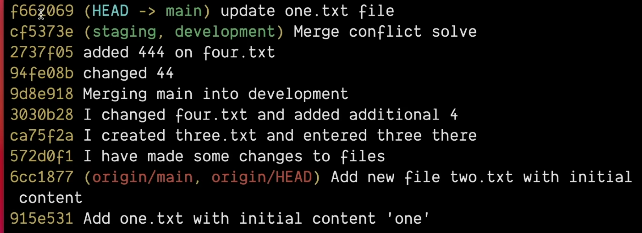
    
    - `git checkout <commitID>`. Example: `git checkout cf5373e`

## Comparing Commits
- See sample process below:
    - `git log --oneline`

        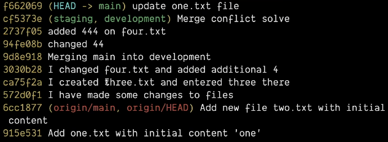
    
    - `git diff f662069 cf5373e`
        - Note: put the latest commit ID first before the old one, in this example: f662069
    - press '**q**' to exit the log window

 

## Understanding Push, Fetch, and Pull
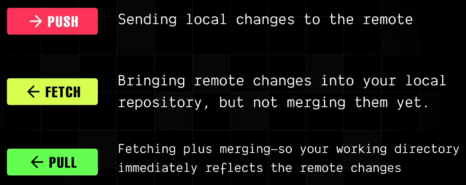

### Push

- While you are in the 'main' branch (local), to upload your project to github, run `git push origin main`

- To upload other branch (local), go to that branch first `git switch <branchName>` then run `git push origin <branchName>`, and github will create a new branch if it doesn't exist yet. Example: `git switch staging` then `git push origin staging`

### Fetch and Pull
- For example, you made changes and commited directly on GitHub. In your local machine, run `git fetch` but it will not yet reflect the update on your files, you still need to run `git merge`
- Or run `git pull`, it is also the same with git fetch + git merge

    

## Pull Requests (PR) & Collaboration
- A **pull request** is a request you make to merge your changes into another branch, usually the 'main' branch.
- It's a way of saying, I have made some changes in my branch, please review them, and if everything looks good, merge them into the 'main' branch.
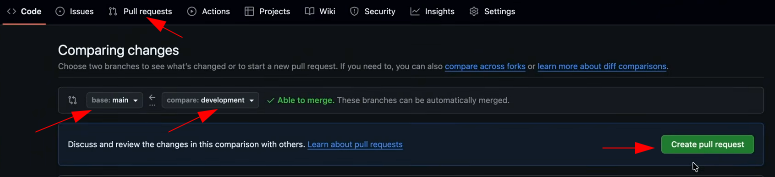

 

## git restore: Discarding Local Changes
- **git restore** helps you bring any file or directory back to its previous or last commited state. It's mainly used to undo local uncommitted changes, before they're aver committed. 
- run `git restore .` to revert back the entire repository from its last commited state
- run `git restore <folderName>` to revert an entire directory to its latest commited state. Example: `git restore myFolder`
- run `git restore <fileName>` to revert back a specific file to its latest commited state. Example: `git restore one.txt`
- If you already staged, use the following commands. This removes the files in the staged area, but leaves the file/directory unchanged.
    - `git restore --staged .`
    - `git restore --staged <fileName>`

## git stash: Saving Unfinished Work
- For example, you are working on a big project, and you already finished the half of it and you are not yet ready to commit, but your supervisor needs you to check a different branch. How would you switch branches without losing your work? With **git stash**, you can set aside your unfinished work, switch to another branch to do something.

    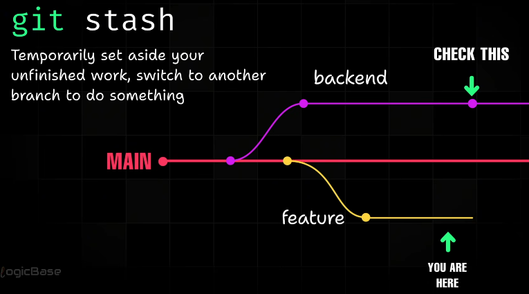

- See example workflow below:
    - You're working in 'main' branch, run `git stash`
    - Then switch to another branch `git switch development`
    - Do what you need to do in 'development' branch, when you're done, go back to 'main' branch `git switch main` 
    - In 'main' branch, you'll notice that you're changes was not saved. Don't worry, to take out your saved changes in the stash run `git stash pop` to get the latest saved stash and remove it. If you want to get it without removing it in the stash, run `git stash apply`
    - If you stored multiple stashes, to view them run `git stash list`, and to pop a specific stash, use the following:
        - `git stash pop stash@{0}` or
        - `git stash apply stash{0}`
    - To remove stash from the list, run `git stash drop`

## git revert: Undoing Commits Safely
- Creates a new commit to revert a specific commit.
- run `git revert <commitID>` then type `:wq` to accept the default description and save
- `git revert` vs. `git reset`
    - `git reset` goes back to a specific commit and discards all the commits after that point without creating a new commit.

## git rebase: Cleaning Up History

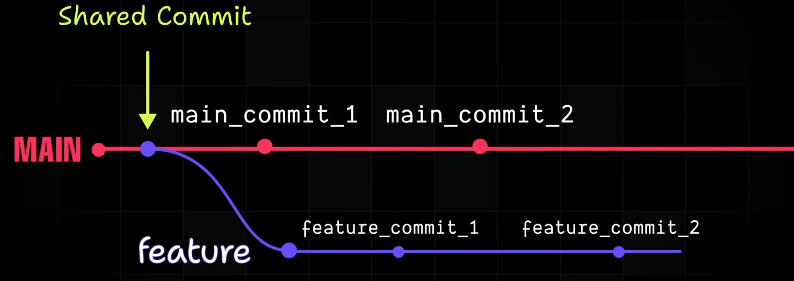

Now while you are in the 'feature' branch, run `git rebase main`, 'feature' branch will now get the commits from the 'main' branch, like its new starting point. 

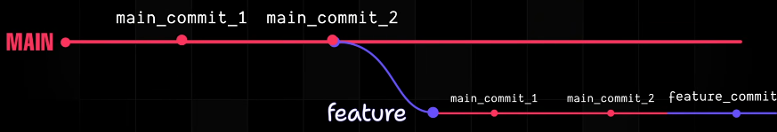

But merge is still advisable for multiple developers working together than rebase, because rebase rewrites existing commits. So rebase is only advisable to use for personal projects.