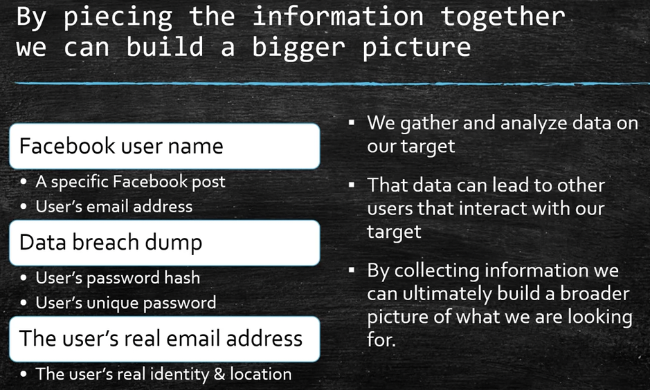
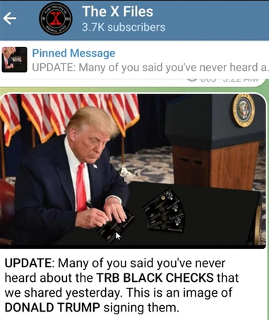
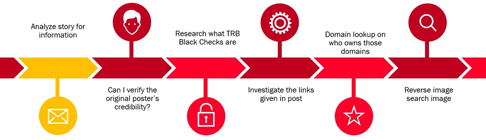
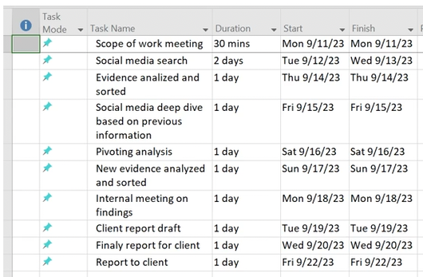
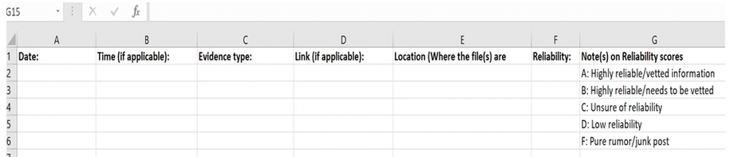
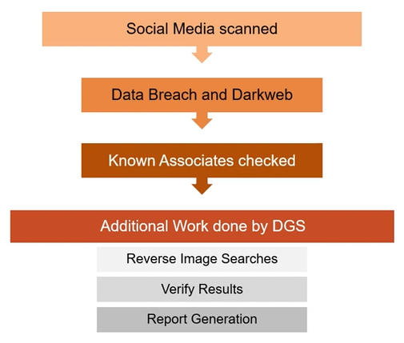
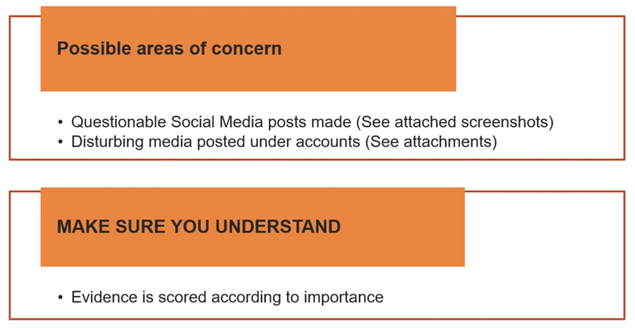

# Introduction

## What is OSINT?
- Open-source intelligence(OSINT) is **data collected from publicly available sources** to be used in an intelligence context.
- In the intelligence community, the term **"open" refers to overt, publicly available sources**(as opposed to covert or clandestine sources).
- It is not related to open-source software or public intelligence.

### What can we find with OSINT?
- Email addresses
- Phone numbers
- Addresses
- Identities
- Background checks
- Social media accounts and information
- Criminal records
- Scams
- Etc.

### Who uses OSINT?
- Law enforcement
- Security professionals
- Malicious hackers
- Businesses
- Investigators
- Journalists
- Home users

### Information Gathering

 

## Mental Preparation
- Have a plan of "attack", be organized
- Try to mentally prepare yourself
- Pace yourself (if you are able to)
- Be prepared for what you may uncover
- Take some time to decompress after your investigation if you need to

 

## OSINT Steps
- What is our goal and starting evidence?
- Example: How can we be certain that this post is legit?

- To solve this, we should outline our steps:

 

## Your tools will break
- Your favorite tool, whether it's a website or a tool that we'll install, **it is going to break at some point**.
- **Example:** When twitter got taken over when it got bought out. The twitter site, the servers, the API which these tools will hook into, came crashing down. And most of the tools that we use for OSINT no longer worked. 
- That's why whenever a tool breaks, we should have a couple of options. **One thing you could always rely on is your methodology**. -- Figure out how you're going to tackle the problem and take that manual approach again.

 

## Ask...
- Ask what information that the client already has.
- Ask what they are willing to share with you.
- Having information that they already have can save a lot of time.

 

## Crossing the line
- We are investigators, not criminals.
- We need to abide by local laws.
- We need to make sure we keep within the guidelines of our company or client.
- If we fail to comply we amy breach our contract, loose our job/client, be fined, or jailed.
- We may loose a legal case due to improper/illegal methods collecting the evidence.

 

## Documents

### Basic Contract
- Before starting your investigation you should have a basic contract made and signed beforehand.
- Names
- Dates
- Scope of Work
- Deliverables (dates, milestones, expectations, etc.)
- What is out of scope?
- Contacts
- Who will be working on what
- Emergency contacts with hours
- Date and sign

### Project Timeline

### Data Collection Notes

### Reports
- Consider making 2 reports.
    - A **technical report**: Detailed report designed for senior investigators, IT administrators, etc.
    - A **elevator pitch report**: A short and to the point report. Make sure it doesn't have any technical jargon or unnessary information. This report will be the executive report for the high level personnel that may not be technical of have the time to read through anything extra.

### Status Summary

### Attention Areas

