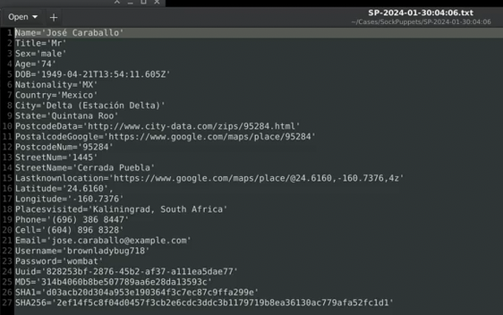

# Sock Puppets

## Basics
- a.k.a. burner account.
- is an alternative account (e-mail, username, fake identiy, etc) that is no way associated with us.
- typically uses: an alternative name, location, username, email address, physical address, phone number, fake profile picture, job title/employer, etc.
- should not use any password we used before.
- varies in complexity.

 

## Sock Puppet Gmail
**Use a smartphone**
- use a burner smartphone (preferred)
- create an account as usual
- this does not require a phone number
- you can generally create 3 in a day
- any more tends to flag Google
- works with iOS and Android

 

## MySudo
### Uses
- **Hide real details:** Keep your real phone number, primary email, and financial details safe from third parties.
- **Stop spam:** Compartmentalize your life so that if a random shopping site or public form leaks your data, only that specific Sudo profile gets spam.
- **Encrypted connection:** Enjoy secure, private communications via Sudo handles without handing over personal registration info.

### Plans and Pricing
- **Free tier (SudoFree):** You can download the app and use Sudo Handles to make free, unlimited, end-to-end encrypted voice, video calls, and messages with other MySudo users. You also get basic private email features.
- **Paid tiers:** To get actual phone numbers that can call or text regular non-MySudo phone numbers, you must pay for a subscription plan.

 

## textfree.com
- TextFree is actually free. You get a real U.S. or Canadian phone number with unlimited texting and calling over Wi-Fi or mobile data at zero cost. It is funded by in-app ads, but you can upgrade to TextFree Plus for $9.99/month to remove ads and unlock extras. 
- While the base app is completely free, there are a few important limitations to keep in mind:
    - **No Verification Codes:** You generally cannot receive short-code SMS verification codes (like from banks or accounts) on the free tier.
    - **Inactivity Expiration:** If you do not use your phone number for 30 days, the number will expire and can be given to someone else.
    - **Ad Interruption:** You will see ads within the app, which can sometimes be intrusive.
 
 

## textnow.com
- TextNow is completely free for basic talk and text services.
- The company provides a real US or Canadian phone number with unlimited domestic calling and texting.
- **How It Works** Wi-Fi Only: You can download the app and use it immediately over Wi-Fi for $0 per month.

 

## Temp mail
- Temp mail is a free, disposable, short-lived email address used to receive messages without revealing your real identity or inbox. It requires no registration, works instantly, and self-destructs after a set time.

 

## CSI Linux Sock Puppets
- Click the `Menu -> OSINT and Online Investigations -> Sock Puppet Builder`
- And it will create you a new identity:

