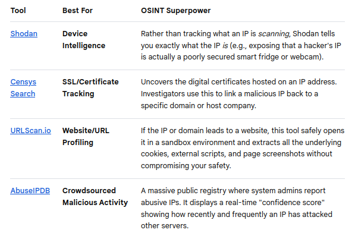

# Advanced Searching

## Google Dorking
- Google Dorking utilizes advanced search operators to filter, isolate, and uncover publicly indexed data.

### Core Google Dork Operators
- `site:` – Restricts results strictly to a specific domain or TLD (e.g., site:gov).
- `filetype:` / ext: – Filters by specific file extensions (e.g., filetype:xlsx).
- `intitle:` – Searches for explicit terms inside the webpage's title bar.
- `allintitle:` – Requires every word in the query to be present in the title.
- `inurl:` – Filters for specific strings or words found directly in the URL.
- `allinurl:` – Requires every word in the query to match the URL structure.
- `intext:` – Scans exclusively for keywords inside the visible body text of a webpage.
- `cache:` – Displays Google's last indexed snapshot of a webpage, even if deleted.
- `AROUND(X)` – Proximity search finding pages where two terms sit within X words of each other.
- `"" (Quotes)` – Forces an exact phrase match.
- `- (Minus)` – Excludes a specific keyword, site, or phrase from the results.

### High-Value OSINT Combinations (By Use Case)
The most practical applications of these operators are categorized into standard intelligence-gathering objectives:

1. **Domain & Subdomain Enumeration**
- Find hidden infrastructure, dev environments, or staging platforms without actively interacting with the target.
- `site:target.com -www -shop -blog`

2. **Exposed Sensitive Files & Leak Hunting**
- Locate public spreadsheets containing logs, employee rosters, financials, or database backups.
- `site:target.com filetype:xlsx OR filetype:docx OR filetype:pdf "confidential"`
- `site:target.com intitle:"index of" "backup" OR "dump"`

3. **Credentials & API Secrets Discovery**
- Search file metadata and public code configurations for hardcoded environment keys, configuration tokens, or passwords.
- `site:github.com OR site:pastebin.com "target.com" "api_key" OR "secret" OR "token"`
- `filetype:env "DB_PASSWORD"`

4. **People Tracking & Profile Cross-Searching**
- Locate resume documents, public email layouts, or specific staff footprint databases.
- `site:://linkedin.com "target company"`
- `"target name" filetype:pdf resume OR cv`
- `site:target.com intext:"@target.com" filetype:xls OR filetype:csv`

5. **Finding Exposed Login & Management Panels**
- Isolate administrative consoles, system access portals, or vulnerable web panels left exposed to the open web.
- `site:target.com inurl:admin OR inurl:login OR inurl:setup`
- `site:target.com intitle:"dashboard" OR intitle:"control panel"`

### OSINT Workflow Automation & Verification
When scaling up your investigation, manual dorking can trigger Google Captchas. You can cross-reference, automate, or verify your dorks using these specialized platforms:
- The **Offensive Security Exploit Database (GHDB)**: Use their classified dork repository to look up hyper-specific query structures for IoT devices, firewalls, and unique software stacks.
- **ShadowDragon Google Dork Assistant**: Use this free assistant to dynamically construct complex queries via a clean user interface without memorizing exact operator constraints.
- **Automation Frameworks**: For bulk domain mapping, tools like theHarvester automate the execution of multiple dork variables safely.

 
 

## Google Maps
- https://www.google.com/maps
- While everyday users rely on it for basic navigation, OSINT investigators exploit its metadata, historical imagery, and URL structures to gather intelligence.

### Advanced OSINT Features in Google Maps

- **Historical Street View (Time Travel):** You can access an archive of past Street View captures dating back to 2007. This allows investigators to track changes in storefronts, identify old signage, note structural modifications to buildings, or see what vehicles were frequently parked at a location over a decade.

- **Metadata and Exact Coordinates:** Google Maps uses precise decimal degrees in its URLs. Extracting these exact coordinates allows you to cross-reference locations across other geospatial tools (like Earth Explorer or Sentinel Hub) to verify satellite data without losing precision.

- **Sun Position and Shadow Analysis (Chronolocation):** By combining Google Maps' 3D Satellite view with the exact date and time a photo was taken, investigators can analyze the angles and lengths of shadows cast by buildings or trees. This helps estimate or verify the exact time of day an event occurred.

- **User-Contributed Photo Spheres:** Beyond official Google Street View cars, independent users frequently upload 360-degree photo spheres. In remote, restricted, or war-torn conflict zones where Google cars cannot travel, these user-submitted spheres provide critical, ground-level ground truth.

- **Reviewer Profile Exploitation:** Clicking on a user who reviewed a business reveals their public Google Maps profile. Investigators can analyze their entire review history, uploaded photos, and timelines to establish a target's patterns of life, frequent locations, and potential associates.

- **Custom Mapping via My Maps:** Investigators use Google My Maps to build private, layered intelligence databases. You can plot cellphone tower locations, map out a suspect's known addresses, sketch crime scene perimeters, and import large datasets (CSV/KML) to visualize geographic correlations.

### URL Triangulation Secrets for Investigators
The URL string of Google Maps changes dynamically and contains valuable data parameters that advanced investigators manipulate manually:

- **The `@` Parameter:** Contains the exact latitude, longitude, and camera zoom level (e.g., @40.7127,-74.0059,17z).

- **The `data=` Parameter:** Contains hex-encoded strings that dictate the exact imagery date, heading, pitch, and unique panorama IDs (panoid). Copying a panoid allows you to save and share the exact camera angle and vintage of a specific piece of evidence before it is updated or removed.

### Enhancing Google Maps with Extensions
To maximize Google Maps for OSINT, investigators rarely use it in isolation. They pair it with specific browser extensions and external tools:

1. **`Mapillary` & `KartaView`:** Crowdsourced street-level imagery platforms that often capture angles, backstreets, and dates that Google Maps missed.

2. **Google Earth Pro (Desktop Client):** Offers vastly superior historical satellite imagery timelines compared to the standard web version of Google Maps, allowing you to slide back through years of aerial photos.

 
 

## Google Images
- https://www.google.com/imghp
- OSINT investigators use free Google Images and Google Lens features to uncover hidden details, track down origins, and verify data.

### Reverse Image Search Modifiers
When using Google Images on a desktop, you can combine your visual search with text-based Google search operators to filter results drastically.

- **Filter by site:** Upload an image and add `site:instagram.com` or `site:linkedin.com` in the search bar to find if that specific image appears on those platforms.

- **Exclude terms:** Upload an image and type `-pinterest` to remove Pinterest clutter from your results.

- **Find specific file types:** Add `filetype:jpg` or `filetype:png` to hunt for specific formats.

###  Isolation and Cropping (Visual Anchors)
Investigators rarely search a whole image if it contains multiple objects. Google Lens allows you to adjust the bounding box corners to focus on tiny, specific details.

- **Crop for clues:** Focus strictly on a unique window frame, a distant mountain ridge, a car license plate, or a logo on a shirt.

- **Identify equipment:** Crop tightly on a security camera, a military patch, or a street lamp to determine the exact model and country of origin.

### Geolocation via Visual Landmarks
Google Lens is highly optimized for recognizing geographical markers that help investigators pinpoint where a photo was taken.

- **Architectural matching:** Lens can identify specific patterns in paving stones, historical building styles, or unique utility poles.

- **Natural features:** It maps flora, rock formations, and mountain silhouettes to known geographic regions.

### Text Extraction for Verification (OCR)
Beyond basic translation, the Optical Character Recognition (OCR) engine in Google Lens is a powerful verification tool.

- **Metadata matching:** Extract serial numbers, flight numbers, or shipping container codes from the image text, then cross-reference them with public logistics databases.

- **Time-stamping:** Copy text from signs or posters in the background to find local business names, which can be checked against registry databases to confirm if a business is still open or when it operated.

### Tracking Image History
You can use Google Lens to build a timeline of when and where an image first appeared.

- **Find the original context:** By looking at all indexed sources, investigators can find the oldest upload of an image. This reveals if a photo is being used out of context (e.g., an old war photo being passed off as current news).

- **Detect digital manipulation:** Comparing your uploaded image against the search results can instantly reveal if elements were photoshopped, cropped, or flipped horizontally.

### Other Free Image Search Engines

#### Yandex Visual Search
Yandex is a Russian search engine, and its reverse image search is entirely free via its website or mobile app.
- **Facial Recognition:** It uses a highly powerful facial recognition algorithm that outperforms Google Lens for matching human faces.
- **Angle Matching:** It can find matches even if the person in the photo is turned sideways or in low lighting.

####  InVID / WeVerify
This is a free, open-source browser extension funded by the European Union specifically for journalists and human rights investigators.
- **Video Deconstruction:** You paste a YouTube, Facebook, or X (Twitter) video link, and it automatically chops the video into keyframe images.
- **Forensic Analysis:** It includes built-in filters (like Lens Flare and Ghosting analysis) to detect if an image has been digitally altered or photoshopped.

 
 

## Google Alerts
- https://www.google.com/alerts
- OSINT investigators treat **Google Alerts** as a **passive monitoring system** and a **digital tripwire**. Instead of manually searching for updates every day, they use it to force Google to automatically email them the moment new information is indexed on the surface web.

### Advanced "Google Dorking" Integration
Investigators do not just type a person's name into Google Alerts. They inject complex search operators (known as Google Dorks) into the alert box to bypass generic news and catch deeply specific file uploads.

- **Document Leak Monitoring:** An investigator tracking a corrupt entity might set an alert for: `filetype:pdf "Confidential" "Company Name"`. If a disgruntled employee leaks a corporate PDF matching that description, the investigator receives an instant notification.

- **Filtering Noise:** To track sensitive events without getting flooded by generic training or marketing spam, they use negative filters: `intext:"active shooter" -training -exercise -consulting`.

### Social Media Live-Tracking
While Google cannot scrape every private social media post, it constantly indexes public profiles, forum threads, and handles.

- **Username/Handle Alerting:** If a target or a person of interest goes radio silent, investigators will set an alert for their known handle across specific domains: `site:instagram.com "target_handle"` or `site:reddit.com "target_handle"`. The moment that user makes a public post or gets tagged in a new thread that Google indexes, the investigator gets an alert.

### Cyber Threat Intelligence & Asset Monitoring
Security-focused OSINT professionals use alerts to spot data breaches or compromised infrastructure before they hit mainstream technical news.

- **Leaked Credentials Tripwires:** Corporations set up alerts for their unique, internal domain configurations or IP ranges. If a text snippet containing "`://company.com`" pops up on a random public forum, pastebin site, or code repository, it acts as an immediate warning of an active data leak.

- **Defacement and Hijacking Alerts:** Threat hunters set alerts for their own company domains combined with common exploit or spam terms (e.g., `site:mycompany.com "casino" OR "crypto scam"`) to immediately discover if their site has been silently hacked and used to host malicious links.

### Dynamic Timeline Building
For long-term tracking of fugitives, missing persons, or ongoing geopolitical conflicts, Google Alerts acts as a timeline builder.

- **Geographical Tracking:** Investigators pin alerts to specific rare place names or coordinates mentioned in local print blogs: `"Target Name" AND "Specific Small Village"`.

- **Corporate Entity Changes:** Setting alerts for specific business registry numbers allows investigators to catch sudden shell-company re-registrations or executive changes published in niche foreign gazettes.

### Weaponizing the RSS Option (The Professional Setup)
Receiving dozens of individual emails can ruin an investigator’s OpSec (Operational Security) and clutter their inbox.
- **How they use it:** Instead of choosing "Deliver to: Email", investigators click "Show options" and change it to **"Deliver to: RSS feed"**.

- They pipe these generated RSS links directly into professional OSINT dashboards, Discord Webhooks, or RSS readers (like Feeder.co or Inoreader). This centralizes their passive intelligence stream into an encrypted workspace without exposing their real email to Google's delivery systems.

 
 

## Geolocation
An investigator needs tools that find locations through pixels and clues, or advanced privacy-first metadata analysis.

### For "Pixel-Only" AI Geolocation (No Metadata)
When an image has no coordinates embedded, these free tools use AI to analyze terrain, flora, architecture, and visual indicators to guess the location.

- **Lenso.ai:** An incredibly powerful, free AI visual search tool built specifically to analyze landscapes and buildings. It is highly effective at matching obscure vacation spots or city streets by examining patterns across millions of online images.

- **Picarta.ai:** Uses artificial intelligence to look at the actual pixels of a photo (mountains, trees, road markings) and predicts the exact country or coordinates, even if the photo was taken in a remote area with zero Street View coverage.

### For True, Deep EXIF Metadata Extraction
If you are handed an original, raw image file from a target, you want a dedicated metadata forensics tool rather than a standard web map viewer.

- **Jeffrey's Image Metadata Viewer:** The undisputed classic, absolute gold standard for OSINT analysts. It extracts deep, hidden technical headers that basic sites ignore—showing not just GPS coordinates, but exact camera serial numbers, lens settings, software editing history, and true creation timestamps.

- **GeoTag.world:** A modern, completely free alternative that maps out embedded metadata instantly while prioritizing user privacy by processing everything quickly inside your browser session.

### For Privacy-Safe Internal Inquiries
When dealing with sensitive or classified evidence, uploading files to public web tools like **GeoImgr** violates operational safety (OpSec) because your files sit on their servers.

- **GeoMakers EXIF Viewer:** Unlike most web tools, this processes your image entirely inside your browser using local client-side JavaScript. Your photo is never transmitted to an external server, keeping the data completely confidential.

- **ExifTool (by Phil Harvey):** A free, command-line desktop application. It has zero graphical interface, but it is the single most powerful tool used by professional forensic investigators globally because it runs locally on your machine and cannot be blocked by an internet outage.

 
 

## Greynoise
- https://viz.greynoise.io/

- is an online portal used by cybersecurity analysts and OSINT investigators to filter out "internet background noise".

- Every second, thousands of automated bots, scanners, and crawlers sweep the globe probing for open doors, vulnerable servers, and exposed cameras. When an investigator spots a suspicious IP address probing an asset, GreyNoise acts as an immediate filter to determine if an IP is a **global, broad scanner** (meaning it scans everyone indiscriminately) or if it is conducting a **targeted, focused attack**.

### Key OSINT Capabilities of GreyNoise
Instead of manually diagnosing traffic logs, GreyNoise allows investigators to utilize specific features:

- **Triage Intent:** It tags IPs dynamically as **Benign** (like Google or Shodan indexers), **Unknown**, or **Malicious** (like known malware botnets or credential stuffers).

- **Vulnerability Mapping:** You can see exactly what an IP is searching for. For instance, a quick search will show you if an IP is looking for a specific vulnerability (CVE).

- **Spoofing Detection:** GreyNoise exposes compromised infrastructure. It will flag if a routine web host is secretly being used to blast out malicious scan traffic.

### Are There Better Free Alternatives?
While GreyNoise is the undisputed king of isolating "noise" vs. "targeted traffic", investigators rarely rely on just one platform. Depending on what you want to uncover about an IP address, several free platforms are better suited for different niches:

