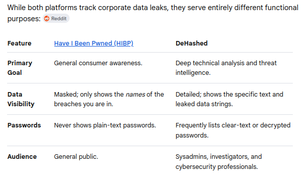
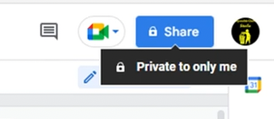
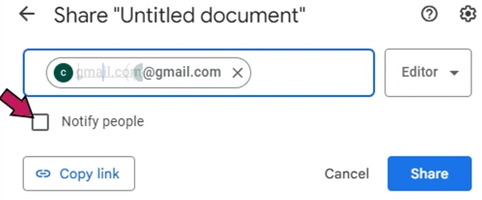

# People Searching

## Black Book Online
- is a free, decentralized public records directory and search engine used in Open Source Intelligence (OSINT) **to find direct links to official government and corporate databases**.
- It serves as a **resource for locating criminal, property, and professional records**, while also functioning as the digital companion to "The Investigator's Little Black Book".
-  is **not completely free**; it operates on a "freemium" model. While you can perform basic searches and set up light tracking without paying, viewing the actual sensitive data requires a paid subscription or pay-as-you-go credits.
- **Access it here:** https://www.blackbookonline.info/

 

## DeHashed
- is a specialized cybersecurity search engine **used to find leaked credentials and personal data from deep web assets and historical data breaches**.
- It allows individuals, security professionals, and law enforcement agencies to **track compromised digital identities and prevent identity theft**.
- Unlike standard security tools that only tell you if you were breached, DeHashed provides actionable, deep-level data insights.
- **Access it here:** https://dehashed.com/

 

## Have I Been Pwned
- is a free website that **checks if your email address or phone number has been compromised in a data breach**.
- Created by cybersecurity expert Troy Hunt, it lets you safely search billions of leaked records to see exactly which companies or sites exposed your personal information.
- **DeHashed vs. Have I Been Pwned**

- **Access it here:** https://haveibeenpwned.com/

 

## Webmii
- is a **people search engine and online reputation tool** that aggregates publicly available information from across the web.
- By entering an individual's first and last name, users can view a compiled profile of social media accounts, professional listings, news mentions, and images.
- **Key Features** 
    - **Visibility Score:** Calculates a numerical rating indicating how prominent a person's digital footprint is online.
    - **Homonym Filters:** Allows users to narrow down search results by adding specific keywords or locations to separate people with identical names.
    - **Data Aggregation:** Pulls live public data dynamically rather than storing a private database of personal records.

 

## Linkedin
- Open-Source Intelligence (OSINT) professionals rely heavily on LinkedIn because it serves as a massive corporate directory, revealing org charts, employee locations, internal technologies, and personal connections.
- Operating with a real identity risks alerting the target and triggering a counter-response. To remain anonymous, investigators deploy specialized fake personas.
- **Building a Convincing Sock Puppet:**
    - **Isolated Infrastructure:** Built using dedicated, burner hardware or virtual machines. They connect through high-quality residential proxies or VPNs so LinkedIn does not link the account to the investigator's actual IP address or geographic location.
    - **AI-Assisted Personas:** Real-sounding names and resumes are designed. AI-generated or heavily edited portraits are sometimes used to avoid easy reverse-image searches.
    - **The "Boring" Persona:** They mimic common, low-threat profiles. A target will ignore an invite from a blank profile, but they are highly likely to accept a connection request from a regional corporate recruiter or a data analyst within their same industry.
    - **Gradual Warming:** Investigators do not immediately search for targets. They let the account sit, add non-target connections slowly, and write brief, generic comments to look like a normal, active user.

 

## Family Tree
- While `FamilyTree.com` itself functions primarily as a genealogy advice blog, directory, and hub for reviewing historical record repositories, using genealogy and family tree platforms is a highly effective, often overlooked strategy in Open Source Intelligence (OSINT).
- When investigators refer to "FamilyTree" for OSINT, they are usually leveraging massive collaborative family tree databases like FamilySearch, FamilyTreeNow, WikiTree, or Ancestry to build out a target's network.
- Access it here: https://www.familytree.com/
- Or you could also try `geni` that does the same thing: https://www.geni.com/ 

 

## Unmask Google Users Using Google Docs
If you only have a gmail address and you want to know the name of that account's owner. Follow the steps below. 

1. Go to google docs and share a blank document/folder.

2. Make sure to **uncheck** the 'Notify poeple', because we don't want them to know that we are sharing a document.

3. Click the **Share** button.

4. Then go back to the shared document to view the gmail address with the name of the owner.