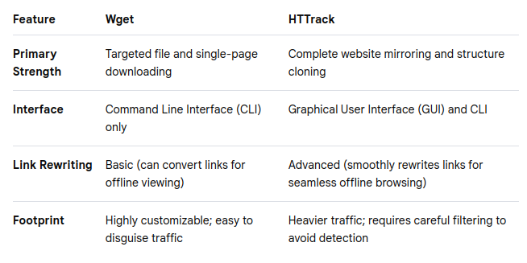

# Website Osint

## Spiderfoot
- is an **open-source, automated reconnaissance and intelligence-gathering tool** designed for cybersecurity professionals and researchers.
- automates the process of Open Source Intelligence (OSINT) collection by **querying over 100 public data sources simultaneously to map out an asset's digital footprint**.

#### Key Uses
- **Target Reconnaissance:** Mapping out domain names, IP addresses, netblocks, and subdomains during the initial phases of a penetration test.
- **Data Leak Detection:** Scanning public repositories and dark web sources to identify exposed credentials, API keys, or sensitive corporate files.
- **Threat Intelligence:** Identifying malicious infrastructure by cross-referencing targets against known blacklists and threat feeds.
- **Attack Surface Management:** Helping organizations view their own internet-facing infrastructure from an attacker's perspective to discover forgotten or unpatched assets.
- **Fraud Investigation:** Gathering background intelligence on email addresses, phone numbers, and usernames for digital forensics or fraud analysis.

 
 

## wget and HTTrack
Both are powerful, command-line and graphical tools used by investigators to clone websites, preserve evidence, and conduct offline analysis without alerting the target.

### wget
Wget is a free, command-line utility used for downloading files from the web using HTTP, HTTPS, and FTP protocols. It is lightweight, pre-installed on most Linux distributions, and highly efficient for targeted data scraping.

#### Key Uses
- **Evidence Preservation:** Downloads exact copies of specific web pages, images, or PDFs to create a local, forensic backup of a target's online content.
- **Media Scraping:** Automates the extraction of specific file types (like `.jpg, .mp4,` or `.pdf`) from a target directory or forum.
- **Log-In Navigation:** Uses cookies and custom user-agents to bypass basic access controls and scrape restricted or member-only forums.
- **Automated Intelligence Gathering:** Runs via cron jobs or scripts to periodically check and download updates from a target site over time.

### HTTrack
HTTrack is an open-source website crawler and archiver. Available as both a command-line tool and a graphical user interface (GUI), it is specifically designed to download an entire website recursively to a local directory.

#### Key Uses
- **Full Website Clones:** Mirrors an entire target website, including its original directory structure, HTML, images, and files, for comprehensive offline review.
- **Offline Link Analysis:** Allows investigators to safely browse a target's website offline, preventing the investigator's IP address from hitting the live site during deep navigation.
- **Disaster / Takedown Insurance:** Captures volatile websites (such as extremist forums, scam pages, or temporary blogs) before they are taken down by the host or altered by the suspect.
- **Hidden Asset Discovery:** Crawls deep into a site's architecture to uncover forgotten, unlinked, or archived pages that are not easily visible via standard browsing.

### Comparison

 
 

## Metagoofil
- is an open-source command-line tool designed **for extracting metadata** from public documents available on a target's website.
- **uses Google search queries to find and download specific file types, then parses their internal metadata** to help cybersecurity professionals map out an organization's network and personnel.

#### Key Uses
- **Information Gathering:** Extracting usernames, paths, and software versions hidden inside public corporate documents.
- **Network Mapping:** Discovering internal server names, local folder structures, and network paths revealed by document creation logs.
- **Social Engineering Prep:** Collecting real employee names and email addresses to design highly targeted phishing simulations.
- **Software Auditing:** Identifying outdated or vulnerable office suites used by the target organization based on document creation tags.
- **Data Leak Prevention:** Helping organizations audit their own public websites to find and remove sensitive metadata before attackers exploit it.

 
 

## Webpage Cache / History

### Wayback Machine
- is a **free, digital archive that captures and stores historical snapshots of the public internet**. In Open Source Intelligence (OSINT), it serves as a digital time machine, allowing investigators to view how websites looked weeks, months, or decades ago.
- **Access it here:** https://web.archive.org/

#### Key Uses
- **Recovering Deleted Content:** Retrieving critical information, such as scrubbed blog posts, removed social media updates, or deleted team pages.
- **Tracking Website Alterations:** Comparing different chronological snapshots to spot edited press releases, modified policies, or changed contact details.
- **Discovering Exposed Endpoints:** Scraping the archive's **CDX API** to find old URLs, forgotten configuration files, or exposed .env files containing credentials.
- **Preserving Digital Evidence:** Using the "Save Page Now" feature to lock a live webpage into a permanent archive link to counter future deletion or link rot.
- **Investigating Disinformation Networks:** Digging into historical source code to extract legacy Google Analytics trackers (UA codes), which can link multiple shell websites to a single threat actor.
- **Tracking Fraudulent Lifecycle:** Mapping out the timeline of scam domains, active e-commerce fraud, or old login portals from companies before they went out of business.

### archive ph
- works almost the same way like wayback machine
- **Access it here:** https://archive.md/

 
 

## BetaMeta
- is a specialized cybersecurity and digital forensics tool that functions as a Temporal Analysis Engine, **designed to extract and visualize hidden chronological details from websites**.
- is a platform that analyzes temporal signatures—including creation dates, archive snapshots, and SSL history—to map the lifecycle and verify the legitimacy of a URL.
- **Access it here:** https://meta.narka.io/

 
 

## dotDB
- is a specialized big data search engine and SaaS platform **designed for researching, tracking, and valuing domain names** across multiple extensions (TLDs).
- enables users to gauge market demand, monitor keyword trends, generate live website snapshots, and track domain portfolio changes. 
- **Access it here:** https://dotdb.com/