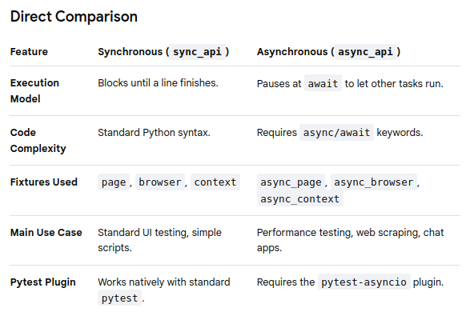

# 01. Setup Environment & Writing Tests

## Introduction
- **Python** - programming language
- **Pytest** - testing framework developed using Python
- **Playwright** - is available as a plugin on top of Pytest

## Installation (with `uv`)
```bash
uv init
uv add --dev pytest-playwright  
uv run playwright install       # To install playwright browsers

uv run pytest                   # To run the test
```

## Conventional Project Folder Structure (with `uv`)
```
playwright-tests/
├── .github/
│   └── workflows/
│       └── playwright.yml      # CI/CD automation pipeline
├── page_objects/               # Page Object Model (POM) directory
│   ├── __init__.py
│   ├── base_page.py            # Common browser interaction helpers
│   ├── login_page.py           # Specific page selectors and actions
│   └── dashboard_page.py
├── tests/                      # Core test suite folder
│   ├── conftest.py             # Global fixtures, hooks, and browser setups
│   ├── test_auth.py            # Authentication test cases
│   └── test_dashboard.py       # Feature-specific test cases
├── test_artifacts/             # Ignored directory for test run outputs
│   ├── screenshots/            # Saved images on test failures
│   ├── videos/                 # Recorded browser sessions
│   └── traces/                 # Playwright trace viewer zip files
├── .gitignore                  # Excludes venv, tokens, and test_artifacts/
├── pyproject.toml              # Project metadata and pytest configurations
└── uv.lock                     # Strict uv dependency lockfile
```

### Core Directory Breakdown
1. **The `tests/` Directory & `conftest.py`**

    - Keep all your actual test files inside a dedicated `tests/` folder. Every test file name must start with `test_` for the runner to detect it.

    - Place a `conftest.py` file directly inside this folder. It is automatically loaded by the framework and holds shared setups, such as custom login credentials, API state injection, or global teardown steps.

2. **The `page_objects/` Directory**

    - As your test suite scales, avoid hardcoding UI selectors (like IDs or CSS classes) inside your tests. Use the **Page Object Model (POM)**.
        - Create a `page_objects/` directory at the root level.
        - Define a class for each web page. The class houses the selectors and specific action methods (e.g., `login_page.enter_credentials()`), keeping your tests highly readable and easy to maintain when the UI changes.

3. **The `test_artifacts/` Directory**

    - Playwright can record videos, capture screenshots on failure, and generate detailed interaction traces.
        - Route these files into a centralized output directory at the root level.
        - Ensure this folder is added to your `.gitignore` file so large binary video and image files are never accidentally committed to your repository.

### Recommended `pyproject.toml` Configuration
To tie this structure together cleanly, configure your `pytest` defaults directly inside your `pyproject.toml` file. This eliminates the need to pass long CLI arguments every time you execute a test:
```
[tool.pytest.ini_options]
testpaths = ["tests"]
addopts = """
    --browser chromium \
    --headed \
    --screenshot=only-on-failure \
    --video=retain-on-failure \
    --output=test_artifacts/
"""
```

## Writing your first playwright test
```py
# test_playwright.py
from playwright.sync_api import Page, expect


# Verify the URL
def test_verifyPageUrl(page: Page):
    page.goto("https://www.google.com/")  # passing url

    # Put the URL in a variable
    my_url = page.url
    print("URL of the application:", my_url)

    expect(page).to_have_url("https://www.google.com/")  # expected url


# Verify the title
def test_verifyTitle(page: Page):
    page.goto("https://www.google.com/")

    # Put the title in a variable
    my_title = page.title()
    print("Title of the page:", my_title)

    expect(page).to_have_title("Google")

```

## Modes of Execution
1. **Headless** (default) - no UI. For example, to run the above test: `uv run pytest test_playwright.py`

2. **Headed** - We can see the UI with the interactions. Example: `uv run pytest test_playwright.py -s -v --headed`

### Flags:
- `-s` (No Capture): "Don't hide my print() statements or block my debugging tools."

- `-v` (Verbose): "Tell me exactly which test is running right now, line by line."

- `--headed`: "Let me visually watch the browser open up and click through the website."

- `--browser`: "To let you choose which browser you want to use. If you did not specify, it will use the default 'chromium' browser."


### Testing a specific function
- From the 'test_playwright.py' example above, if we want to test the 'test_verifyTitle' only, run: `uv run pytest test_playwright.py::test_verifyTitle -s -v --headed` 

### Parallel Testing Execution
- `pytest-xdist` is a plugin that extends pytest with new test execution modes, most notably looponfail and parallel test execution across multiple CPU cores or workers.

- How to implement:
    - Install the plug-in: `uv add --dev pytest-xdist`
    - Use the `-n` flag: 
        ```bash
        # Automatically spawn workers equal to your available CPU cores
        pytest -n auto

        # Specify an exact number of parallel workers
        pytest -n 4
        ```
        
<br>

## Synchronous vs Asynchronous

- In pytest-playwright, the choice between **Synchronous (sync)** and **Asynchronous (async)** determines how your test code executes: **Sync runs line-by-line, blocking execution** until a task finishes, while **Async runs non-blocking tasks concurrently**, allowing other code to execute while waiting for network responses.

- Here is a comprehensive breakdown to help you choose the right approach for your testing framework.



### Synchronous Testing (Sync)
The synchronous API is the **easiest to write and read**. It behaves exactly like standard Python scripts. Each line of code must fully complete before the program moves to the next line.
```py
# test_sync.py
def test_google_search(page): # Uses standard sync page fixture
    page.goto("https://google.com")
    page.fill("textarea[name='q']", "Playwright")
    page.press("textarea[name='q']", "Enter")
    assert "Playwright" in page.title()
```
- **Pros**: Clean syntax, no boilerplate code, highly readable.
- **Cons**: Cannot perform concurrent operations within a single test execution thread.

### Asynchronous Testing (Async)
- The asynchronous API is built for **speed and concurrency**. It is ideal when you need to handle long-running operations simultaneously, such as listening to WebSockets while filling out a form, or triggering multiple API calls in parallel.
```py
# test_async.py
import pytest

@pytest.mark.asyncio # Requires pytest-asyncio to run
async def test_google_search_async(async_page): # Uses async page fixture
    await async_page.goto("https://google.com")
    await async_page.fill("textarea[name='q']", "Playwright")
    await async_page.press("textarea[name='q']", "Enter")
    assert "Playwright" in await async_page.title()
```
- **Pros**: Highly efficient for data scraping, handling real-time events, or running concurrent background tasks.
- **Cons**: Slightly steeper learning curve due to mandatory `async` and `await` keywords. Missing an `await` can lead to silent test failures or unhandled promises.

### Key Technical Rule for Pytest
- You **cannot mix** sync and async fixtures in the same test file seamlessly.

### Which one should you choose?

- **Choose Sync if**: You are building **standard functional end-to-end (E2E) web automation tests**. It reduces cognitive load and keeps your test suites maintainable.

- **Choose Async if**: Your app relies heavily on **real-time event streaming**, or you need to optimize **massive data scraping** jobs by triggering parallel browser contexts within a single script.

