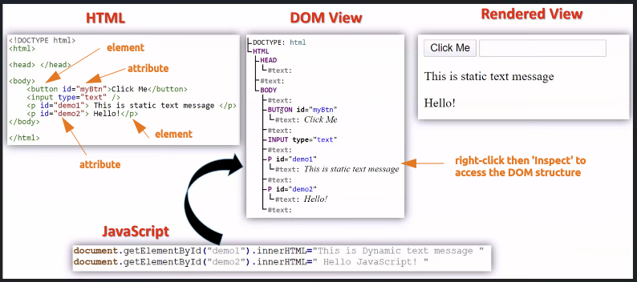
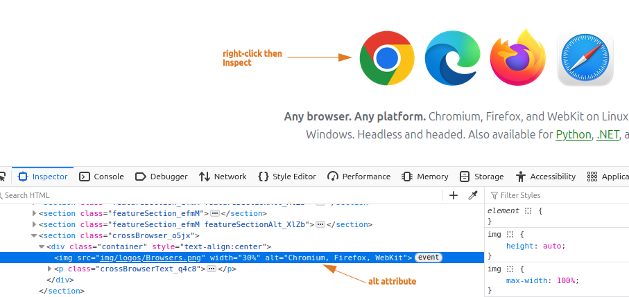
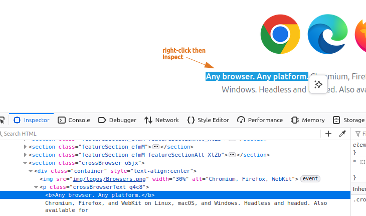
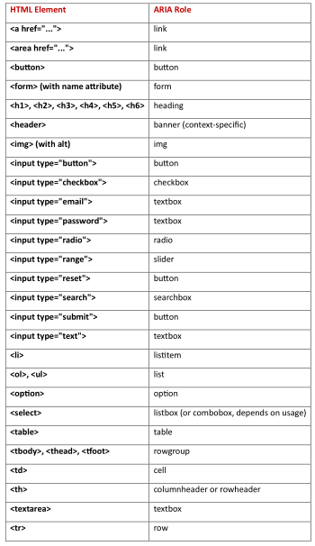
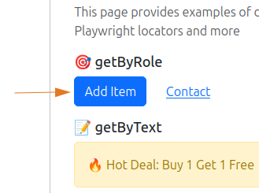
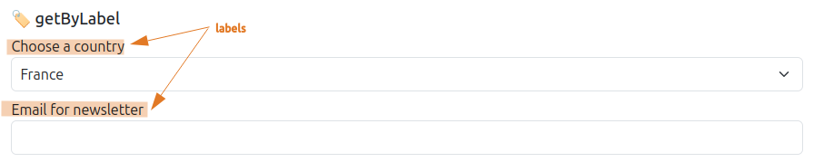
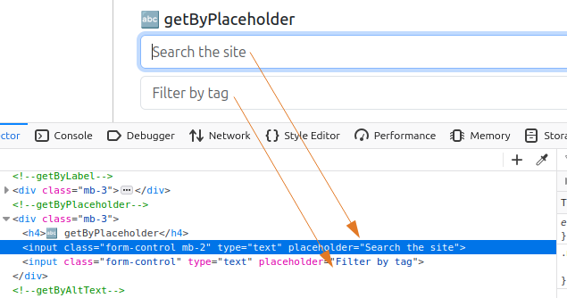
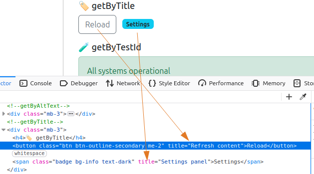
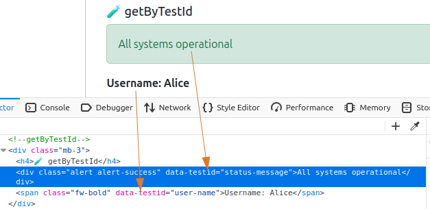

# 02. Playwright Built-In Locators
- [Playwright Documentation: Locators](https://playwright.dev/python/docs/locators)

## Elements and Attributes Basics



<br>

## page.get_by_alt_text()
- To locate an element, usually image, by its text alternative.
- Example: Locate the 'alt' attribute of the 'website icons logo'.



```py
# test_locators.py
from playwright.sync_api import Page, expect

def test_verify_locators(page: Page):
    page.goto("https://playwright.dev/python/")
    # Use 'wait for timeout' just to pause and see the page for a specified time. This is not required.
    page.wait_for_timeout(5000)  # 5000ms = 5 seconds
    logo = page.get_by_alt_text("Chromium, Firefox, WebKit")
    expect(logo).to_be_visible()
```
```
uv run pytest test_locators.py -s -v --headed
```
<br>

## page.get_by_text()
- To locate by text content.
- Example: Locate the text 'Any browser. Any platform.'



```py
import re  # when you want to use Regular Expressions (Regex)

from playwright.sync_api import Page, expect


def test_verify_locators(page: Page):
    page.goto("https://playwright.dev/python/")

    # get_by_text(), you can choose on the 3 examples below
    expect(page.get_by_text("Any browser. Any platform.")).to_be_visible()  # full text
    expect(page.get_by_text("Any browser. Any")).to_be_visible()  # partial text
    expect(page.get_by_text(re.compile(".*browser. Any.*"))).to_be_visible()  # use re.compile() if you want to use regex
```

<br>

## page.get_by_role()
- is not an attribute of an element, and we cannot see it in the DOM of the webpage.
- every element has a certain role - a button, or a checkbox, or a header, etc.
- **List of common HTML elements and their corresponding ROLES**



- Example: Locate the 'Add Item' button.



```py
from playwright.sync_api import Page, expect

def test_verify_locators(page: Page):
    page.goto("https://practice.expandtesting.com/locators")
    role = page.get_by_role("button", name="Add Item")
    expect(role).to_be_visible()
```

<br>

## page.get_by_label()
- to locate a form control by associated label's text.



- Example: Locate the label 'Choose a country' and select the option 'Japan'. Locate the label 'Email for newsletter' and fill it by 'name@test.com'.
```py
from playwright.sync_api import Page

def test_verify_locators(page: Page):
    page.get_by_label("Choose a country").select_option(label="Japan")
    page.get_by_label("Email for newsletter").fill("name@test.com")
```

<br>

## page.get_by_placeholder()
- to locate an input by placeholder.



- Example: Locate the placeholder 'Search the site' and fill it with 'Hello'.

```py
from playwright.sync_api import Page

def test_verify_locators(page: Page):
    page.get_by_placeholder("Search the site").fill("Hello!")
```

<br>

## page.get_by_title()
- to locate an element by its title attribute.



- Example: Locate the title 'Refresh content', then click its button.

```py
from playwright.sync_api import Page

def test_verify_locators(page: Page):
    page.get_by_title("Refresh content").click()
```

<br>

## page.get_by_test_id()
- to locate an element based on its data-testid attribute (other attributes can be configured).



- Example: Locate the element that has a test id of 'status-message', and verifiy that it contains text 'All systems operational', and also verify that it has a class of'alert alert-success'

```py
from playwright.sync_api import Page, expect

def test_verify_locators(page: Page):
    expect(page.get_by_test_id("status-message")).to_contain_text(
        "All systems operational"
    )
    expect(page.get_by_test_id("status-message")).to_have_class("alert alert-success")
```