# 03. How to use CSS Locators in Playwright
- [Playwright Documentation: Locators](https://playwright.dev/python/docs/locators)

## Combinations of CSS Selector
- Note: 'tag' name is optional only. Example: In `tag#id`, `tag` name is optional only, you can just put `#id` instead of `tag#id`.

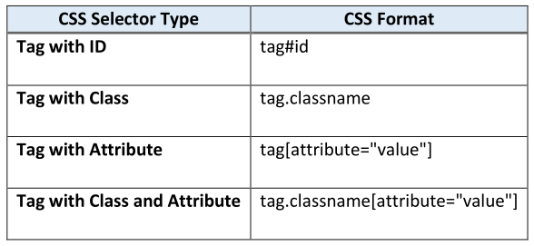

### Tag with ID
- Example: Select the input search bar by using `tag#id` combination, and fill it with 'macbook pro'.

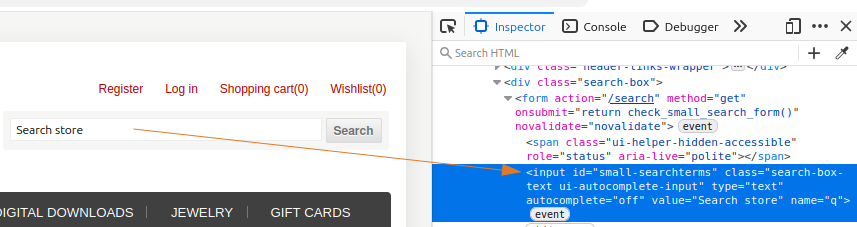

```py
from playwright.sync_api import Page

def test_verify_css_locators(page: Page):
    page.goto("https://demowebshop.tricentis.com/")
    page.locator("input#small-searchterms").fill("macbook pro")
    # tag name is only optional, so you can also write this as:
    # page.locator("#small-searchterms").fill("macbook pro")
```

### Tag with Class
- Example: Select again the input search bar (from the previous example), but now by using `tag.class` combination, and fill it with 'lenovo laptop'.

```py
from playwright.sync_api import Page

def test_verify_css_locators(page: Page):
    page.goto("https://demowebshop.tricentis.com/")
    page.locator("input.search-box-text").fill("lenovo laptop")
    # tag name is only optional, so you can also write this as:
    # page.locator(".search-box-text").fill("lenovo laptop")
```
- **Note**: In this example the full class name is `class="search-box-text ui-autocomplete-input valid"`, just copy the first part but **DO NOT INCLUDE** the words after a 'space', that's why we didn't include "ui-autocomplete-input valid".

### Tag with Attribute
- Example: Select again the input search bar (from the previous example), but now by using `tag[attribute="value"]` combination, and fill it with 'asus vivobook'.
```py
from playwright.sync_api import Page

def test_verify_css_locators(page: Page):
    page.goto("https://demowebshop.tricentis.com/")
    page.locator('input[name="q"]').fill("asus vivobook")
    # tag name is only optional, so you can also write this as:
    # page.locator('[name="q"]').fill("asus vivobook")
```

### Tag with Class and Attribute
- Example: Click the 'Search' button, by using `tag.class[attribute="value"]` combination.

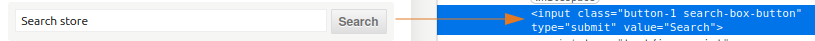

```py
from playwright.sync_api import Page

def test_verify_css_locators(page: Page):
    page.goto("https://demowebshop.tricentis.com/")
    page.locator("input.button-1[value=Search]").click()
    # tag name is only optional, so you can also write this as:
    # page.locator(".button-1[value=Search]").click()
```
- **Note**: Notice that in the class, we include just the first part, hence we ignore everything after the 'space' and didn't include 'search-box-button'

<br>

## 2 Main Types of Selectors
1. **Absolute** – Follow the full path to find the element.
2.  **Relative** – Find the element using a shortcut path.

### 1. Absolute CSS Selectors – Full Path
- These selectors **go step-by-step from the root (html) to the target element**, like following a complete map.
- Example: Locate the text - 'Basic Web Page Example' from the body tag.

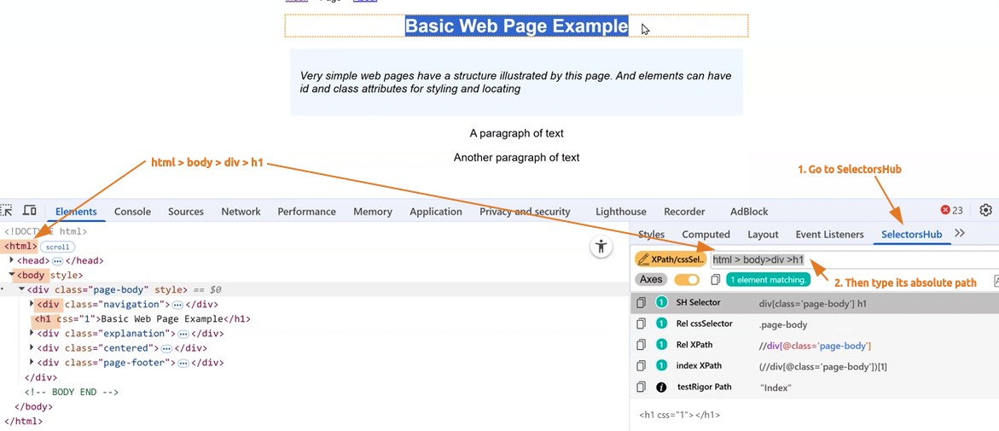

- Other examples:

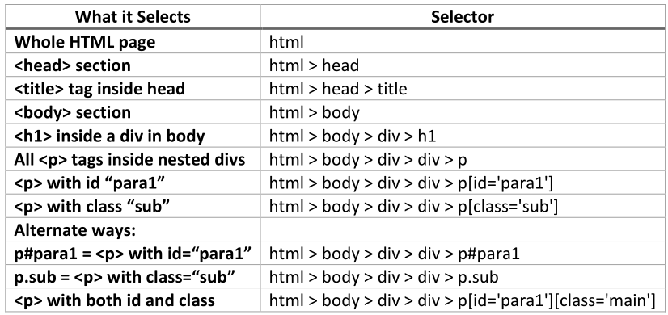

**Note**: Tools like `SelectorsHub` often avoid absolute paths because they’re long and fragile.

### 2. Relative CSS Selectors – Shortcuts
- These selectors **find elements directly without tracing the full path**.
- Example: Select the paragraph 'Another paragraph of text'.

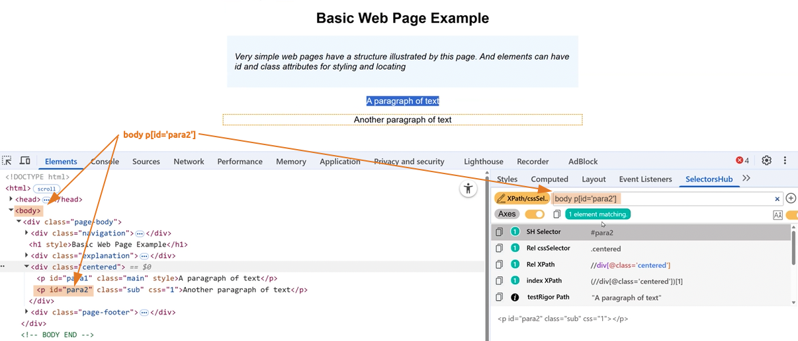

- Other examples:

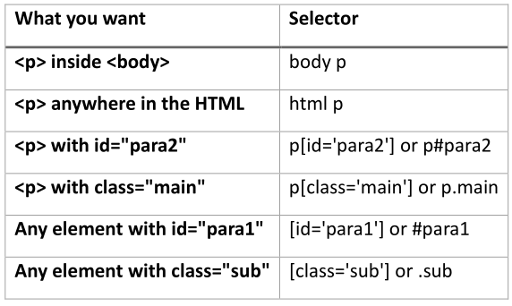

#### Selecting Specific Children
- You can select elements based on their **position** among siblings.

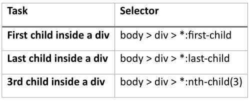

#### Attribute Selectors (Pattern Matching)
- Use these when you want to match part of an attribute's value.

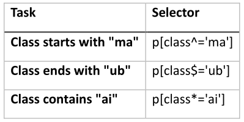

#### Combining Selectors
- You can combine selectors to filter even more specifically.

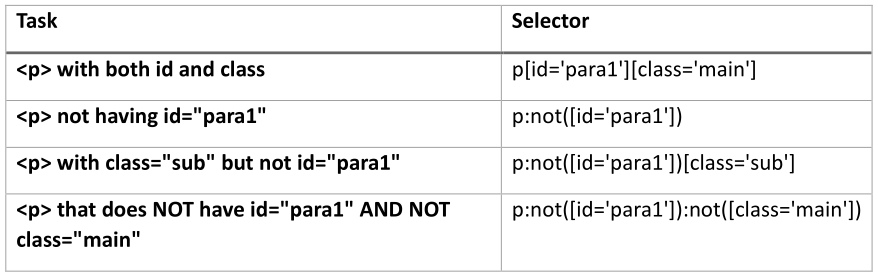

#### Following Sibling Selectors
- Used to select elements that come right after another element.

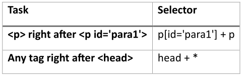

<br>

## How to Use the SelectorsHub extension
- Example: Locate the 'Advanced search' checkbox then click. URL is "https://demowebshop.tricentis.com/search?q=demo"

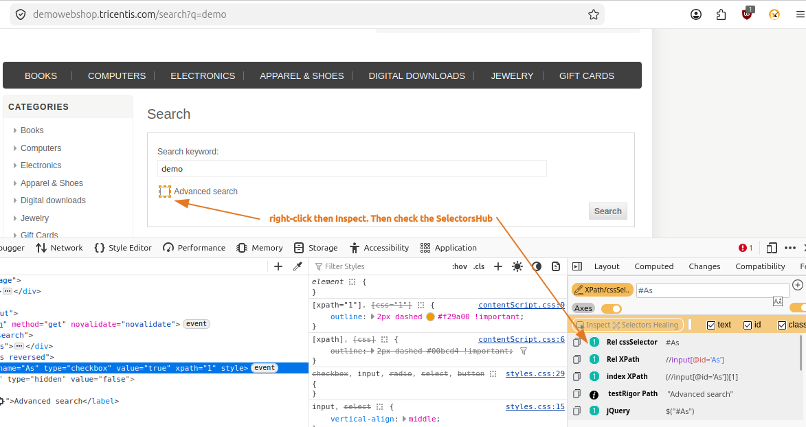
```py
from playwright.sync_api import Page

def test_verify_css_locators(page: Page):
    page.goto("https://demowebshop.tricentis.com/search?q=demo")
    page.locator("#As").click()
```