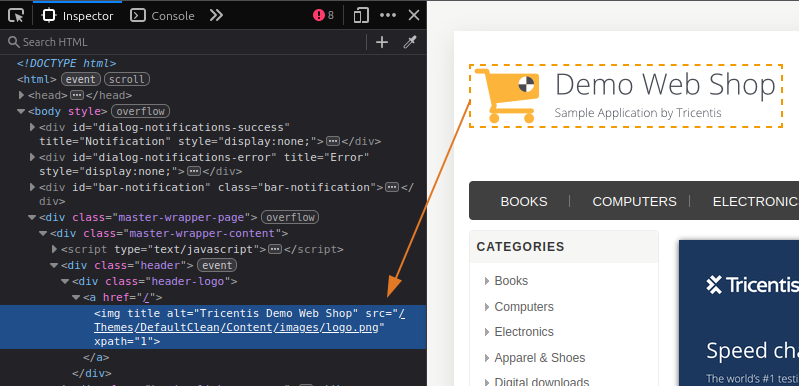
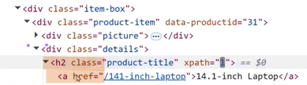
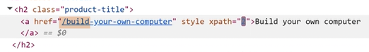
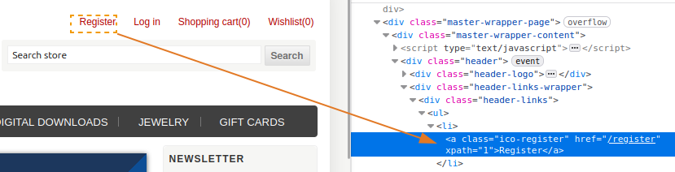
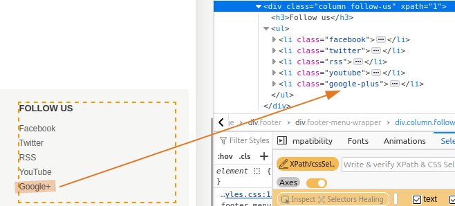
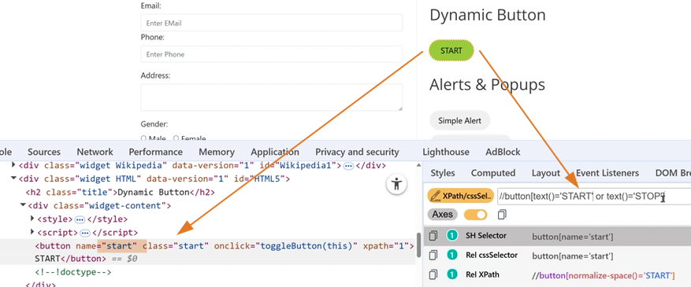

# 04. How to use XPath Locators in Playwright 
- [Playwright Documentation: Locators](https://playwright.dev/python/docs/locators)

## XPath
- XPath stands for **XML Path Language**.
- It is a **syntax used to navigate through elements and attributes** in an XML document.
- In web automation, XPath **is used to locate elements** on a webpage by their structure and attributes.

<br>

## Types of XPath

### 1. Absolute XPath (Full XPath)
- It starts with a single `/`, which represents the root node.
- **XPath Format:** `/html/body/div/div[2]/div[1]`
- Example: Locate the Logo of the 'Demo Web Shop'



- Right-click the element (logo) -> Inspect. In the DOM right-click the element -> Copy -> Copy full XPath
- Or, go to **SelectorsHub** and copy its **Abs XPath**
```py
from playwright.sync_api import Page, expect

def test_xpath_locators(page: Page):
    # Launch the URL    
    page.goto("https://demowebshop.tricentis.com/")

    # Absolute xpath (full path) - NOT recommended
    logo = page.locator("//html[1]/body[1]/div[4]/div[1]/div[1]/div[1]/a[1]/img[1]")
    expect(logo).to_be_visible()
```

<br>

### 2. Relative XPath (Partial XPath)
- It starts with `//`, which allows XPath to search anywhere in the document.
- **XPath Format:** `//tagname[@attribute='value']`
- Example: Locate the same logo from the previous example.
- Right-click the element (logo) -> Inspect. Go to **SelectorsHub** and copy its **Rel XPath**
```py
from playwright.sync_api import Page, expect

def test_xpath_locators(page: Page):
    # Launch the URL    
    page.goto("https://demowebshop.tricentis.com/")

    # Relative xpath (partial path) - recommended
    logo = page.locator("//img[@alt='Tricentis Demo Web Shop']")
    expect(logo).to_be_visible()
```

#### Which XPath Should Be Preferred?
- **Relative XPath** is preferred because it is shorter, easier to maintain, and less likely to break if the webpage structure changes.

<br>

### 3. XPath with contains() Function
- Matches elements that contain a specific substring within an attribute.
- **XPath Format:** `//*[contains(@class, 'btn')]`
- Example: Locate all the products that has 'computer'. And name the items using `text_content` and `all_text_contents` methods.


- Inspect which tags are common with these products. Upon inspecting, the common are 'h2' and 'anchor' tags.
- Which means the XPath for these 6 items: `//h2//a`
- To further filter this and get the 4 items with name 'computer', we will use the 'contains' function: `//h2//a[contains(@href,'computer')]`
- Note: `@href` means 'the partial text' 



```py
from playwright.sync_api import Page, expect

def test_xpath_locators(page: Page):
    # Launch the URL    
    page.goto("https://demowebshop.tricentis.com/")

     # 3. XPath with contains() Function
    products = page.locator("//h2//a[contains(@href,'computer')]")
    products_count = products.count()

    print("Products count:", products_count)
    expect(products).to_have_count(products_count)

    print(
        "First computer product:", products.first.text_content()
    )  # To get the first product's name by using 'first' and 'text_content' methods
    print("Last computer product:", products.last.text_content()) # Get the last
    print("N-th computer product:", products.nth(2).text_content()) # Index 2 means the 3rd item

    # To print all the items using loop
    product_titles = products.all_text_contents()

    print("Print product titles using loop:")
    for i in product_titles:
        print(i)
```

<br>

### 4. XPath with starts-with() Function
- Matches elements whose attribute values start with a specified string.
- **XPath Format:** `//*[starts-with(@id, 'user')]`
- Example: Refer to previous 'FEATURED PRODUCTS'. Locate all the products that starts with 'Build'.



- same with the previous example, the XPath for these 6 items: `//h2//a`
- To further filter this and get the 3 items that starts with '/build', we will use the 'starts-with' function: `//h2//a[starts-with(@href,'/build')]`

```py
from playwright.sync_api import Page, expect

def test_xpath_locators(page: Page):
    # Launch the URL    
    page.goto("https://demowebshop.tricentis.com/")

    # 4. XPath with starts-with() Function
    build_products = page.locator("//h2//a[starts-with(@href,'/build')]")

    print("Build products count:", build_products.count())
    expect(build_products).to_have_count(3)
```

<br>

### 5. XPath with text() Function
- Selects elements based on the exact text content of the element.
- **XPath Format:** `//*[text()='Login']`
- Example: Locate the inner text 'Register'



```py
from playwright.sync_api import Page, expect

def test_xpath_locators(page: Page):
    # Launch the URL    
    page.goto("https://demowebshop.tricentis.com/")

    # 5. XPath with text() Function - is representing the inner text of the element
    registration_link = page.locator("//a[text()='Register']")
    expect(registration_link).to_be_visible()
```

<br>

### 6. XPath with last() Function
- Selects the last element in a set of matching nodes.
- **XPath Format:** `//input[last()]`
- Example: Locate the last element (Google+) in the 'FOLLOW US' section



```py
from playwright.sync_api import Page, expect

def test_xpath_locators(page: Page):
    # Launch the URL    
    page.goto("https://demowebshop.tricentis.com/")

     # 6. XPath with last() Function
    google_plus_link = page.locator("//div[@class='column follow-us']//li[last()]")
    expect(google_plus_link).to_have_text("Google+")
```

<br>

### 7. XPath with position() Function
- Selects an element based on its position in the list of matching nodes.
- **XPath Format:** `//input[position()=2]`
- Example: Locate 'Twitter' from the 'FOLLOW US' section from the previous example.

```py
from playwright.sync_api import Page, expect

def test_xpath_locators(page: Page):
    # Launch the URL    
    page.goto("https://demowebshop.tricentis.com/")

     # 6. XPath with last() Function
    twitter_link = page.locator("//div[@class='column follow-us']//li[position()=2]")
    expect(twitter_link).to_have_text("Twitter")
```

### 8. XPath with `or` or `and` Operators
- Uses the `or` operator to combine multiple attribute conditions, where **only one of the conditions needs to be true** for the element to be selected.
- **XPath Format:** `//tagname[@attribute1='value1' or @attribute2='value2']`
- Example: Locate the 'Start' button, that when clicked,  becomes a 'Stop' button. For this dynamic button, it is better to use the `or` operator.



- Use the `and` operator to combine multiple attribute conditions that must **all be true**
for the element to be selected.
- **XPath Format:** `//tagname[@attribute1='value1' and @attribute2='value2']`