# Data and APIs 

## Python File Handling
- [Youtube Link: Python File Handling](https://www.youtube.com/watch?v=BRrem1k3904&list=PL0Zuz27SZ-6MQri81d012LwP5jvFZ_scc&index=23)

### rawx
- r = Read
- a = Append
- w = Write
- x = Create

### Reading Files
- You will get an error if the file doesn't exist.

```py
file = open('names.txt', 'r')   # 'r' is not required because it is the default
print(file.read())   

# To read just the first 4 characters of the file:
print(file.read(4))

# To read just the first line of the file:
print(file.readline())          # Repeat this command line twice if you want to see the 2 lines, 3x for 3 lines, and so on

# To loop all the lines:
for line in file:
    print(line)
```

### Closing Files
- If you open a file, it is IMPORTANT TO CLOSE THE FILE, especially if you made some changes and you want to reflect the changes on the actual file.
```py
file.close()
```

### Using try-except-finally
- To avoid getting errors when opening a file that doesn't exist, use `try-except-finally`
```py
try:
    file = open('no_file.txt')
    print(file.read())
except:
    print("The file you want to read doesn't exist.")
finally:
    file.close()
```

### Append Files
- Creates a file if it doesn't exist.
```py
file = open('names.txt', 'a')
file.write('Neil')
file.close()
# Then read the file to check your changes
file = open('names.txt')
print(file.read())
file.close()
```

### Write / Overwrite files
```py
# To overwrite everything inside a file
file = open('context.txt', 'w')
file.write('I deleted all of the context')
file.close()
# Then read the file to check your changes
file = open('context.txt')
print(file.read())
file.close()
```

### Two Ways to Create Files
- Opens a file for writing, creates the file if it does not exist
```py
file = open('name_list.txt', 'w')
file.close()
# Now name_list.txt has been created
```
- Creates the specified file but returns an error if the file exists, we need to `import os` first
```py
if not os.path.exists('dave.txt'):
    file = open('dave.txt', 'x')
    file.close()
# Now dave.txt file has been created
```

### Deleting files
- Avoid an error if the file that you want to delete doesn't exist
```py
if os.path.exists('dave.txt'):
    os.remove('dave.txt')
else:
    print("The file that you wish to delete doesn't exist")
```

### with keyword
- In this example we will restore the content of "names.txt" by copying "more_names.txt"
```py
with open('more_names.txt') as file:
    content = file.read()

with open('names.txt', 'w') as file:
    file.write(content)
```
<br>
<br>
<br>

## JSON in Python - Read & Write
- [Youtube Link: Read & Write JSON Files in Python](https://www.youtube.com/watch?v=vrs5MVYkats)

### What is JSON?
- JSON stands for `JavaScript Object Notation`
- Used across almost every programming language
- Represents data in a structured, readable text format
- It is mainly used to:
    - store data
    - transfer data between programs
    - work with APIs
    - save configuration files

### JSON Structure and Syntax
```js
{
    "name": "Asha",
    "age": 22,
    "is_student": true,
    "skills": ["Python", "Data Analysis"]
}
```
- **Key Rules:**
    - Keys and Strings must be inside `double quotes("")` 
    - Boolean values are in lower case - `true` and `false`
    - `null` represents no value
    - Functions, comments, trailing commas are NOT ALLOWED

### JSON Data Types

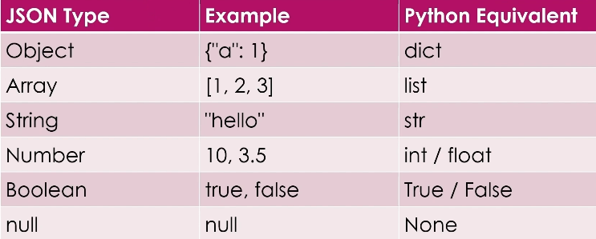

### JSON Functions in Python

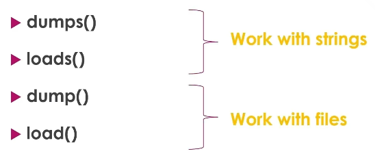

- `dumps()` - converts Python data into a JSON formatted string. Use `dumps()` when you want to send data over a network, store it in a database, or simply print it in JSON format.
```py
import json     # Always "import json" to import json modules

# Example: Convert a Python dict to json string
student_dict = {
    'name': 'Jamie',
    'age': 12,
    'city': 'New York'
}
print(type(student_dict))   # Result is <class 'dict'>
# To convert it to a json string
json_str1 = json.dumps(student_dict)
print(type(json_str1))      # Result is <class 'str'>
```

- `loads()` - takes a JSON string and converts it to a Python object. Use `loads()` when your JSON is in a variable, API response, or coming from the internet, not a file.
```py
# To convert a json, you need to wrap it first with single quotes ('), and put it in a variable.
# If it has multiple lines, wrap it with triple quotes (''')
import json

text = '{"name": "Sam", "age": 14}'
data = json.loads(text)
print(data)             # Result is {'name': 'Sam', 'age': 14}
print(type(data))       # Result is <class 'dict'>
```

- `dump()` - writes a Python object directly into a `JSON file`.
```py
import json

student_dict = {
    'name': 'Jamie',
    'age': 12,
    'city': 'New York'
    'marks': [80, 92, 75]
    'languages': ['English', 'French']
}

with open('mydata.json', 'w') as f:         # "mydata.json" is the name of the json file that you want to create
    json.dump(student_dict, f, indent = 4)  # this means you want to use the dump function to write student_dict to f, and the 'indent=4' to fix the indention format of the created json file to become more readable
```

- `load()` - reads a JSON file and converts it into a Python object
```py
import json

with open('mydata.json', 'r') as f:         # reads the json file
    output = json.load(f)  
print(output)       # Result is like student_dict above
```

### Summary

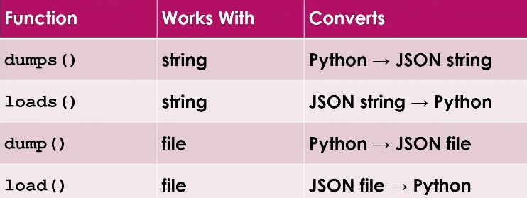

<br>
<br>
<br>

## CSV in Python - Read & Write
- [Youtube Link: How to Work with CSV Files in Python: Built-in CSV Module Tutorial](https://www.youtube.com/watch?v=sfTUVXfC0X0)

### What is CSV?
- CSV stands for `Comma-Separated Values`
- Datas are represented in rows and columns
- First row contains the column names, and rows below hold the actual data or records
- Individual values are separated by commas
- CSV files can be opened by a text editor (example below), but much readable in Excel

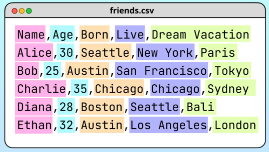

### How to Read a CSV File using Loop
- You can loop to print each row but this is difficult to read
- Example (data.csv) for practice

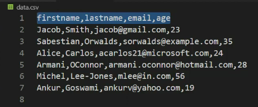

```py
with open('data.csv', 'r') as f:   # it's okay not to put "r" as read is the default
    for row in f:
        print(row)
```

### How to Read a CSV File as Python Lists
- `reader` function is used to read csv files that put them on python lists. You need to import the csv module to use this.
```py
import csv

with open('data.csv', 'r') as f:
    data = csv.reader(f)        # use the reader function (from csv module) on f then put it in a variable
    for row in data:
        print(row)   
```
Output: Each row is in separated python list.

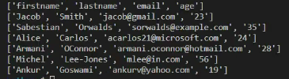

- If you want to print only the 'firtsname' and the 'email', put their `indexes` 0 and 2

```py
import csv

with open('data.csv', 'r') as f:
    data = csv.reader(f)    
    for row in data:
        print(row[0], row[2])   # specify the `index`
```
Output:

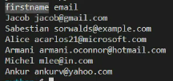

- If you want to skip the headers row ('firstname','lastname','email', 'age'), use the `next` function.
```py
import csv

with open('data.csv', 'r') as f:
    data = csv.reader(f) 
    next(data)                  # use the 'next' function
    for row in data:
        print(row[0], row[2])
```
Output:

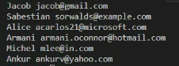

### How to Read a CSV File as Python Dictionaries
- `DictReader` function is used to read csv files that put them on python dictionaries. You need to import the csv module to use this.
```py
import csv

with open('data.csv', 'r') as f:
    data = csv.DictReader(f)    
    for row in data:
        print(row)     
```
Output: Headers as key, and Datas as values

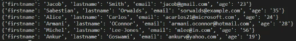

- For example, if you want to read the key 'email' only
```py
import csv

with open('data.csv', 'r') as f:
    data = csv.DictReader(f)    
    for row in data:
        print(row['email'])     # Specify the Key/s that you want
```
Output:

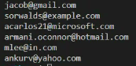


### How to Write a CSV File using writer()
- To use an existing CSV file and create a new CSV file with this data. Put `with open()` inside its `with open()` and use the `writer` function.
```py
import csv

# To create a new csv file with the same content with the old csv file but change the delimiter to semi-colon(;)
with open('data.csv', 'r') as old_csv:                      # 'data.csv' is the existing csv file that you need to read
    with open('new_data.csv', 'w', newline='') as new_csv:  # 'new_data.csv is the name of the new csv file, use newline='' argument to avoid having spaces between lines
        old_data = csv.reader(old_csv)                      # reader function to read the existing csv file
        new_data = csv.writer(new_csv, delimiter=';')       # writer function to create and write a new csv file, and use semi-colon as a new delimiter
        for row in old_data:
            new_data.writerow(row)                          # use writerow function on the new csv file
```
Output: A new csv file named 'new_data.csv'.

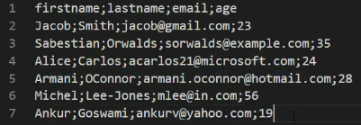

### How to Read a CSV File with different delimiter
```py

import csv

with open('new_data.csv', 'r') as f:
    data = csv.reader(f, delimiter=';')     # To read the new_data.csv that has different delimiter
    for row in data:
        print(row)   
```
Output: The output python lists will automatically have comma as a delimiter


### How to Write a CSV File using DictWriter()
```py
import csv

with open('data.csv', 'r') as old_csv:                      
    with open('new_data.csv', 'w', newline = '') as new_csv:  
        old_data = csv.DictReader(old_csv)
        field_name = ['firstname', 'lastname', 'email', 'age']      # You need to specify the fields, since this is a dictionary you can change the order of the fields/columns if you want. Example: If you want 'age' to go first instead of 'email'                
        new_data = csv.DictWriter(new_csv, fieldnames = field_name) # Then put its variable in this 'fieldnames' argument      
        new_data.writeheader()                                      # Use the writerheader on the new csv to include the headers
        for row in old_data:
            new_data.writerow(row)                         
```
Output:

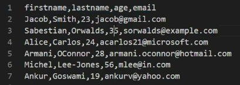

- If you want to create a new csv file but not include a field like the 'age'.
```py
import csv

with open('data.csv', 'r') as old_csv:                      
    with open('new_data.csv', 'w', newline = '') as new_csv:  
        old_data = csv.DictReader(old_csv)
        field_name = ['firstname', 'lastname', 'email']             # Don't include the 'age' field here                  
        new_data = csv.DictWriter(new_csv, fieldnames = field_name)  
        for row in old_data:
            del row['age']                                          # Then delete the each 'age' row here
            new_data.writerow(row)                         
```
Output:

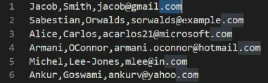

<br>
<br>
<br>

## API Requests in Python
- [Youtube Link: Master Python Requests In 15 Minutes. Call Any API](https://www.youtube.com/watch?v=Xnbef8F_Yfc&t=10s)

### Requests Theory
#### URLs and Endpoints

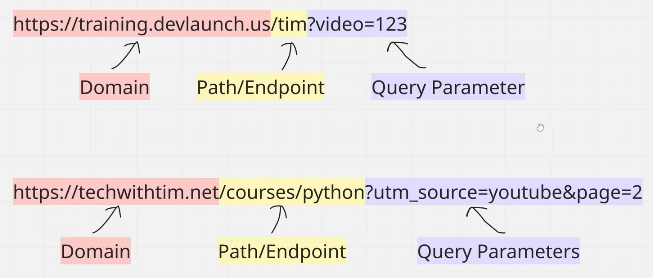

#### Request and Response

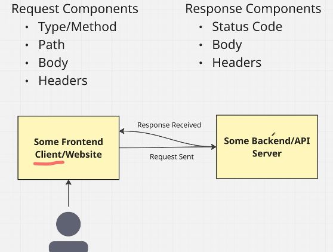

- Example:

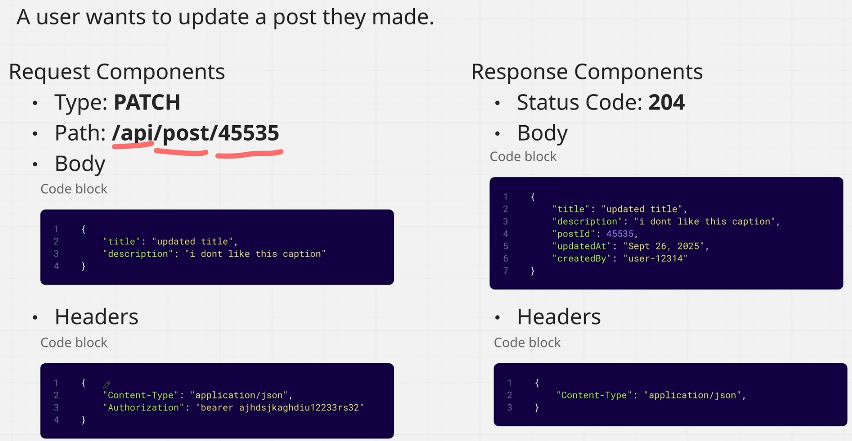

#### HTTP Status Codes

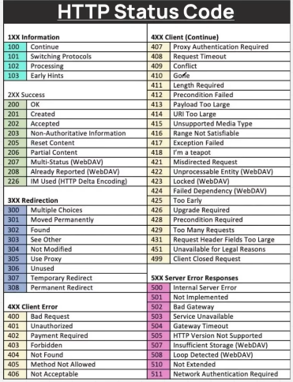

#### HTTP Methods

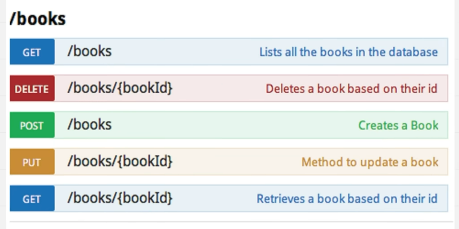

### Setup / Install (using VS Code)

#### Using venv
1. Open your project folder in VS Code.
```
cd /path/to/your/project
code .
```
2. Create and activate the environment by opening the built-in terminal in VS Code. Run your setup commands here:
```
python3 -m venv .venv
source .venv/bin/activate
pip install requests
```
3. Select the Python Interpreter in VS Code. 
    - Press Ctrl + Shift + P to open the Command Palette
    - Type Python: Select Interpreter and select it.
    - Look for the option that shows .venv or ./venv/bin/python
    - Click it to select it.

4. Test the setup by creating a new file named test.py in VS Code and paste this snippet:
```py
import requests

response = requests.get('https://httpbin.org')
print(f'Status Code: {response.status_code}')
```
#### Using uv (recommended)
1. Open your project folder in VS Code.
2. Initialize it: `uv init .`
3. Add your library: `uv add requests`
4. Choose the interpreter in VS Code (Ctrl + Shift + P -> Python: Select Interpreter -> Choose the one created by uv).
5. Write your code in 'main.py'
6. Run it safely using: `uv run main.py`

### Basic Requests Demo
```py
import requests

url = "https://jsonplaceholder.typicode.com/posts/1"

response = requests.get(url)

print('Status code:', response.status_code)
print('Content-Type:', response.headers.get('Content-Type'))

data = response.json()  # parse JSON into a Python dict
print('Post title:', data['title'])
```
- Then run your script `uv run main.py`.
- Output:

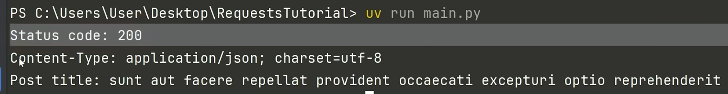


### Query Parameters (Get request)
```py
import requests

url = "https://reqres.in/api/users"
parameter = {'page': 2}

response = requests.get(url, params=parameter) # params argument to add the params on the url
print('Final URL:', response.url)   # shows ?page=2

response.raise_for_status()         # raises error for 4xx/5xx

data = response.json()
print('Page:', data['page'])
for user in data['data']:
    print(user['email'])
```
- Then run your script `uv run main.py`.
- Output:

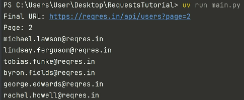

### Body (Post request)
```py
import requests

url = "https://jsonplaceholder.typicode.com/posts"

payload = {                                 
    'title': 'Hello from Python',
    'body': 'This is a test post.',
    'userId': 1,
}                           # python dict to represent JSON

response = requests.post(url, json=payload) # json=payload argument is the data that you want to create/inject

print('Status code:', response.status_code) # To check if your post request is successful
data = response.json()
print(data)
```
- Then run your script `uv run main.py`
- Output: Notice that the status code is 201, which means that the post request is successful.

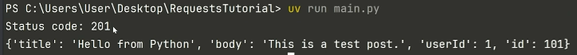


### Error Handling
```py
import requests

try:
    # httpbin /delay/3 waits 3 seconds before responding
    response = requests.get('https://httpbin.org/delay/3', timeout=1)   # timeout=1 means you need to get a reply in 1 second
    response.raise_for_status()     # raises error for 4xx/5xx
    print('Success:', response.json()0
except requests.exceptions.Timeout: # be specific when making exception when you're trying to handle errors 
    print('Request timed out')
except requests.exceptions.RequestException as e:
    print('Request failed:', e)
```
- Then run your script `uv run main.py`
- Output: Request timed out because it took more than 1 second to reply

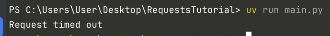


### Authorization
- Sometimes when you're working with an API, you will generate something called an **API Token** or an **Authorication Token**. This is something that needs to be sent alongside your request to verify that you are who you say you are, so you can perform some restrictive actions.
```py
import requests

TOKEN = 'AAAAA67bnjhg768797hkjhkjh98789hk'
BASE_URL = 'https://api.x.com/2/users/by/username/TechWithTimm'

auth = {
    'Authorization': f'Bearer {TOKEN}',
}

response = requests.get(BASE_URL, headers=auth) # add your api token on headers argument)

print('Status code:', response.status_code)
print('URL:', response.url)

try:
    data = response.json()
    print(data)
except ValueError:
    print('Response is not JSON.')
    print(response.text)
```
- Then run your script `uv run main.py`
- Output: Notice that you got a 200 status code, but you will get an error if you're not authorized.

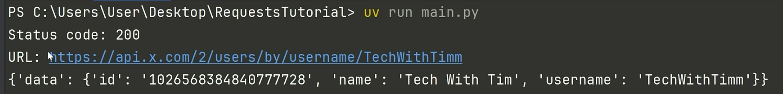

<br>
<br>
<br>

## Types of API
- [Youtube Link: Every Type Of API Explained in 18 Minutes](https://www.youtube.com/watch?v=VQyPVCT2Kl8)

### REST (Representational State Transfer)
#### What It Is
**REST** is an architectural style designed around **resources** (like users, products, or orders), each identified by a unique URL. It uses standard HTTP methods (`GET, POST, PUT, DELETE`) to perform operations. REST is stateless, meaning each request must contain all the information necessary to understand and process it. It relies heavily on HTTP status codes to communicate success or failure and most commonly uses **JSON** or **XML** for data exchange.

#### Testing Strategy & Tools
- **Validation**: You must validate HTTP status codes (e.g., 200 OK, 201 Created, 400 Bad Request, 401 Unauthorized), response JSON schemas, header fields, performance latency, and query parameters.

- **Tools**: Postman, RestAssured (Java), Playwright, Cypress, `requests` (Python).

#### Code Example (Python)
```py
import requests

base_url = "https://typicode.com"

# 1. Test POST (Create Resource)
new_user = {"name": "QA Engineer", "username": "qa_automation"}
post_response = requests.post(base_url, json=new_user)

assert post_response.status_code == 201
user_id = post_response.json()["id"]

# 2. Test GET (Read Resource)
get_response = requests.get(f"{base_url}/1")  # Using a known valid ID for this public API
assert get_response.status_code == 200

response_data = get_response.json()
# QA Assertion: Schema validation and data verification
assert "name" in response_data
assert "email" in response_data
assert isinstance(response_data["id"], int)
```

<br>

### GraphQL
#### What It Is
GraphQL is a query language and runtime for APIs developed by Meta. Unlike REST, which has multiple endpoints for different resources, GraphQL exposes a **single endpoint** (usually `/graphql`). The client sends a highly structured request specifying exactly what data fields it needs, and the server returns a JSON payload containing only those requested fields. This completely eliminates the REST issues of **over-fetching** (getting unnecessary data) and **under-fetching** (needing multiple API requests to get related data).

#### Testing Strategy & Tools
- **Validation**: Since GraphQL almost always returns an HTTP `200 OK` (even when business logic errors occur), you must explicitly parse the `errors` array in the JSON response body. You validate specific data structures matching the client's query.

- **Tools**: Apollo Studio, Postman, Insomnia, Playwright, `requests` (Python).

#### Code Example (Python)
```py
import requests

url = "https://trevorblades.com"

# GraphQL queries are structured string payloads sent via HTTP POST
graphql_query = """
query GetCountryDetails($code: ID!) {
  country(code: $code) {
    name
    native
    capital
    currency
  }
}
"""

# Variables keep the query reusable and parameterized
variables = {"code": "CA"}

response = requests.post(url, json={"query": graphql_query, "variables": variables})

assert response.status_code == 200
response_json = response.json()

# QA Critical Step: GraphQL errors appear inside the body, not in the HTTP status code
assert "errors" not in response_json, f"GraphQL Error found: {response_json.get('errors')}"

# QA Assertion: Validate exact structural response requested
country_data = response_json["data"]["country"]
assert country_data["name"] == "Canada"
assert country_data["capital"] == "Ottawa"
assert country_data["currency"] == "CAD"
```

<br>

### SOAP (Simple Object Access Protocol)
#### What It Is
SOAP is a legacy, highly structured protocol that uses strictly XML for data exchange. It relies on a **WSDL (Web Services Description Language)** file, which acts as a strict contract defining exactly what operations, inputs, and outputs are allowed. It is still heavily used in banking, healthcare, and legacy enterprise systems due to its built-in security (WS-Security) and ACID compliance.

#### Testing Strategy & Tools
- **Validation**: You must validate against the WSDL schema. Testing involves checking strict XML structures, headers, and fault codes.

- **Tools**: SoapUI, Postman, ReadyAPI, and libraries like `zeep` (Python) or `Apache CXF` (Java)

#### Code Example (Python)
```py
import requests

# SOAP requests require specific headers and an XML payload
url = "http://dneonline.com"
headers = {
    "Content-Type": "text/xml; charset=utf-8",
    "SOAPAction": "http://tempuri.org"
}

# The XML payload strictly matching the WSDL contract
payload = """<?xml version="1.0" encoding="utf-8"?>
<soap:Envelope xmlns:xsi="http://w3.org" 
               xmlns:xsd="http://w3.org" 
               xmlns:soap="http://xmlsoap.org">
  <soap:Body>
    <Add xmlns="http://tempuri.org">
      <intA>5</intA>
      <intB>3</intB>
    </Add>
  </soap:Body>
</soap:Envelope>"""

response = requests.post(url, data=payload, headers=headers)

# QA Assertion: Verify status code and look for specific XML tags
assert response.status_code == 200
assert "<AddResult>8</AddResult>" in response.text
```

<br>

### WebSockets
#### What It Is
Unlike REST, which is request-response based, WebSockets provide a **persistent, bi-directional, real-time connection** over a single TCP socket. Once the handshake is complete, the client and server can send data to each other at any time without waiting for a request. This is used for chat apps, live sports tickers, and stock trading platforms.

#### Testing Strategy & Tools
- **Validation**: You must test the connection handshake, state preservation, asynchronous message ordering, reconnect logic, and data payloads (usually JSON).

- **Tools**: Postman (WebSocket requests), K6, `websockets` library (Python), or `Socket.io-client` (JavaScript).

#### Code Example (Python)
```py
import asyncio
import websocket  # pip install websocket-client

# Establish a persistent connection to a live crypto price feed
ws = websocket.WebSocket()
ws.connect("wss://://binance.com")

# Receive the real-time stream data
result = ws.recv()
print(result)  # Outputs a JSON string of the latest trade

# QA Assertion: Verify connection stability and payload schema
assert ws.connected is True
assert "price" in result or "p" in result
ws.close()
```
<br>

### gRPC (Google Remote Procedure Call)
#### What It Is
gRPC is a high-performance, open-source framework developed by Google. It uses **Protocol Buffers (Protobuf)** as its interface definition language and message interchange format instead of JSON or XML. It runs exclusively over **HTTP/2**, allowing for multiplexing and streaming (client, server, or bidirectional). It is the industry standard for microservice-to-microservice communication.

#### Testing Strategy & Tools
- **Validation**: Testing requires compiling `.proto` files to understand the method definitions. You validate binary payloads, latency, metadata headers, and streaming endpoints.

- **Tools**: BloomRPC, Postman (gRPC support), gRPCurl, `grpcio-testing` (Python).

#### Code Example (Python)
```py
import grpc
import user_pb2       # Generated from user.proto file
import user_pb2_grpc  # Generated from user.proto file

# Open a gRPC channel to the microservice
channel = grpc.insecure_channel('localhost:50051')
stub = user_pb2_grpc.UserServiceStub(channel)

# Create a strongly-typed request defined by the Protobuf file
request = user_pb2.UserRequest(user_id="12345")
response = stub.GetUserProfile(request)

# QA Assertion: Type-safe assertions on the response object
assert response.email == "testuser@example.com"
assert response.status == user_pb2.UserStatus.ACTIVE
```
<br>

### Webhooks (Reverse APIs)
#### What It Is
A Webhook is an **event-driven API**. Instead of your application polling a server for updates, the third-party server automatically sends an HTTP POST request to your application's endpoint whenever an event occurs. Common examples include Stripe sending a webhook when a payment succeeds, or GitHub sending one when code is pushed.

#### Testing Strategy & Tools
- **Validation**: As a QA, you must mock or trigger the third-party event and verify your application receives the payload, processes it correctly, handles duplicates (idempotency), and verifies security signatures (e.g., HMAC-SHA256 headers).

- **Tools**: Ngrok (to expose localhost), Hookdeck, Mockoon, WireMock.

#### Code Example (Python / Flask for receiving side)
```py
from flask import Flask, request, jsonify
import hmac
import hashlib

app = Flask(__name__)
WEBHOOK_SECRET = b"super_secret_signing_key"

@app.route('/stripe-webhook', methods=['POST'])
def handle_webhook():
    payload = request.data
    signature = request.headers.get('X-Stripe-Signature')

    # QA Verification: Validate that the request actually came from Stripe
    expected_sig = hmac.new(WEBHOOK_SECRET, payload, hashlib.sha256).hexdigest()
    if not hmac.compare_digest(expected_sig, signature):
        return jsonify({"error": "Invalid signature"}), 401

    # Process the verified webhook event
    data = request.json
    if data['event'] == 'payment.succeeded':
        # Trigger internal QA test steps for successful payment flow
        return jsonify({"status": "processed"}), 200

if __name__ == '__main__':
    app.run(port=5000)
```

<br>

### Message Queues / Event-Driven APIs (AMQP, MQTT, Kafka)
#### What It Is
In asynchronous distributed architectures, services communicate via event streams or message brokers rather than direct HTTP requests. Common protocols include **AMQP** (RabbitMQ), **MQTT** (IoT devices), and log-based streaming like **Apache Kafka**. A service publishes a message to a topic/queue, and other services consume it.

#### Testing Strategy & Tools
- **Validation**: You validate message publishing, consumption, message format schema, dead-letter queues (where failed messages go), and consumer lag under load.

- **Tools**: Kafka-python, `pika` (RabbitMQ), MQTT Explorer, Jmeter.

#### Code Example (Python for Apache Kafka)
```py
from kafka import KafkaProducer, KafkaConsumer
import json

# Setup Producer to simulate a system event
producer = KafkaProducer(bootstrap_servers=['localhost:9092'],
                         value_serializer=lambda v: json.dumps(v).encode('utf-8'))

# Publish an event to the 'orders' topic
producer.send('orders', {'order_id': '999', 'status': 'created'})
producer.flush()

# Setup Consumer to verify the system processed the event
consumer = KafkaConsumer('orders', bootstrap_servers=['localhost:9092'],
                         auto_offset_reset='earliest', value_deserializer=lambda x: json.loads(x.decode('utf-8')))

# QA Assertion: Read the message back and verify correctness
for message in consumer:
    event_data = message.value
    assert event_data['order_id'] == '999'
    assert event_data['status'] == 'created'
    break # Break loop after verifying the expected message
```

<br>

### Server-Sent Events (SSE)
#### What It Is
SSE is a **one-way real-time protocol** where the client establishes a standard HTTP connection using the `EventSource` API, and the server keeps this connection open to continuously push text-based data stream updates down to the client. It is lighter than WebSockets and is used for notification feeds, live logs, or AI text-generation streams (like ChatGPT typing answers).

#### Testing Strategy & Tools
- **Validation**: Verify that the connection stays open (`Content-Type: text/event-stream`), validate line-by-line streaming chunks, and check automatic client reconnection behaviors.

- **Tools**: Postman, curl, `sseclient` library.

#### Code Example (Python)
``` py
import requests
import sseclient  # pip install sseclient-py

url = "http://localhost:8080/stream/notifications"
# Connect to the stream with headers allowing streaming data
response = requests.get(url, stream=True, headers={"Accept": "text/event-stream"})
client = sseclient.SSEClient(response)

# QA Assertion: Evaluate events as they stream in natively
for event in client.events():
    data = event.data
    # Assert each incoming chunk meets schema expectations
    assert "notification_id" in data
    print(f"Received stream event: {data}")
    break # Disconnect after verifying the initial data stream
```

<br>
<br>
<br>

## Python Environment Variables in QA Automation (with `uv`)
- Environment variables keep sensitive data out of your source code. This prevents accidental leaks to public repositories and allows you to switch between testing environments easily.

### Why Use Environment Variables in QA?
- **Security:** Keeps API keys and database passwords out of git repository commits.
- **Flexibility:** Changes test URLs from staging to production without altering code.
- **CI/CD Integration:** Allows automation servers (Jenkins, GitHub Actions) to inject configuration dynamically.

### Project Workflow

#### 1. Project Setup with `uv`
- The `uv` tool manages your Python versions and project dependencies efficiently.
- **Create a New Project**
```py
# Initialize a new project directory
uv init qa-automation-env
cd qa-automation-env
```
- **Install Dependency** - We use `python-dotenv` to read variables from a local file during development.
```py
# Add python-dotenv to your project
uv add python-dotenv
```

#### 2. Storing Secrets Locally (.env file)
- Create a file named `.env` in your project root directory. Do not commit this file to Git.
```py
# .env file
BASE_URL="https://example.com"
API_KEY="test_secret_key_12345"
DB_PASSWORD="SuperSecurePassword987"
```
- **Critical Security Step** - Add the `.env` file to your `.gitignore` file so it is never pushed to GitHub.
```py
# .gitignore
.env
.venv/
```

#### 3. Reading Variables in Python (os Module)
- Use the built-in `os` module combined with `python-dotenv` to load and read your configurations safely.
```py
# test_api.py
import os
from dotenv import load_dotenv

# Load variables from the .env file into the system environment
load_dotenv()

# Retrieve variables using os.environ.get()
# The second argument provides a fallback default value if the variable is missing
BASE_URL = os.environ.get("BASE_URL", "https://example.com")
API_KEY = os.environ.get("API_KEY")
DB_PASSWORD = os.environ.get("DB_PASSWORD")

def test_authentication():
    # Constructing request URL using environment variables
    login_url = f"{BASE_URL}/v1/login"
    
    headers = {
        "Authorization": f"Bearer {API_KEY}"
    }
    
    print(f"Sending request to: {login_url}")
    print(f"Using API Key: {API_KEY[:4]}****") # Masking secret in logs
    
    # Your test assertions go here
    assert API_KEY is not None, "API Key is missing!"

if __name__ == "__main__":
    test_authentication()
```

#### 4. Running the Tests with `uv`
- Execute your Python scripts within the managed virtual environment using `uv run`.
```py
# Execute your test file
uv run test_api.py
```

### QA Best Practices
- **Always use fallbacks:** Use `os.environ.get("VAR", "default")` to prevent tests from crashing due to missing non-sensitive parameters.
- **Use strict lookups for secrets:** Use `os.environ["API_KEY"]` if the test must fail immediately when a critical key is missing.
- **Mask logs:** Never print full passwords or API keys to test execution logs or console outputs.
- **CI/CD configuration:** In GitHub Actions or Jenkins, inject these identical variable keys into the runner environment settings instead of using a `.env` file.

<br>
<br>
<br>

## Python Database Connections in QA Automation (with `uv`)
- QA Automation engineers frequently need to verify "backend" changes. After an API or UI test submits data, you must connect directly to the database to ensure the records were stored accurately.

### Why Use `sqlite3` in QA?
- **Zero Configuration:** No servers to install; the database is just a local file.
- **Perfect for Mocking:** Ideal for testing local automation frameworks and pipelines.
- **Standard SQL:** Uses the same SQL syntax as larger databases like PostgreSQL or MySQL.

### Project Workflow

#### 1. Project Setup with `uv`
- Since `sqlite3` is part of the standard Python library, you do not need to install any external database packages.
- Initialize Project:
```py
# Create a new directory for database testing
uv init qa-db-testing
cd qa-db-testing
```

#### 2. Writing the Database Verification Script
- This script simulates a test case where a user is added, and the automation script connects to the database to verify the insertion.
- Using the `with` statement (also called a context manager) is the gold standard for database connections. It handles the cleanup automatically, meaning it will safely close the connection and commit your data even if your test fails in the middle of execution.
```py
# test_database.py
import sqlite3

DB_NAME = "test_automation.db"

def setup_mock_database():
    """Helper function to create a table and insert sample data."""
    # The 'with' statement automatically handles commits or rollbacks
    with sqlite3.connect(DB_NAME) as conn:
        cursor = conn.cursor()
        
        # Create a fresh users table for our test
        cursor.execute("DROP TABLE IF EXISTS users")
        cursor.execute("""
            CREATE TABLE users (
                id INTEGER PRIMARY KEY AUTOINCREMENT,
                username TEXT NOT NULL,
                email TEXT NOT NULL,
                status TEXT NOT NULL
            )
        """)
        
        # Simulate an application saving data
        cursor.execute(
            "INSERT INTO users (username, email, status) VALUES (?, ?, ?)",
            ("qa_tester", "tester@example.com", "active")
        )
        # Note: 'conn.commit()' is automatically called when exiting this block!
    # Connection is safely handled here automatically

def test_user_data_verification():
    """The QA automation test logic using context managers."""
    # 1. Arrange: Ensure the data exists
    setup_mock_database()
    
    # 2. Act: Connect to the DB to fetch the record we want to verify
    target_user = "qa_tester"
    query = "SELECT email, status FROM users WHERE username = ?"
    
    with sqlite3.connect(DB_NAME) as connection:
        cursor = connection.cursor()
        cursor.execute(query, (target_user,))
        
        # fetchone() grabs the single matching row tuple: (email, status)
        record = cursor.fetchone()
    # The connection is automatically CLOSED here, even if lines above fail!
    
    # 3. Assert: Verify the database values match expected outcomes
    assert record is not None, f"Test Failed: User '{target_user}' not found in database!"
    
    db_email = record[0]
    db_status = record[1]
    
    print(f"\n[DB Verification] Found User: {target_user}")
    print(f"[DB Verification] Email: {db_email} | Status: {db_status}")
    
    assert db_email == "tester@example.com", f"Expected tester@example.com but got {db_email}"
    assert db_status == "active", f"Expected status 'active' but got {db_status}"
    print("Test Passed: Database records are 100% accurate!")

if __name__ == "__main__":
    test_user_data_verification()
```

#### 3. Running the Test with `uv`
- Run your script safely within your isolated environment.
```py
# Execute the database test script
uv run test_database.py
```

### QA Best Practices for Database Testing
- **Always Close Connections:** Use `connection.close()` or a context manager (`with sqlite3.connect(...) as conn:`) to avoid locking the database file.
- **Use Parameterized Queries:** Never use f-strings for SQL variables (e.g., `f"SELECT * FROM users WHERE name = '{name}'"`). Always use `?` placeholders to avoid formatting bugs.
- **Clean Up Test Data:** Clean your state. Use `DROP TABLE` or `DELETE` statements before or after tests so old test runs don't corrupt new runs.
- Use Fetch Methods Wisely:
    - `cursor.fetchone()` when expecting one unique row (like a specific User ID).
    - `cursor.fetchall()` when verifying a list of items (like products in a cart).

<br>
<br>
<br>

## Data Generation in QA Automation (with `uv`)
- Automated tests often require unique data for every run (e.g., registering a new user). Reusing the same data causes tests to fail due to duplicate errors. Generating random or realistic data solves this problem.

### Why Use Data Generation in QA?
- **Prevents Data Collisions:** Stops tests from failing because a username or email already exists in the database.
- **Increases Test Coverage:** Exposes edge cases by testing unpredictable variations in names, lengths, and numbers.
- **Simulates Real Users:** Creates realistic scenarios for performance, UI, and backend validation.

### Project Workflow
#### 1. Project Setup with `uv`
- Python has a built-in module named `random` for basic data generation. For complex, realistic data, QA engineers use a popular library called `Faker`.
- Initialize Project:
```py
# Create a new directory for data generation testing
uv init qa-data-generation
cd qa-data-generation
```

- Install Dependency
```py
# Add Faker to your project using uv
uv add faker
```

#### 2. Writing the Data Generation Script
- This script demonstrates how to generate fake users using Python's built-in tools and the advanced `Faker` library.
```py
# test_data_generation.py
import random
import string
from faker import Faker

# Initialize the Faker library (can specify locales, e.g., Faker('en_US'))
fake = Faker()

def generate_with_built_in_random():
    """Generates basic fake data using only Python's built-in modules."""
    print("--- Using Built-in 'random' Module ---")
    
    # 1. Random Username: Combinations of text and numbers
    # Generates 8 random lowercase letters
    random_letters = "".join(random.choices(string.ascii_lowercase, k=8))
    username = f"user_{random_letters}"
    
    # 2. Random Email: Injecting random numbers to ensure uniqueness
    random_suffix = random.randint(1000, 9999)
    email = f"qa_test_{random_suffix}@example.com"
    
    # 3. Random Phone Number: Standard string formatting with random digits
    # Generates a string of 7 random numbers
    phone_body = "".join(random.choices(string.digits, k=7))
    phone_number = f"555-{phone_body}"
    
    print(f"Generated Username: {username}")
    print(f"Generated Email:    {email}")
    print(f"Generated Phone:    {phone_number}\n")
    
    # Quick structural validations (QA checks)
    assert username.startswith("user_")
    assert "@example.com" in email

def generate_with_faker_library():
    """Generates realistic test data using the Faker library."""
    print("--- Using 'Faker' Library (Industry Standard) ---")
    
    # 1. Realistic Username: Generates clean, human-like usernames
    username = fake.user_name()
    
    # 2. Realistic Email: Generates standard formatted emails matching real domains
    email = fake.email()
    
    # 3. Realistic Phone Number: Generates realistic formats (handles regions automatically)
    phone_number = fake.phone_number()
    
    print(f"Generated Username: {username}")
    print(f"Generated Email:    {email}")
    print(f"Generated Phone:    {phone_number}\n")
    
    # Assertions to ensure data was generated properly
    assert len(username) > 0, "Username generation failed!"
    assert "@" in email, "Invalid email format generated!"

if __name__ == "__main__":
    generate_with_built_in_random()
    generate_with_faker_library()
```

#### 3. Running the Script with `uv`
- Execute the file cleanly within your managed virtual environment.
```py
# Run the data generation script
uv run test_data_generation.py
```

### QA Best Practices for Data Generation
- **Seed Your Randomness:** If a test fails, you need to recreate the exact data that broke it. Use `Faker.seed(1234)` or `random.seed(1234)` during debugging to generate the exact same "random" data repeatedly.
- **Keep Core Formats Valid:** Ensure generated emails contain `@` and domain extensions, and phone numbers strictly match the length rules of your target system's database validators.
- **Isolate Test Identity Indicators:** Prefix your generated data with identifiers like `test_` or `qa_`. This makes it simple for your database administrators to filter out and purge automation clutter from performance environments.