# Python Course
- [Youtube Link: Python Full Course for Beginners - From Zero to Hero](https://www.youtube.com/watch?v=Rq5gJVxz55Q)

## Chapter 1 - Python Fundamentals

### Setup your Environment (VS Code)

- Press `ctrl+shift+P`, then type `Python:Select Interpreter` then select the python that you've installed.
- ``ctrl+shift+` `` - to open a new terminal, you can open multiple terminal by using ``ctrl+shift+` ``, then you can select **bash** for example
- ``ctrl+` `` - to open again a previously opened terminal
- `python3 --version` - run this on terminal to verify your python version for linux, `py --version` for windows
- `python3` - run this on terminal to run python repo, to quit type `quit()`
- Press `ctrl+shift+P`, then type `Preferences:Open Keyboard Shortcuts`. Type `Run python file`. Double-click keybinding to assign `ctrl+R`.
- **VS Extensions** - Python, autopep8, Material Icon Theme, One Dark Pro


### Comments
- `#` - used to make comments/notes
- `ctrl+/` - select all the texts that you want to be a comment then press `ctrl+/`
- `shift+alt+down` - copy an entire line


### print() function
- `print()` is a python built-in function that displays messages on the output screen. Example: `print("Hello World!")`
- **Escape Sequences**


Example:
```py
print("Hi \"Python\"")  # To print Hi "Python"
print('Hi \'Python\'')  # To print Hi 'Python'
print('Hi "Python"')    # To print Hi "Python"
print("Path: C:\\Users\\John")  # To print Path: C:\Users\John
print("Message1\n")     # To print a space line after your message
print("Message1\tMessage2") # To put a tab space between the words
```
- **Triple Quotes** - for Python to allow multiples lines inside the triple quotes


### Variables
- `=` - to assign variables. Example:
```py
name = "John"
print("My name is", name)     # Output is: My name is John
# The comma provided space between is and name
```
- You can't use on variable names: <br>
    hyphen(-), start with a number, characters like '!', keywords like 'if' or 'for'
- **Python Naming Conventions**


### input() function
- To get something from the user. Example:
```py
name = input("Enter Your Name:")   # This is a dynamic value
country = "Germany" # This is hard-coded (static) value
print(name, "comes from", country)
```
- **Dynamic value** - data entered by the user that can vary each time the program runs
- **Hard-coded (static) value** - fixed piece of data written directly into your code that never changes at runtime


### Data Types

```py
# Data Types
a = 10      # int
b = 3.14    # float
c = "Hello" # str
d = 'Hi'    # str
e = "1234"  # str
f = True    # bool
g = False   # bool
h = None    # NoneType
i = ""      # str - blank
j = " "     # str - empty
```

### Functions and Methods


#### Examples of Functions
- `type()` - is a built-in function that returns the data type of a value.
- `len()` - is a built-in function that gives the total count of items inside a value. Examples:
```py
text = "hi"
number = 10

print(type(text))   # <class 'str'>
print(type(number)) # <class 'int'>

print(len(text))   # Result is 2
print(len(number)) # TypeError. int has no length value
```
#### Examples of Methods
- `upper()` - is a method of the class str that converts all the letters to uppercase.
- `bit_length()` - is a method of the class int that returns the length of a number in binary. Examples:
```py
text = "hi"
number = 10

print(text.upper()) # Result is HI
print(number.upper()) # AttributeError. int has no attribute upper
print(number.bit_length())  # Result is 4
```
<br>
<br>

## Chapter 2 - Python Strings

### String Functions - Categories


### Types
#### type()
- is a built-in function that returns the data type of a value. Example:
```py
name = "John"
age = 24

print(type(name))   # <class 'str'>
print(type(age))    # <class 'int'>
```
- #### str()
- is a built-in function that converts any value into string value. Example:
```py
age  = 24

print("Your age is:" + age)         # This will cause an Error
# To correct this use the str function
print("Your age is:" + str(age))    # Your age is:24
# If you want to permanently convert your int variable to str
age = str(age)
```
### Math
#### len()
- is a built-in function that gives the total count of items inside a value. Example:
```py
password = "123a"
print(len(password))    # Result is 4
# This is useful if a web app requires a minimum number of char for password
if len(password) < 8:
    print("Your password is too short!")
# Take note that it will count everything even spaces
name = "  John"
print(len(name))    # Output will be 6 because 4 + 2 spaces
```
#### count()
- is a built-in method that returns how often a word appears in the string. Output is int. Example:
```py
text = """
Python is easy to learn.
Python is powerful.
Many people love python.
"""
print(text.count("Python"))     # Result is 2
```
### Transformations
#### replace()
- is a built-in method that swaps part of the text with something new. Output is str. Example:
```py
date = "2026/06/12"
print(date.replace("/", "-"))  # Result is 2026-06-12 

phone = "176-1234-56"
print(phone.replace("-", ""))  # Result is 176123456 
# Replacing 2 or more
price = "$1,299.99"
print(price.replace("$", "").replace(",", ""))  # Result is 1299.99
```
#### "string" + "string"
- joins two or more strings into one. Example:
```py
first_name = "John"
last_name = "Doe"
full_name = first_name + " " + last_name
print(full_name)   # Result is John Doe
```
#### f{}
- f-string is a modern way to format and build strings. Example:
```py
name = "John"
age = 34
is_student = False
# Old style
print("My name is " + name + ", I am" + str(age) + " years old, and student status is " + str(is_student) + ".")
# New style using f-string
print(f"My name is {name}, I am {age} years old, and student status is {is_student}.")
```
#### split()
- is a built-in method that breaks a string into smaller parts. Output is a list. Example:
```py
stamp = "2026-09-20 14:30"
# To separate them by their space
print(stamp.split(" "))     # Result is ['2026-09-20', '14:30']
```
#### "string" * number
- repeats the string multiple times. Output is str. Example:
```py
print("ha" * 3)     # Result is hahaha
print("#" * 10)     # Result is ########## 
```
#### Indexing and Slicing


```py
# Extract 1 character (Indexing)
text = "Python"
print(text[0])      # Result is P
print(text[-1])     # Result is n
# Extacting more than 1 character (Slicing)
date = "2026-06-12"
print(date[0:4])    # Result is 2026
print(date[:4])     # Result is also 2026
print(date[-2:])    # Result is 12
```
### Cleaning
#### lstrip(), rstrip(), strip()
- are built-in methods to clean white spaces.
- use `lstrip()` to clean white space/s on the left
- use `rstrip()` to clean white space/s on the right
- use `strip()` to clean white space/s on both left and right
```py
text = " Engineering"
print(text.lstrip())    # Result is Engineering
text = "Engineering  "
print(text.rstrip())    # Result is Engineering
text = "  Engineering "
print(text.strip())     # Result is Engineering
text = "###Abc123##"
print(text.strip("#"))  # Result is Abc123
```
#### lower(), upper()
- are built-in methods that are used for case conversion
```py
text = "python PROGRAMMING"
print(text.lower())     # Result is python programming
print(text.upper())     # Result is PYTHON PROGRAMMING
# Comparing data example
search = "Email ".lower().strip()
data = " emAil".lower().strip()
print(search == data)   # Result is True
```
### Search
#### startswith(), endswith(), in, find()
- are used to search characters


```py
phone = "+63-919-1234567"
print(phone.startswith("+63"))      # Result is True

email = "john@gmail.com"
print(email.endswith("gmail.com"))  # Result is True

print("@" in email)                 # Result is True

# One of the best use of using find() is if you want to splice inconsistent number of characters
phone1 = "+63-919-1234567"
phone2 = "63-917-7654321"
phone3 = "0063-920-1357901"
# Using splice - but we need to count the index
print(phone1.[4:])  # Result is 919-1234567
print(phone2.[3:])  # Result is 917-7654321
print(phone3.[5:])  # Result is 920-1357901
# Using find() - so that you don't have to count the index
print(phone1[phone1.find("-")+1:])  # Result is 919-1234567
print(phone2[phone2.find("-")+1:])  # Result is 917-7654321
print(phone3[phone3.find("-")+1:])  # Result is 920-1357901
```
### Validation
#### isalpha()
- is a built-in method that checks if the string has only letters. Output is boolean. Example:
```py
country = "USA"
print(country.isalpha())    # Result is True
```

#### isnumeric()
- is a built-in method that checks if the string has only numbers. Output is boolean. Example:
```py
phone = "09181234567"
print(phone.isnumeric())    # Result is True
```

<br>
<br>

## Chapter 3 - Python Numbers


### Types
#### type()
- is a built-in function that returns the data type of a value. Example:
```py
x = 5
y = 5.7
z = 2 + 3j

print(type(x))  # Result is <class 'int'>
print(type(y))  # Result is <class 'float'>
print(type(z))  # Result is <class 'complex'>
```
#### int()
- is a built-in function that converts compatible value into int value. Output is int. Example:
```py
x = "24"
print(type(x))  # Result is str
x = int(x)      
print(type(x))  # Result is now int
```
#### float()
- is a built-in function that converts compatible value into float value. Output is float. Example:
```py
x = 3           # int that will be converted to float
print(int(x))   # Result is 3.0
y = "3.14"      # str that will be converted to float
print(int(y))   # Result is 3.14
```
#### complex()
- is a built-in function that creates a complex number using real and imaginary parts. Output is complex. Example:
```py
x = 3   # real
y = 4   # will become the imaginary
print(complex(x,y))     # Result is 3+4j
```

### Math Operators
```py
print(2 + 3)    # Addition. Result is 5
print(5 - 3)    # Subtraction. Result is 2
print(4 * 2)    # Multiplication. Result is 8
print(7 / 2)    # Division. Result is 3.5
print(7 // 2)   # Floor Division - it divides two numbers and rounds down. Result is 3
print(7 % 2)    # Remainder. Result is 1
print(2 ** 3)   # Exponential. Result is 8

# How to Shortcut. Example:
x = 2
x = x + 3
# You can write it just like this:
x = 2
x += 3  # Result is also 5
```

### Rounding
#### abs()
- is a built-in function that returns the absolute (non-negative) value of a number. Output is int. Example:
```py
print(abs(2 - 10))  # Result is 8
```
#### floor(), ceil(), round()


```py
import math     # You need to import math to use the floor & ceil functions
price = 35.54879
print(math.floor(price))    # Result is 35
print(math.ceil(price))     # Result is 36
print(round(price))         # Result is 36
print(round(price,2))       # Result is 35.55
```
#### trunc()
- cuts off the decimal part and keeps the whole number (no rounding). Also needs to import math to be used. Example:
```py
import math
price = 15.69
print(math.trunc(price))    # Result is 15
# if you don't want to import math just to use trunc(), you can also use int() which will do the same
print(int(price))           # Result is also 15
```

### Random
#### random()
- returns a random float between 0.0 and 1.0. We need to import random. Output is float.
```py
import random
print(random.random())  # Result is 0.496024166 which is random
```
#### randint()
- gets a random whole number from start to end that you specify (both included). Also need to import random. Output is int. Example:
```py
import random
print(random.randint(1,6))  # Result will be any number from 1 to 6
```

### Validation
#### is_integer()
- is a built-in method that checks if a float has no decimal part (is a whole number). Output is boolean. Example:
```py
x = 7.0
print(x.is_integer())   # Result is True
y = 7.1
print(y.is_integer())   # Result is False
```
#### isinstance()
- is a built-in function that checks if a value belongs to a certain data type that you expect. Output is boolean. Example:
```py
x = 70
print(isinstance(x, int))   # Result is True
print(isinstance(x, float)) # Result is False
```

<br>
<br>

## Chapter 4 - Python Logic & Operators


### Functions
#### bool()
- is a built-in function. Output is boolean.
- True - if the value is non-empty or non-zero
- False - if the value is empty or zero
```py
print(bool(123))    # Result is True
print(bool("Hi!"))  # Result is True
print(bool())       # Result is False since it is empty
print(bool(0))      # Result is False
print(bool(""))     # Result is False
print(bool(None))   # Result is False
```
#### any(), all()


```py
email = ""
phone = "0919-1234567"
username = ""
# Allows registration if any field is filled
print(any([email, phone, username])) # Result is True because at least one is filled which is the phone

# Allows registration only if all fields is filled
print(all([email, phone, username])) # Result is False because only one field is filled
```
#### isinstance()
- is a built-in function that checks if a value belongs to a certain data type that you expect. Output is boolean. Example:
```py
print(isinstance(123, int))   # Result is True
print(isinstance(True, str))  # Result is False
```

### Comparison Operators
- it compares two or more values and return True or False based on the result.


#### Chained Comparison
- it evaluates it from left to right, checking each condition one by one. Example:
```py
# Is age between 18 and 30?
age = 20
print(18 <= age <= 30)    # Result is True
```

### Logical Operators
#### and | or 
- used to combine multiple boolean expressions


#### not
- it reverses the truth
- it turns True into False, and False into True
```py
print(3 > 2)        # Result is True
print(not 3 > 2)    # Result is False

name = ""
print(not name)     # Result is True
print(not 0)        # Result is True
```

#### Execution Order
- "and" has higher priority than "or"

 

- use parenthesis to control the order


### Membership Operators - "in" and "not in"
- checks if a value is inside another value
```py
print("o" in "python")      # Result is True
print("f" not in "python")  # Result is True
print(3 not in [1, 2, 3])   # Result is False
# One of its use in real world is to validate a domain if it is in the banned list.
domain = "gmail.com"
banned_domains = ["spam.com", "fake.org", "bot.net"]
print(domain not in banned_domains]     # Result is True
```

### Identity Operators - "is" and "is not"
- checks if two variables refer to the same object in memory, python creates different IDs if the values are not simple


- But python will create same IDs if the values are simple


- And if you created a new variable from a previous variable, python will not create a new ID.
```py
x = [1, 2, 3]
y = x
print(x == y)   # Result is True
print(x is y)   # Result is True
```

<br>
<br>

## Chapter 5 - Python Conditional Statements
- checkpoint that checks a condition
    - True? Runs the Code
    - False? Skip it

### if (stand-alone)
- defines the first condition
- "if this is true, do this - otherwise, do nothing"


```py
score = 100
if score >= 90:
    print("A")   # Result is A. But if you change the score to a lower value like 89 or below, it will not print anything. 
```

### else (two-way decision)
- runs only if all previous conditions are false
- "if nothing was true, do this instead"


```py
score = 80
if score >= 90:
    print("A")
else:
    print("F")  # Result is F
```

### elif (multiple conditions)
- asks a follow-up question, and only runs if previous conditions were false
- "if the first wasn't true, try this one"


```py
score = 85
if score >= 90:
    print("A")
elif score >= 80:
    print("B")
else:
    print("F")  # Result is B
```

### elif elif (branching)
- you can have multiple elif


```py
score = 75
if score >= 90:
    print("A")
elif score >= 80:
    print("B")
elif score >= 70:
    print("C")
elif score >= 60:
    print("D")
else:
    print("F")  # Result is C
```

### nested if
- if statement inside another if
- "if the first is true, then check the second"


```py
score = 95
is_submitted_project = True
if score >= 90:
    if is_submitted_project:
        print("A+")
    else:
        print("A")
elif score >= 80:
    print("B")
elif score >= 70:
    print("C")
elif score >= 60:
    print("D")
else:
    print("F")  # Result is A+
```

### Connecting Conditions with "and" & "or"


```py
score = 95
is_submitted_project = True
if score >= 90 and is_submitted_project:
    print("A+")
elif:
    print("A")
elif score >= 80:
    print("B")
elif score >= 70:
    print("C")
elif score >= 60 or is_submitted_project:
    print("D") 
else:
    print("F")  # Result is A+ if the student get 90+ & submitted a project. And students who got below 60 can still get a D as long as they submitted a project.
```

### Inline if (ternary)
- used only for simple logics


```py
# We will convert this to inline if
score = 80
if score >= 90:
    print("A")
else:
    print("F")

# This is the simplified version
score = 100
print("A" if score >= 90 else "F")

# Or we could put it in a variable
grade = ("A" if score >= 90 else "F")
print(grade)

# If the statement has an elif
score = 80
if score >= 90:
    print("A")
elif score >= 80:
    print("B")
else:
    print("F")
# This will be the simplified version
print("A" if score >= 90 else "B" if score >= 80 else "F")
```

### case-match
- evaluate a value against multiple values
- runs the code of the first match
- can be used only for matching values
```py
# Example: Convert the full country names into 2-letter abbreviations
country = "United States"

match country:
    case "United States"
        print("US")
    case "India"
        print("IN")
    case "Egypt"
        print("EG")
    case _:                 # this is the equivalent of "else"
        print("Unknown Country")
```

<br>
<br>

## Chapter 6 - Python Loops
- repeat a block of code over and over until a condition is met
- there two types - for and while

### "for" loops
```py
# Instead of writing this code this sample code:
print("Round: 1")
print("Round: 2")
print("Round: 3")
print("Round: 4")
print("Round: 5")
# We could simplify this using for loops:
for i in (1,2,3,4,5):
    print(f"Round: {i}")
# Or we could also put the tuple in a variable:
items = (1,2,3,4,5)
for item in items:
    print(f"Round: {item})
```
```py
# Another example:
scores = [80, 50, 60, 75]
total = 0
for score in scores:
    total += score
    print("Current Total:", total)
print("Final Total:", total)
```
```py
# Another example (cleaning data)
files = [' Report.csv ', 'DATA.csv ', ' final.TXT']
for file in files:
    file = file.strip().lower().replace(".txt", ".csv")
    print(f"Processing {file}")
# Result:
# Processing report.csv
# Processing data.csv
# Processing final.csv
```

#### Sequences that are used in "for" loops
- tuple or list like the examples above
- string


- range


#### Special Loop Statements


#### break
- it stops the loop immediately
- it jumps out and ends the loop right away
```py
name = ["john", "maria", "", "sam"]
for name in names:
    if name == "":
        print("Empty value detected!")
        break
    print(f"Name: {name}")
# The Result will be:
# Name: john
# Name: maria
# Empty value detected!
```
#### continue
- it skips one loop cycle without stopping the loop
```py
name = ["john", "maria", "", "sam"]
for name in names:
    if name == "":
        print("Empty value detected!")
        continue
    print(f"Name: {name}")
# The Result will be:
# Name: john
# Name: maria
# Empty value detected!
# Name: sam
```
#### pass
- it is a placeholder where nothing happens
- "for now, just keep going and do nothing"
```py
name = ["john", "maria", "", "sam"]
for name in names:
    if name == "":
        pass    # todo: handle empty value later
    print(f"Name: {name}")
# The Result will be:
# Name: john
# Name: maria
# Name:
# Name: sam
```

#### "else" in "for" loops
- runs a block of code only if the loop finishes naturally
- best used with "break", you'll know something went wrong if "else" didn't execute
```py
# Check for even number
items = [1, 3, 5, 7]
for i in items:
    if i % 2 == 0:
        print("Even number found:", i)
        break
else:
    print("All numbers are odd!")
```

#### nested "for" loops
- loop inside another loop
```py
letters = ["a", "b"]
numbers = [1, 2, 3]

for x in letters:       # outer loop
    for y in numbers:   # inner loop
        print(f"({x}, {y})")

# Result will be:
# (a, 1)
# (a, 2)
# (a, 3)
# (b, 1)
# (b, 2)
# (b, 3)
```

### "while" loops
- repeats a block of code over and over as long as the condition is **True**
- "while" loops have a risk of infinite loops

#### "while" condition (1st type of "while" loop)
- initialize the variable first (ex. i = 1)
- then make a condition (ex. i < 4)
- then update that value (ex. i +=1)


```py
# A program that will keep asking until you say "yes"
answer = ""
while answer != "yes":
    answer = input("Do you agree?(yes/no): ")
print("Thank You")
```
#### "while" True (2nd type of "while" loop)


```py
# Let's recreate the "keep asking until you say yes program" above with "while True"
while True:
    answer = input("Do you agree?(yes/no): ")
    if answer == "yes":
        break
print("Thank You")
```
#### while condition vs while True


### for vs while


<br>
<br>

## Chapter 7 - Python Data Structures
- is a way of organizing and storing data so it can be used efficiently
- `4x Types of Data Structures`

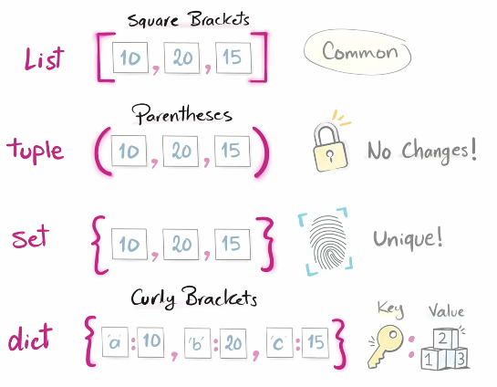

- there are built-in methods specifically for each type of data

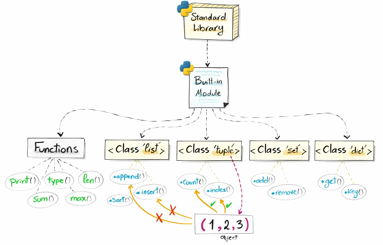

### functions vs methods
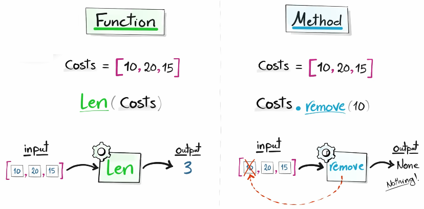

- `function` - will create an output from your input (data)
- `method` - can directly manipulate the input value (data)

### Lists []
- ordered collection of items
- changeable / flexible
- allows duplicates
- very commonly used
- see picture below for our roadmap on how to use lists

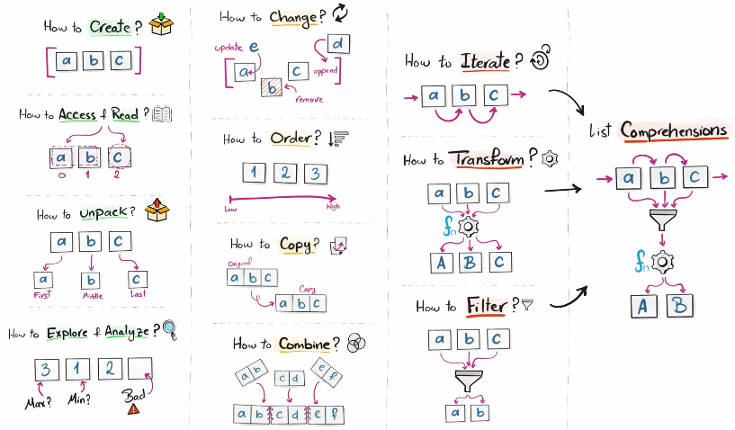

#### Create Lists
```py
# You can manually create a list
empty = []
letters = ["a", "b", "c"]
numbers = [1, 2, 3]
mixed = [1, "a", True, None]
matrix = [["a", "b", "c"], 
          ["d", "e", "f"]]
mixed_matrix = [["a", "b"],
                [1, 2, 3]]

# You can make a list using the list() function
empty = list()              # Result is []
letters = list("abc")       # Result is ["a", "b", "c"]
numbers = list(range(1, 4)) # Result is [1, 2, 3]
```

#### Read & Access Lists
```py
lst = ["a", "b", "c", "d"]
# To access the whole list
print(lst)
# To get one item
print(lst[0])               # Result is a
print(lst[-1])              # Result is d
```
- To get item/s from a nested (matrix) list, see below:

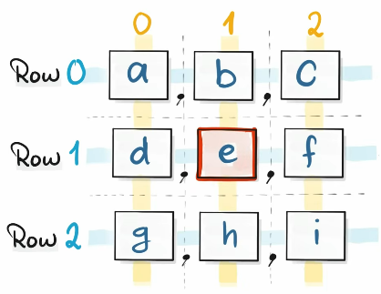

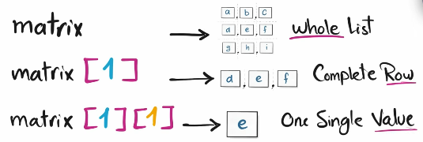
```py
# To get one item from a nested (matrix) list, specify its row index first, then its column index
matrix = [["a", "b", "c"], 
          ["d", "e", "f"],
          ["g", "h", "i"]]
print(matrix[2][1])     # To get the "h"
print(matrix[0][0])     # To get the "a"
```
- Slicing - to get multiple items

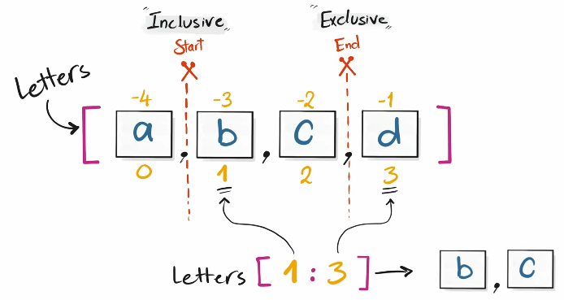
```py
lst = ["a", "b", "c", "d"]
print(lst[:2])      # Result is ["a", "b"]
print(lst[1:3])     # Result is ["b", "c"]
print(lst[1:])      # Result is ["b", "c", "d"]

matrix = [["a", "b", "c"], 
          ["d", "e", "f"],
          ["g", "h", "i"]]
print(matrix[2][:2])    # Result is ["g","h"]
```

#### Unpacking Lists
  - number of variables must match the values exactly - not less, not more
```py
person = ["Maria", 29, "Data Engineer", "Spain"]
# The long way
name = person[0]
age = person[1]
role = person[2]
country = person[3]

# The short and better way
name, age, role, country = person

# For example, what if you need only the first and last item
name, *details, country = person
# Note that you can only use 1 asterisk at a time, and the word "details" is just a variable, you can change it

# You could also skip by using the underscore, for example, you only need the name & role
name, _, role, _ = person

# Note that you could combine the power of asterisk & underscore
numbers = [1, 3, 4, 5, 8, 10]
first, *_, last = numbers
# Result will be first = 1, last = 10
```

#### Explore & Analyze Lists
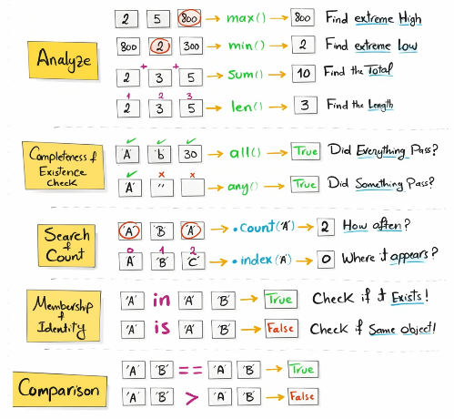
```py
numbers = [1, 5, 5, 4, 3]
print("Max:", max(numbers))         # Result is Max: 5
print("Min:", min(numbers))         # Result is Min: 1
print("Sum:", sum(numbers))         # Result is Sum: 15
print("Length:", len(numbers))      # Result is Length: 5

print("All:", all(numbers))         # Result is All: True
print("All:", all(["a", "", "c"]))  # Result is All: False

print("Any:", any(numbers))         # Result is Any: True
print("Any:", any(["a", "", "c"]))  # Result is Any: True
print("Any:", any([0, 0, 0))        # Result is Any: False

print("Count:", numbers.count(5))   # Result is Count: 2
print("Index:", numbers.index(5))   # Result is Index: 1

print(4 in numbers)                 # Result is True
print(8 in numbers)                 # Result is False
print(8 not in numbers)             # Result is True

list1 = [1, 2, 3]
list2 = [1, 2, 3]
list3 = [5, 2, 3]
list4 = list1
print(list1 is list2)               # Result is False, because they have different object IDs
print(list1 is list4)               # Result is True
print(list1 == list2)               # Result is True
print(list1 < list2)                # Result is True, because it only compared the first element, 1 < 5 which is True
```  

#### Changing Lists
- This is to permanently change the list using methods
- `Adding items`
```py
letters = ["a", "b", "c"]
# Use the append method if you want the new item to be added at the end
letters.append("x")  
print(letters)          # Result is ["a", "b", "c", "x"]

# Use the insert method if you want to insert the new item at a specific position, use index for the position
letters.insert(0, "x")
print(letters)          # Result is ["x","a","b","c"]

# Adding in matrix
matrix = [["a", "b", "c"], 
          ["d", "e", "f"],
          ["g", "h", "i"]]
# To add a new row
matrix.append(["j", "k", "l"])  # To add new list to the last 
matrix.insert(0, [0, 1, 2])     # To add new list at the start

# To add a new item inside a list, for example you want to add "x" at the end of the 2nd row
matrix[1].append("x")
# 2nd list in the matrix list will now be ["d", "e", "f", "x"]
```
- `Removing items`
```py
letters = ["a", "b", "c"]
# Use the clear method to remove everything
letters.clear()             
print(letters)              # Result is []

# Use the remove method to remove only the first match
letters.remove("b")
print(letters)              # Result is ["a", "c"]

# Use the pop method to remove an item by position
letters.pop(0)
print(letters)              # Result is ["b", "c"]
# If you don't put value, pop will always remove the last item
letters.pop()
print(letters)              # Result is ["a", "b"]
# You could also store the removed value of the pop method
removed_letter = letters.pop()
print(letters)              # Result is ["a", "b"]
print(removed_letter)       # Result is "c"

# To remove items in matrix, for example the "e"
matrix = [["a", "b", "c"], 
          ["d", "e", "f"],
          ["g", "h", "i"]]
matrix[1].pop(1)
```
- `Updating items`
```py
letters = ["a", "b", "c"]
letters[2] = "e"
print(letters)              # Result is ["a", "b", "e"]

# To update a matrix list for example the "f" to "x"
matrix = [["a", "b", "c"], 
          ["d", "e", "f"],
          ["g", "h", "i"]]
matrix[1][2] = "x"
```

#### Sorting Lists
-  Use the `sort` method to sort a list of numbers from lowest to highest, or a word list in alphabetical order
```py
letters = ["c", "a", "b"]
numbers = [4, 7, 3, 5]

letters.sort()
print(letters)              # Result is ["a","b","c"]
numbers.sort()
print(numbers)              # Result is [3, 4, 5, 7]
# Use sort(reverse=True) to sort the list from highest to lowest
letters.sort(reverse = True)
print(letters)              # Result is ["c","b","a"]
numbers.sort(reverse = True)
print(numbers)              # Result is [7, 5, 4, 3]

# In sorting matrix list, python will only sort it by the first item of each inner list
```
- To NOT permanently sort the list, use the `sorted` function and assign the output to a new value
```py
letters = ["c", "a", "b"]

asc_letters = sorted(letters)
print(asc_letters)          # Result is ["a","b","c"]   
des_letters = sorted(letters, reverse = True)
print(des_letters)          # Result is ["c","b","a"]  
```
- `reverse` method is used if you want to reverse the list (flip the order)
```py
letters = ["c", "a", "b"]

letters.reverse()
print(letters)              # Result is ["b", "a", "c"]
```
- `reversed` function is used to NOT permanently reverse the list and assign the output to a new value
```py
letters = ["c", "a", "b"]

rev_letters = list(reversed(letters))
print(rev_letters)          # Result is ["b", "a", "c"]
```

#### Copying Lists
- `Assignment Copy` - Using the `=` to assign a new variable, but both variables reference the same list in memory, so changes made to the original will reflect to the copy, and changes made to the copy will reflect to the original
```py
original = [0, 1, 2, 3]
original_copy = original

original_copy.pop()
# Now original and original_copy will both have [0, 1, 2]
```
- `Shallow Copy` - to create a real extra copy, use the **copy** method, so that each list is independent from each other, but only the top level, this is not advisable to use on nested lists
```py
original = [0, 1, 2, 3]
original_copy = original.copy()

original_copy.pop()
# Now original_copy will have [0, 1, 2], but original copy stays the same [0, 1, 2, 3]
```
- `Deep Copy` - best used on nested lists (matrix) as it will create an independent copy for all levels - no matter how nested is your list, but you need to import **copy** to use this
```py
import copy
matrix = [["a", "b", "c"], 
          ["d", "e", "f"],
          ["g", "h", "i"]]
matrix_copy = copy.deepcopy(matrix)
# Now even if you change a list within a list, it will be independent from each other
```

#### Combining Lists
```py
# Addition
letters = ["a", "b", "c"]
numbers = [1, 2, 3]
comb = letters + numbers    
print(comb)         # Result is ["a","b","c",1,2,3]

# Multiplier
print(letters * 2)  # Result is ["a","b","c","a","b","c"]

# To create a nested list
comb = [letters, numbers]
print(comb)         # Result is [["a","b","c"],[1,2,3]]

# Use the extend method to permanently change a list by adding another list
numbers.extend(letters)
print(numbers)      # Result is [1,2,3,"a","b","c"]

# Use the zip function to make tuples from the lists provided
comb = zip(letters, numbers)
print(comb)     # Result is [("a",1), ("b",2), ("c",3)]
# Note that if one list has more values, those values will not be used as they have no pair)
```

#### Iterators
- We use iteration to transform data.
- Iterators are used in loops.
- Iterables are the values that could be iterated in a list
```py
# Example: If you want to transform a list of small letters to capitalized letters and put it in a new list
letters = ["a", "b", "c"]
letters_big = []
for l in letters:
    letters_big.append(l.upper())
print(letters_big))    # Result is ["A", "B", "C"]
```
- `enumerate` function is used to add index on each value in list. It is commonly used on finding the exact position of the bad data in your list.

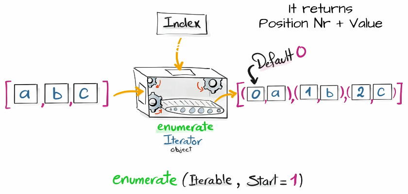
```py
letters = ["a", "b", "c"]
print(list(enumerate(letters))) # Result is [(0,"a"),(1,"b"),(2,"c")]

# If you don't want to start from 0, you can specify where to start
print(list(enumerate(letters, start = 1))) # Result is [(1,"a"),(2,"b"),(3,"c")]

# If you need to use it on loops
letters = ["a", "b", "c"]
for index, value in enumerate(letters):
    print(index, value)
```

- `reversed` function is used to return an iterator that flips the data order
```py
letters = ["a", "b", "c"]
for l in reversed(letters):
    print(l)    # Result is c b a
```

- `zip` function combines two or more sequences into pairs (tuples)
```py
letters = ["a", "b", "c"]
numbers = [1, 2, 3]
for l, n in zip(letters, numbers):
    print(l, n) # Result is ("a",1) ("b",2) ("c",3) 
```

- `map` function is used to repeat a function on each value in the list. So you need to give it 2 things, the function that needs to be repeated, and the iterable (list).
```py
# Example, turn lowercase letters into uppercase letters 
letters = ["a", "b", "c"]
print(list(map(str.upper, letters)))    # Result is ["A", "B", "C"]
# Another example, you want to turn the string numbers to int
numbers = ["1", "2", "3"]
print(list(map(int, numbers)))    # Result is [1, 2, 3]
```

- `filter` function is used to filter only the values that you need. This is also used to clean up the list by removing invalid data.

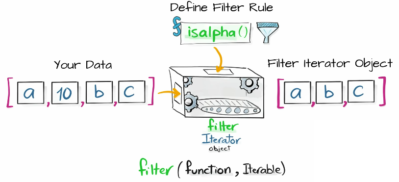
```py
letters = ["a", "", "b", None, "c", False]
# If you want to filter out all the None
print(list(filter(None, letters)))  # Result is ["a", "b", "c"]
# You can also use "bool" to also filter out all falsy values, works exactly the same like "None"
print(list(filter(bool, letters)))  # Result is ["a", "b", "c"]
```

- `lambda` function is a small, anonymous function that can be defined in a single line of code. A lambda can contain any expression, including conditions.

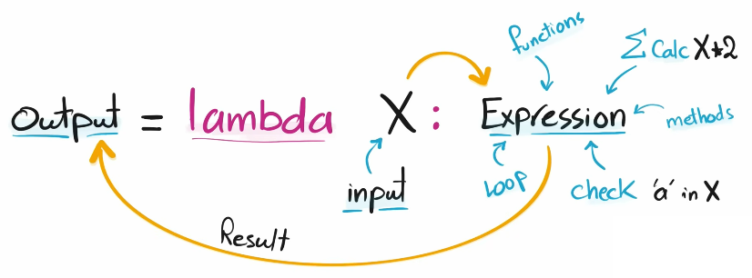
```py
# Example 1: Only 1 variable
multiple = lambda x: x * 2
print(multiple(2))      # The result is 4

# Example 2: 2 variables
add = lambda x, y: x + y
print(add(5, 4))        # The result is 9

# Example 3: "if a letter is in the word python" checker
check = lambda i: i in "python"
print(check("n"))       # The result is True
```

- `lambda + map`
```py
prices = ["$12.50", "$9.99", "$100.00"]
print(list(map(lambda p: float(p.replace("$", "")), prices))) # Result is [12.50, 9.99, 100.00]
```

- `lambda + filter`
```py
# Example 1: Filter the prices higher or equal than 100
prices = [120, 30, 300, 80]
print(list(filter(lambda p: p >= 100, prices))) # Result is [120, 300]

# Example 2: Filter the nested list to show the student's name that starts with "M" only
students = [["Maria", 85],
            ["John", 80],
            ["Max", 95]]
print(list(filter(lambda row: row[0].startswith("M"), students)))
# Result is [["Maria", 85],
#            ["Max", 95]]
```

#### List Comprehensions
- Loop, data transformation, and filtering all in one line. Example:

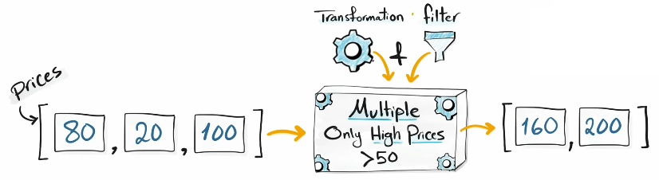

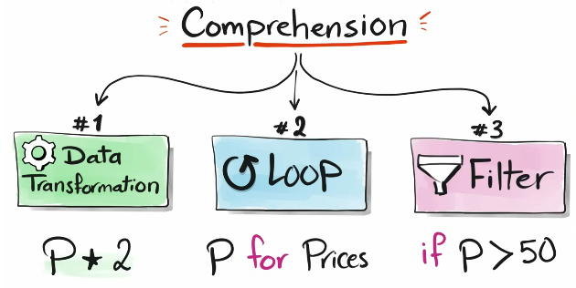
```py
# Example: Normalize the domains into standard format
domains = ["www.google.com",
           "openai.com",
           "localhost",
           "WWW.DATA.COM"]
cleaned = [
    d.lower().replace("www.", "")   # Transformation
    for d in domains                # Loop
    if "." in d                     # Filter
]
print(cleaned)  # Result is ["google.com", "openai.com", "data.com"]
```


### Tuples ()
- Ordered collection that can't be changed after creating it
- Allows duplicates
- Indexed


### Sets {}
- Unordered collection of unique values
- It is NOT indexed
- Mutable

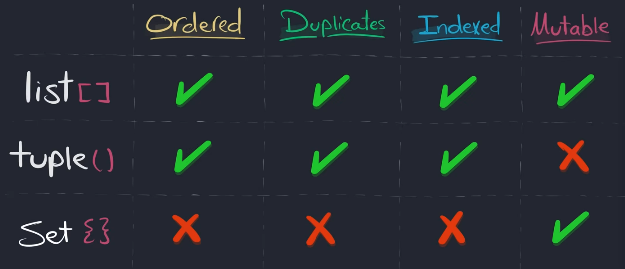

#### Sets Methods
- `add` method is used to insert item somewhere in the set, but only if it is new
```py
a = {10, 20, 30, 40}
a.add(50)
print(a)        # Result is {40, 10, 50, 20, 30}
```

- `update` method is used to merge another group of values (iterable - could be a list, set, or string) into the set
```py
a = {10, 20, 30, 40}
a.update("Hi")
print(a)        # Result is {40, 10, "H", 20, "i", 30}

a.update([1,2])
print(a)        # Result is {1, 2, 40, 10, 20, 30}

a.update({1,2})
print(a)        # Result is {1, 2, 40, 10, 20, 30}

# You can use math operators as quick shortcuts: |&-^
a |= {1,2}
print(a)        # Result is {1, 2, 40, 10, 20, 30}
```

- `discard` method is used to remove the item if it exists and does nothing if it does not
```py
a = {10, 20, 30, 40}
a.discard(10)
print(a)        # Result is {40, 20, 30}
```

#### Sets Math Methods
- **Math Operators** return a new set and leave the originals untouched

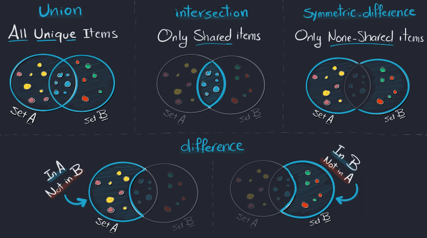

- `union` method is used to combine all unique items from both sets.
```py
a = {10 ,20, 30, 40}
b = {30, 40, 50, 60}

print(a.union(b))   # Result is {40, 10, 50, 20, 60, 30}
print(a | b)        # This is the shortcut for a.union(b)
```

- `intersection` method is used to return only the shared items
```py
a = {10 ,20, 30, 40}
b = {30, 40, 50, 60}

print(a.intersection(b))    # Result is {40, 30}
print(a & b)                # This is the shortcut for a.intersection(b)
```

- `symmetric_difference` method is used to find NON-shared values
```py
a = {10 ,20, 30, 40}
b = {30, 40, 50, 60}

print(a.symmetric_difference(b))  # Result is {10, 50, 20, 60}
print(a ^ b)                      # This is the shortcut for a.symmetric_difference(b)
```


- `difference` method is used if you want to get the values that belongs only to that group
```py
a = {10 ,20, 30, 40}
b = {30, 40, 50, 60}

print(a.difference(b))  # Result is {10, 20}
print(a - b)            # This is the shortcut for a.difference(b)

print(b - a)            # Result is {50, 60}
```

#### Sets Relationship Methods
- `issubset` method is used to return True if ALL items in this set exist in the other
- `issuperset` method is used to return True when it includes ALL items of the other set
```py
a = {10 ,20, 30, 40}
b = {30, 40, 50, 60}
print(a.issubset(b))    # Result is False

a = {30, 40}
b = {30, 40, 50, 60}
print(a.issubset(b))    # Result is True
print(b.issuperset(a))  # Result is True
```

- `isdisjoint` method is used to return True if both sets share NO items at all (no overlapping)
```py
a = {10 ,20}
b = {30, 40, 50, 60}
print(a.isdisjoint(b))  # Result is True
```

### Dictionaries {:}
- Ordered
- Keys must be unique (no duplicates)
- Values allow duplicates
- Not indexed, but we use keys to access the values
- Mutable

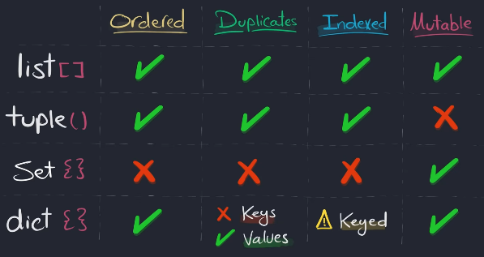

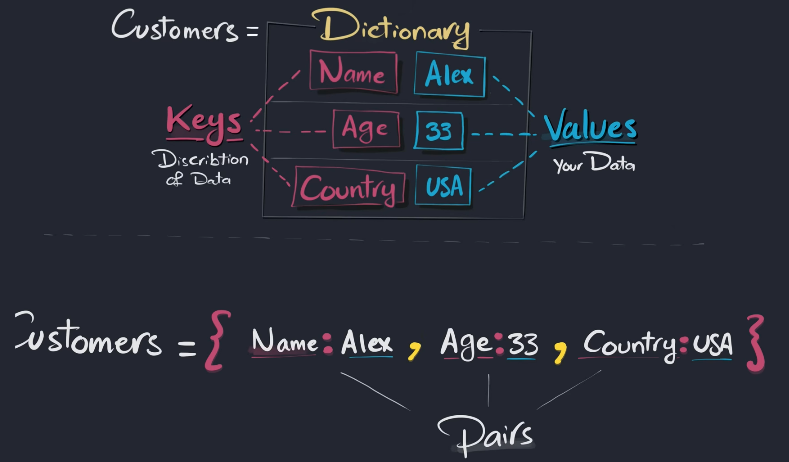

#### Dictionary Methods
- `get` method is used to return the value safely, gives None if missing
```py
user = {"id": 1, "age": 30, "city": "berlin"}

print(user.get("age"))              # Result is 30
print(user.get("name"))             # Result is None
print(user.get("name", "Unknown"))  # Result is Unknown
```

- `in` operator is used to test if the key is inside the dictionary
```py
user = {"id": 1, "age": 30, "city": "berlin"}

print("age" in user)        # Result is True
print("name" in user)       # Result is False
print("name" not in user)   # Result is True
```

View objects give you a live view of the dictionary's keys, values, or key value pairs.
- `keys` method is used to return all the KEYS in your dictionary
- `values` method is used to return all the VALUES in your dictionary
- `items` method is used to return all (key,value) pairs of your dictionary. It produces tuples of your (key,values), which is perfect when you need key and value together for looping, transforming data, building new dicts, comparing and more.
```py
user = {"id": 1, "age": 30, "city": "berlin"}

print(user.keys())      # Result is dict_keys(["id","age","city"])
print(user.values())    # Result is dict_values([1, 30,"berlin"])
print(user.items())     # Result is dict_items([("id", 1), ("age", 30), ("city", "berlin")])
# Looping the keys and values while using the items method
for key, value in user.items():
    print(key, value)
# Result is:
# id 1
# age 30
# city berlin
```

- `Add, Update, and Remove`
    - `update` method is used for updating the dictionary (single or multiple)
    - `pop` method is used to remove a specific key & value, it is best to provide a default word like "Not Found" just in case you used pop on a non-existing key
    - `popitem` method is used to delete the last pair of key & value
```py
user = {"id": 1, "age": 30, "city": "berlin"}
# To add a new key & value
user["name"] = "John"   # Result is {"id": 1, "age": 30, "city": "berlin", "name": "John"}
# To update a value
user["age"] = 35        # Result is {"id": 1, "age": 35, "city": "berlin", "name": "John"}
# To update multiple values, use update method
user.update({"age": 40, "city": "Paris"})
# To remove a key & value, use the pop method, and if you want, you can put the removed value in a variable (not req'd)
age = user.pop("age")
print(user)             # Result is {"id": 1, "city": "Paris", "name": "John"}
print("Removed Item:", age) # Result is Removed Item: 40
# It is better to put a default word like "Not Found" just in case you used pop on a non-existing key
user.pop("salary", "Not Found")    # Result is Not Found
# If you want to remove the last key & value, use popitem method
user.popitem()  # Result is {"id": 1, "city": "Paris"}
```

- `fromkeys` method is used to build a new dictionary where all keys get the same default value
```py
user = dict.fromkeys(["id", "name", "age", "city"], None)
print(user)     # Result is {"id": None, "name": None, "age": None, "city": None}
```

<br>
<br>

## Chapter 8 - Python Functions 
**Functions** are small, reusable block of code that does one specific job.

### Sources of Functions
- `Built-in` - comes with python
```py
# Built-in Function (Just Calling)
print(len("Python"))
```
- `Standard Library` - written by python team 
    - Import them to be able to use them
```py
# Function From Libraries (Import then Call)
import math
number = 4.2
print(math.ceil(number))
```
- `External Library` - written by community / other developers.
    - Install the external libraries
    - Then Import them to be able to use them
- `User-Defined` - written by you
    - Define them then use them

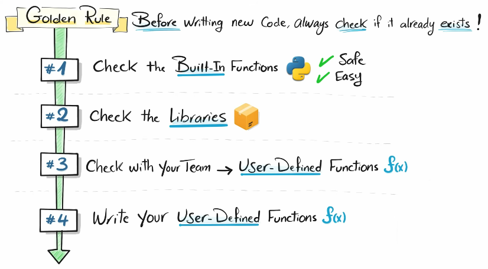

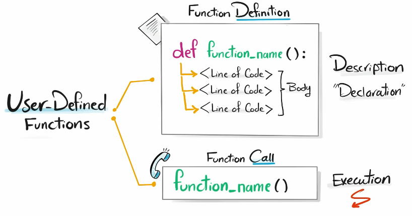

```py
# Simple Example:
def make_coffee():
    print("Start Machine")
    print("Make Coffee")
    print("Add milk")
    print("Enjoy it")

print("Wake Up")
make_coffee()
print("Working for a while")
make_coffee()
```

### Parameters and Arguments
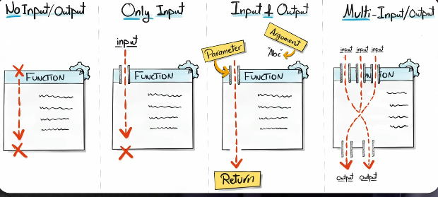

- `Parameters` - names used in function definition that describe what data the function expects
- `Arguments` - actual values passed in a function call that are assigned to parameters

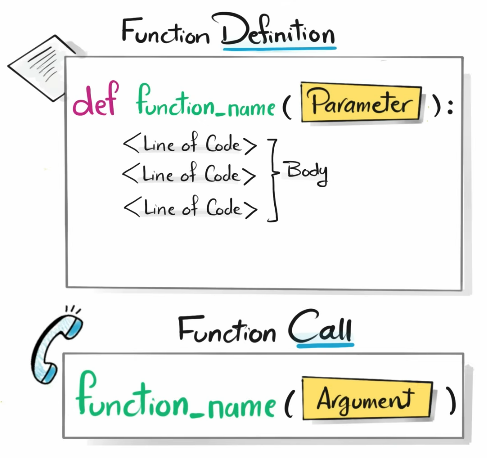
```py
# Simple Example:
def multiply_two(x):
    print(x * 2)

multiply_two(3)         # Result is 6

# Another Example: Rule - Normalize Strings
def clean_name(name):
    print(name.strip().lower())

clean_name("  MarIa  ") # Result is maria
```

#### Global Variables and Local Variables
- `Global Variable` is created outside the function that can be accessed anywhere
- `Local Variable` is created inside the function that can be accessed only inside the function

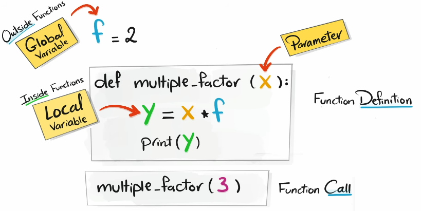

#### Multiple Arguments
- rule is number of arguments must match the number of parameters

- `Positional Arguments` - values pass to the function based on their order. The order of arguments must match the order of the parameters.
```py
# Create a function that
# Send first & last names to be cleaned
# then merge them into a full name
def clean_name(first, last, country):
    cleaned_first = first.strip().lower()
    cleaned_last = last.strip().lower()
    merged = (f"{cleaned_first} {cleaned_last} from {country}")
    print(merged)

clean_name("  JOhn  ", " dOe   ", "DE") # result is john doe from DE
```

- `Keyword Arguments` - values pass to the function based on their names. To convert the above example to a keyword argument, you must assign the variable inside the parameters when calling the function.
```py
clean_name(country = "DE", first = "  JOhn ", last = "DOE ")
# result will also be john doe from DE
```

- `Mixed Arguments` - combination of Positional & Keyword. Rule is you must start with positional args then keyword
```py
clean_name("  JOhn  ", last = "DOE ", country = "DE")
# result will also be john doe from DE
```

#### Default Parameter
- Parameter that has already a value so if you don't pass anything in Python uses that value automatically
```py
def clean_name(first, last, country = "n/a"):
    cleaned_first = first.strip().lower()
    cleaned_last = last.strip().lower()
    merged = (f"{cleaned_first} {cleaned_last} from {country}")
    print(merged)
# Now even if the user doesn't specify a country, it will just show "n/a"
```

#### *args & **kwargs
- Allows functions to accept an unknown number of arguments, because sometimes you don't know how many arguments will be passed to your function
- `*args` - one star (*) means positional arguments
- data type is tuple
- When to use *args
    - when you pass similar values (multiple int, multiple strings, etc)

```py
# Get the total of numbers
def total(*args):
    print(sum(args))

total(1, 2)         # Result is 3
total(1, 4, 5)      # Result is 10
```

- `**kwargs` - two stars (**) means keyword arguments
- data type is dict
- when to use **kwargs
    - when you pass different type of values (combination of string, int, boolean, etc)
```py
# Create the user profile
def create_user(**kwargs):
    print(kwargs)

create_user(first_name = "John", last_name = "Doe", age = 33, is_male = True)
# Result is {"first name": "John", "last_name": "Doe", "age": 33, "is_male": True}
create_user(name = "Maria", age = 20)
# Result is {"name": "Maria", "age": 20}
```

#### Return
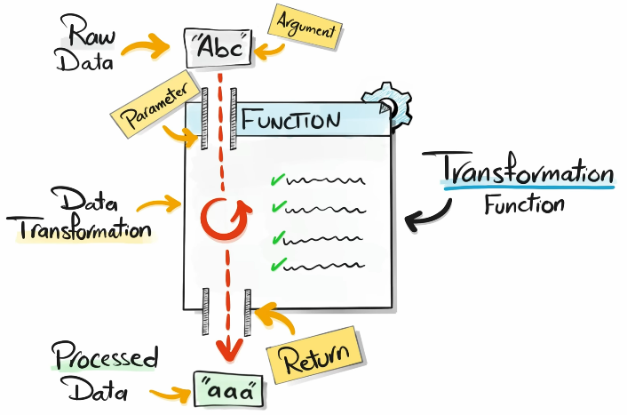

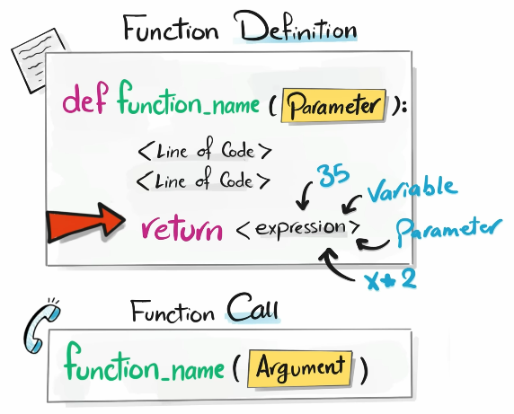

- In our previous function examples, we use `print` for us humans to see the new value, now we will use `return` for Python to see the new value (send data back to the program)
- If a function has no return statement, Python returns None
- Assign the function call to a variable to store the result
```py
def clean_name(name):
    cleaned = name.strip().lower()
    return cleaned

cln_name = clean_name("  MaRia ")
print(cln_name)     # Result is maria
```
- A function can have multiple return statements
```py
def clean_name(name):
    if not name:
        return None
    else:
        cleaned = name.strip().lower()
        return cleaned

cln_name = clean_name("  MaRia ")
print(cln_name)     # Result is maria
cln_name = clean_name("")
print(cln_name)     # Result is None
```
- You can also have multiple return values separated by commas
```py
def clean_name(name):
    lo_cleaned = name.strip().lower()
    up_cleaned = name.strip().upper()
    return lo_cleaned, up_cleaned

cln_name = clean_name("  MaRia ")
print(cln_name)     # Result is a tuple ("maria", "MARIA")
# If you don't want your result to be a tuple, create 2 global variables
lo_name, up_name = clean_name("  MaRia ")
print(lo_name) 
print(up_name)      # Result is maria 
                    #           MARIA
```

### Function Types By Purpose "use cases"
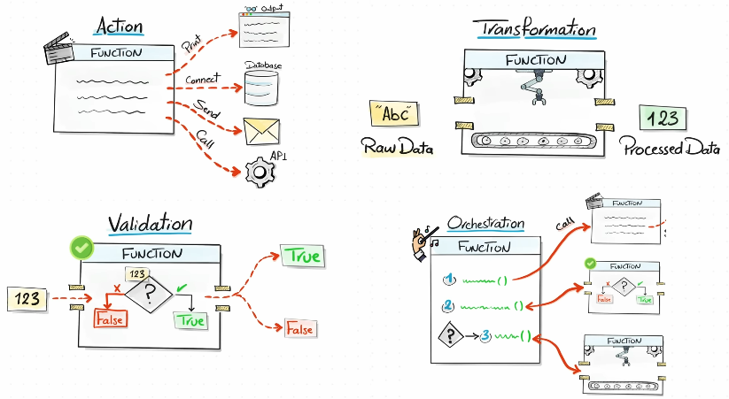

#### Action Functions
- Designed to perform an operation in the system instead of returning values

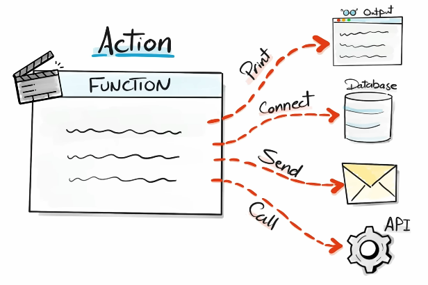

- `with open` - opens the file safely and closes it automatically when done
- `append mode "a"` - it appends data at the end of the file
```py
# Example: Store app that log messages in a file whenever an event occurs
def write_log(message):
    with open(r"C:\Main\Python\app.log", "a") as file:
        file.write(message + "\n")

write_log("App Started")    # Result is it will create an app.log that has App Started message inside
```

#### Transformation Functions
- Raw data goes in, gets transformed, and returns processed data

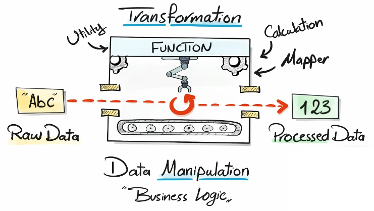

```py
# Example: Python program that cleans email addresses and splits them into structured data (username and domain)
def clean_and_split_email(email):
    cl_email = email.strip().lower()
    #john@gmail.com
    username, domain = cl_email.split("@")
    return {"username": username,
            "domain": domain}

print(clean_and_split_email(" jOhn@gMail.com  "))
# Result is {"username": "john", "domain": "gmail.com"}
```

#### Validation Functions
- Validates a condition and returns a boolean result (True or False)

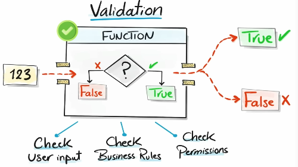

```py
# Example: Python program that checks whether the password meets the minimum requirement of 8 characters
def is_valid_password(password):
    return len(password) >= 8

print(is_valid_password("123456"))  # Result is False
```

#### Orchestrator Functions
- Controls program flow by calling other functions in the correct order

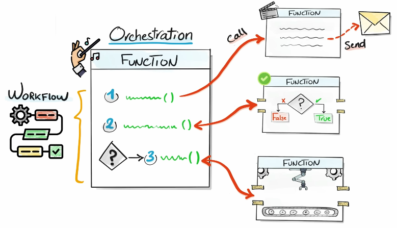

- **Create a mini-project**
    - Receive an email from the user
    - Validate the email
    - If it is invalid, Log an error in a file
    - If it is valid, clean and structure the email
    - Log each step of the program
```py
# Action Function
def write_log(message):
    with open(r"C:\Main\Python\app.log", "a") as file:
        file.write(message + "\n")

# Validation Function
def is_valid_email(email):
    return "@" in email and "." in email

# Transformation Function
def clean_and_split_email(email):
    email = email.strip().lower()
    username, domain = email.split("@")
    return {"username": username,
            "domain": domain}

# Orchestrator Function
def process_user_email(email)
    write_log("App Started")
    # We must check if the email is valid
    is_valid_email(email)
    # If it is not valid, we log the problem
    # If it is valid, we clean it and store structured data
    # And we log what happened
    if not is_valid_email(email):
        write_log(f"Invalid Email received: {email}")
    else:
        clean_email = clean_and_split_email(email)
        write_log(f"Processed Email: {clean_email}")
    write_log("App Stopped")

# We receive an email from a user
email = input("Please enter your Email: ")
process_user_email(email)
```

### 8x Habits for Writing Functions
1. Use `snake_case` for function names.
2. Use clear descriptive function names.
    - Describe exactly what the function does
    - Start with a `verb`
    - Use full words, avoid abbreviations
3. Parameter names describe their values.
    - Use full, meaningful words
    - Avoid abbreviations and single letters
4. Always describe functions using docstring (""" """).
    - Help teammates understand your code
    - Help future you remember the logic 
5. Replace `prints` with `return` to send data back to the program.
6. Don't change parameter values directly, create `local variables` for any processing.
7. Use data type hints.
    - Always add type hints to parameters and return to make the function easier to understand
8. Explain `args` & `return` in docstring (""" """).
    - Always describe what goes in and what comes out of the function in the docstring