# Python Course
- [Youtube Link: Python Full Course for Beginners - From Zero to Hero](https://www.youtube.com/watch?v=Rq5gJVxz55Q)

## Chapter 1 - Python Fundamentals

### Setup your Environment (VS Code)

- Press `ctrl+shift+P`, then type `Python:Select Interpreter` then select the python that you've installed.
- ``ctrl+shift+` `` - to open a new terminal, you can open multiple terminal by using ``ctrl+shift+` ``, then you can select **bash** for example
- ``ctrl+` `` - to open again a previously opened terminal
- `python3 --version` - run this on terminal to verify your python version for linux, `py --version` for windows
- `python3` - run this on terminal to run python repo, to quit type `quit()`
- Press `ctrl+shift+P`, then type `Preferences:Open Keyboard Shortcuts`. Type `Run python file`. Double-click keybinding to assign `ctrl+R`.
- **VS Extensions** - Python, autopep8, Material Icon Theme, One Dark Pro


### Comments
- `#` - used to make comments/notes
- `ctrl+/` - select all the texts that you want to be a comment then press `ctrl+/`
- `shift+alt+down` - copy an entire line


### print() function
- `print()` is a python built-in function that displays messages on the output screen. Example: `print("Hello World!")`
- **Escape Sequences**

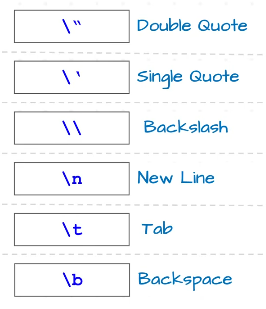

Example:
```py
print("Hi \"Python\"")  # To print Hi "Python"
print('Hi \'Python\'')  # To print Hi 'Python'
print('Hi "Python"')    # To print Hi "Python"
print("Path: C:\\Users\\John")  # To print Path: C:\Users\John
print("Message1\n")     # To print a space line after your message
print("Message1\tMessage2") # To put a tab space between the words
```
- **Triple Quotes** - for Python to allow multiples lines inside the triple quotes
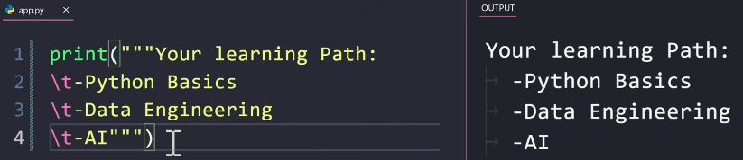


### Variables
- `=` - to assign variables. Example:
```py
name = "John"
print("My name is", name)     # Output is: My name is John
# The comma provided space between is and name
```
- You can't use on variable names: <br>
    hyphen(-), start with a number, characters like '!', keywords like 'if' or 'for'
- **Python Naming Conventions**
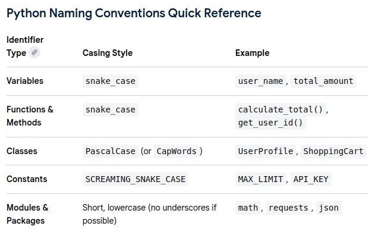

### input() function
- To get something from the user. Example:
```py
name = input("Enter Your Name:")   # This is a dynamic value
country = "Germany" # This is hard-coded (static) value
print(name, "comes from", country)
```
- **Dynamic value** - data entered by the user that can vary each time the program runs
- **Hard-coded (static) value** - fixed piece of data written directly into your code that never changes at runtime


### Data Types
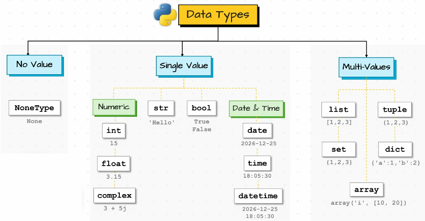
```py
# Data Types
a = 10      # int
b = 3.14    # float
c = "Hello" # str
d = 'Hi'    # str
e = "1234"  # str
f = True    # bool
g = False   # bool
h = None    # NoneType
i = ""      # str - blank
j = " "     # str - empty
```

### Functions and Methods
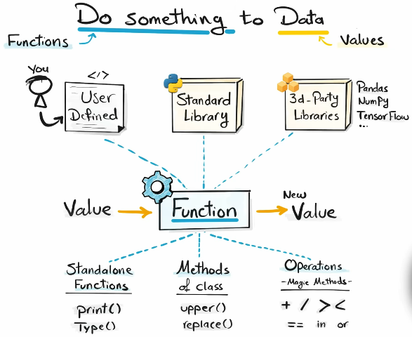

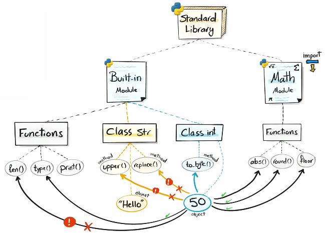

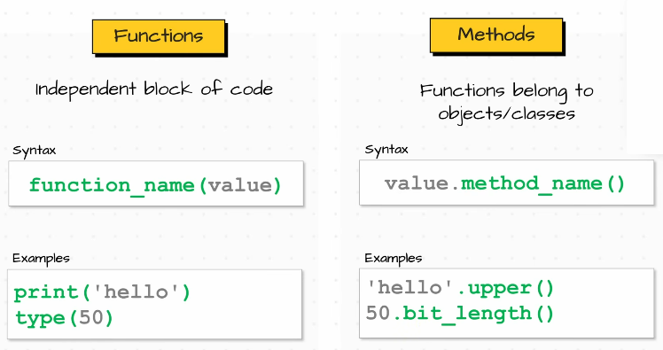

#### Examples of Functions
- `type()` - is a built-in function that returns the data type of a value.
- `len()` - is a built-in function that gives the total count of items inside a value. Examples:
```py
text = "hi"
number = 10

print(type(text))   # <class 'str'>
print(type(number)) # <class 'int'>

print(len(text))   # Result is 2
print(len(number)) # TypeError. int has no length value
```
#### Examples of Methods
- `upper()` - is a method of the class str that converts all the letters to uppercase.
- `bit_length()` - is a method of the class int that returns the length of a number in binary. Examples:
```py
text = "hi"
number = 10

print(text.upper()) # Result is HI
print(number.upper()) # AttributeError. int has no attribute upper
print(number.bit_length())  # Result is 4
```
<br>
<br>

## Chapter 2 - Python Strings

### String Functions - Categories
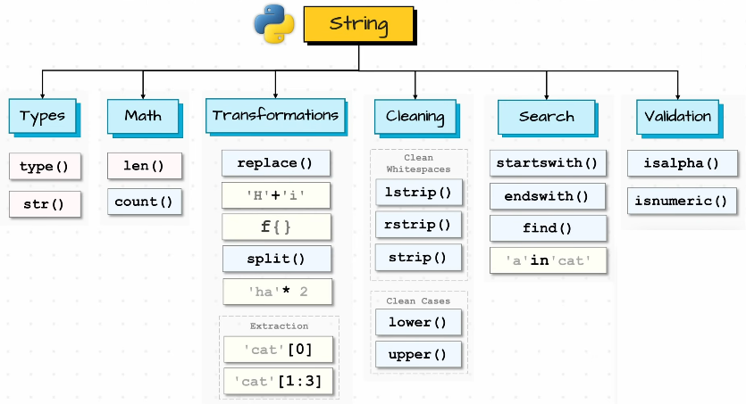

### Types
#### type()
- is a built-in function that returns the data type of a value. Example:
```py
name = "John"
age = 24

print(type(name))   # <class 'str'>
print(type(age))    # <class 'int'>
```
- #### str()
- is a built-in function that converts any value into string value. Example:
```py
age  = 24

print("Your age is:" + age)         # This will cause an Error
# To correct this use the str function
print("Your age is:" + str(age))    # Your age is:24
# If you want to permanently convert your int variable to str
age = str(age)
```
### Math
#### len()
- is a built-in function that gives the total count of items inside a value. Example:
```py
password = "123a"
print(len(password))    # Result is 4
# This is useful if a web app requires a minimum number of char for password
if len(password) < 8:
    print("Your password is too short!")
# Take note that it will count everything even spaces
name = "  John"
print(len(name))    # Output will be 6 because 4 + 2 spaces
```
#### count()
- is a built-in method that returns how often a word appears in the string. Output is int. Example:
```py
text = """
Python is easy to learn.
Python is powerful.
Many people love python.
"""
print(text.count("Python"))     # Result is 2
```
### Transformations
#### replace()
- is a built-in method that swaps part of the text with something new. Output is str. Example:
```py
date = "2026/06/12"
print(date.replace("/", "-"))  # Result is 2026-06-12 

phone = "176-1234-56"
print(phone.replace("-", ""))  # Result is 176123456 
# Replacing 2 or more
price = "$1,299.99"
print(price.replace("$", "").replace(",", ""))  # Result is 1299.99
```
#### "string" + "string"
- joins two or more strings into one. Example:
```py
first_name = "John"
last_name = "Doe"
full_name = first_name + " " + last_name
print(full_name)   # Result is John Doe
```
#### f{}
- f-string is a modern way to format and build strings. Example:
```py
name = "John"
age = 34
is_student = False
# Old style
print("My name is " + name + ", I am" + str(age) + " years old, and student status is " + str(is_student) + ".")
# New style using f-string
print(f"My name is {name}, I am {age} years old, and student status is {is_student}.")
```
#### split()
- is a built-in method that breaks a string into smaller parts. Output is a list. Example:
```py
stamp = "2026-09-20 14:30"
# To separate them by their space
print(stamp.split(" "))     # Result is ['2026-09-20', '14:30']
```
#### "string" * number
- repeats the string multiple times. Output is str. Example:
```py
print("ha" * 3)     # Result is hahaha
print("#" * 10)     # Result is ########## 
```
#### Indexing and Slicing
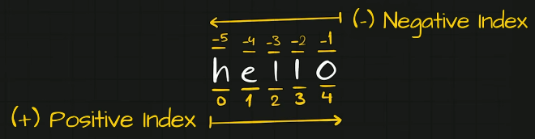
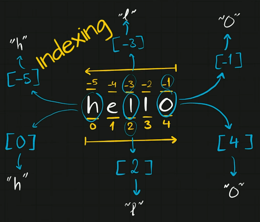
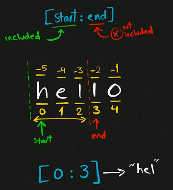
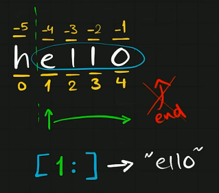
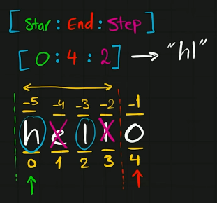

```py
# Extract 1 character (Indexing)
text = "Python"
print(text[0])      # Result is P
print(text[-1])     # Result is n
# Extacting more than 1 character (Slicing)
date = "2026-06-12"
print(date[0:4])    # Result is 2026
print(date[:4])     # Result is also 2026
print(date[-2:])    # Result is 12
```
### Cleaning
#### lstrip(), rstrip(), strip()
- are built-in methods to clean white spaces.
- use `lstrip()` to clean white space/s on the left
- use `rstrip()` to clean white space/s on the right
- use `strip()` to clean white space/s on both left and right
```py
text = " Engineering"
print(text.lstrip())    # Result is Engineering
text = "Engineering  "
print(text.rstrip())    # Result is Engineering
text = "  Engineering "
print(text.strip())     # Result is Engineering
text = "###Abc123##"
print(text.strip("#"))  # Result is Abc123
```
#### lower(), upper()
- are built-in methods that are used for case conversion
```py
text = "python PROGRAMMING"
print(text.lower())     # Result is python programming
print(text.upper())     # Result is PYTHON PROGRAMMING
# Comparing data example
search = "Email ".lower().strip()
data = " emAil".lower().strip()
print(search == data)   # Result is True
```
### Search
#### startswith(), endswith(), in, find()
- are used to search characters
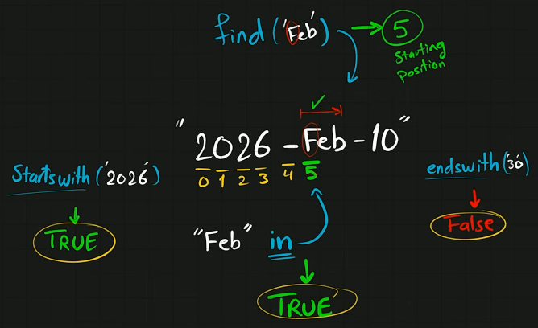
```py
phone = "+63-919-1234567"
print(phone.startswith("+63"))      # Result is True

email = "john@gmail.com"
print(email.endswith("gmail.com"))  # Result is True

print("@" in email)                 # Result is True

# One of the best use of using find() is if you want to splice inconsistent number of characters
phone1 = "+63-919-1234567"
phone2 = "63-917-7654321"
phone3 = "0063-920-1357901"
# Using splice - but we need to count the index
print(phone1.[4:])  # Result is 919-1234567
print(phone2.[3:])  # Result is 917-7654321
print(phone3.[5:])  # Result is 920-1357901
# Using find() - so that you don't have to count the index
print(phone1[phone1.find("-")+1:])  # Result is 919-1234567
print(phone2[phone2.find("-")+1:])  # Result is 917-7654321
print(phone3[phone3.find("-")+1:])  # Result is 920-1357901
```
### Validation
#### isalpha()
- is a built-in method that checks if the string has only letters. Output is boolean. Example:
```py
country = "USA"
print(country.isalpha())    # Result is True
```

#### isnumeric()
- is a built-in method that checks if the string has only numbers. Output is boolean. Example:
```py
phone = "09181234567"
print(phone.isnumeric())    # Result is True
```

<br>
<br>

## Chapter 3 - Python Numbers
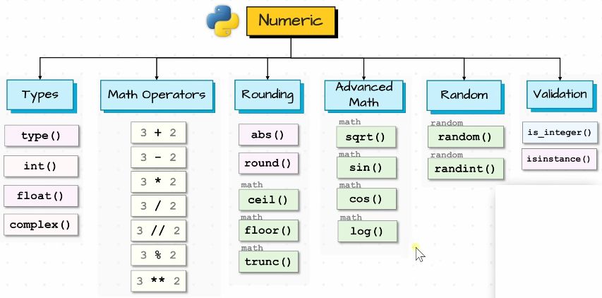

### Types
#### type()
- is a built-in function that returns the data type of a value. Example:
```py
x = 5
y = 5.7
z = 2 + 3j

print(type(x))  # Result is <class 'int'>
print(type(y))  # Result is <class 'float'>
print(type(z))  # Result is <class 'complex'>
```
#### int()
- is a built-in function that converts compatible value into int value. Output is int. Example:
```py
x = "24"
print(type(x))  # Result is str
x = int(x)      
print(type(x))  # Result is now int
```
#### float()
- is a built-in function that converts compatible value into float value. Output is float. Example:
```py
x = 3           # int that will be converted to float
print(int(x))   # Result is 3.0
y = "3.14"      # str that will be converted to float
print(int(y))   # Result is 3.14
```
#### complex()
- is a built-in function that creates a complex number using real and imaginary parts. Output is complex. Example:
```py
x = 3   # real
y = 4   # will become the imaginary
print(complex(x,y))     # Result is 3+4j
```

### Math Operators
```py
print(2 + 3)    # Addition. Result is 5
print(5 - 3)    # Subtraction. Result is 2
print(4 * 2)    # Multiplication. Result is 8
print(7 / 2)    # Division. Result is 3.5
print(7 // 2)   # Floor Division - it divides two numbers and rounds down. Result is 3
print(7 % 2)    # Remainder. Result is 1
print(2 ** 3)   # Exponential. Result is 8

# How to Shortcut. Example:
x = 2
x = x + 3
# You can write it just like this:
x = 2
x += 3  # Result is also 5
```

### Rounding
#### abs()
- is a built-in function that returns the absolute (non-negative) value of a number. Output is int. Example:
```py
print(abs(2 - 10))  # Result is 8
```
#### floor(), ceil(), round()
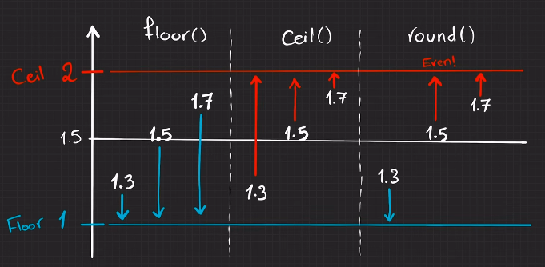

```py
import math     # You need to import math to use the floor & ceil functions
price = 35.54879
print(math.floor(price))    # Result is 35
print(math.ceil(price))     # Result is 36
print(round(price))         # Result is 36
print(round(price,2))       # Result is 35.55
```
#### trunc()
- cuts off the decimal part and keeps the whole number (no rounding). Also needs to import math to be used. Example:
```py
import math
price = 15.69
print(math.trunc(price))    # Result is 15
# if you don't want to import math just to use trunc(), you can also use int() which will do the same
print(int(price))           # Result is also 15
```

### Random
#### random()
- returns a random float between 0.0 and 1.0. We need to import random. Output is float.
```py
import random
print(random.random())  # Result is 0.496024166 which is random
```
#### randint()
- gets a random whole number from start to end that you specify (both included). Also need to import random. Output is int. Example:
```py
import random
print(random.randint(1,6))  # Result will be any number from 1 to 6
```

### Validation
#### is_integer()
- is a built-in method that checks if a float has no decimal part (is a whole number). Output is boolean. Example:
```py
x = 7.0
print(x.is_integer())   # Result is True
y = 7.1
print(y.is_integer())   # Result is False
```
#### isinstance()
- is a built-in function that checks if a value belongs to a certain data type that you expect. Output is boolean. Example:
```py
x = 70
print(isinstance(x, int))   # Result is True
print(isinstance(x, float)) # Result is False
```

<br>
<br>

## Chapter 4 - Python Logic & Operators
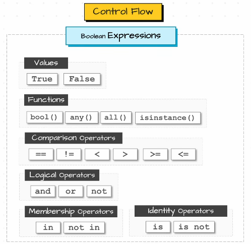

### Functions
#### bool()
- is a built-in function. Output is boolean.
- True - if the value is non-empty or non-zero
- False - if the value is empty or zero
```py
print(bool(123))    # Result is True
print(bool("Hi!"))  # Result is True
print(bool())       # Result is False since it is empty
print(bool(0))      # Result is False
print(bool(""))     # Result is False
print(bool(None))   # Result is False
```
#### any(), all()
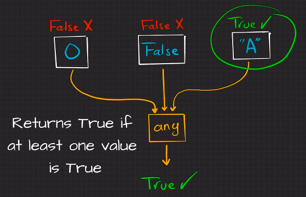
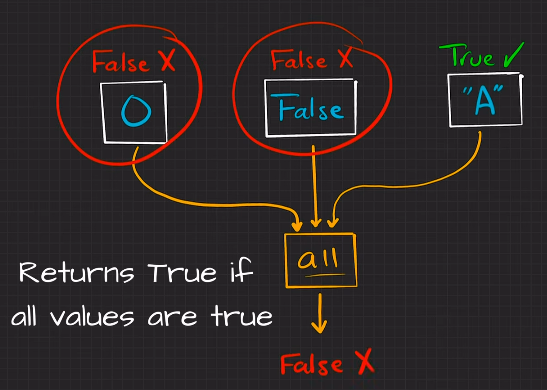

```py
email = ""
phone = "0919-1234567"
username = ""
# Allows registration if any field is filled
print(any([email, phone, username])) # Result is True because at least one is filled which is the phone

# Allows registration only if all fields is filled
print(all([email, phone, username])) # Result is False because only one field is filled
```
#### isinstance()
- is a built-in function that checks if a value belongs to a certain data type that you expect. Output is boolean. Example:
```py
print(isinstance(123, int))   # Result is True
print(isinstance(True, str))  # Result is False
```

### Comparison Operators
- it compares two or more values and return True or False based on the result.

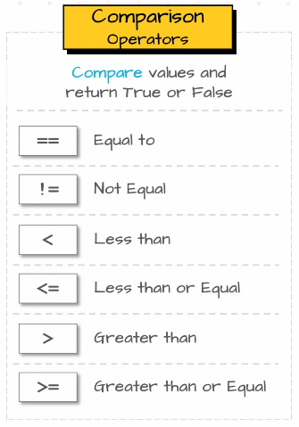
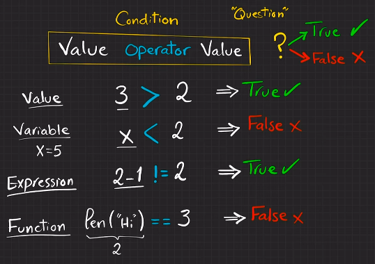

#### Chained Comparison
- it evaluates it from left to right, checking each condition one by one. Example:
```py
# Is age between 18 and 30?
age = 20
print(18 <= age <= 30)    # Result is True
```

### Logical Operators
#### and | or 
- used to combine multiple boolean expressions

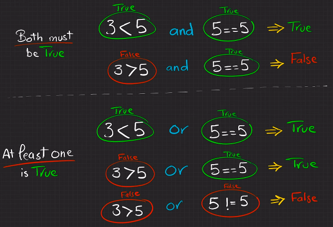

#### not
- it reverses the truth
- it turns True into False, and False into True
```py
print(3 > 2)        # Result is True
print(not 3 > 2)    # Result is False

name = ""
print(not name)     # Result is True
print(not 0)        # Result is True
```

#### Execution Order
- "and" has higher priority than "or"
 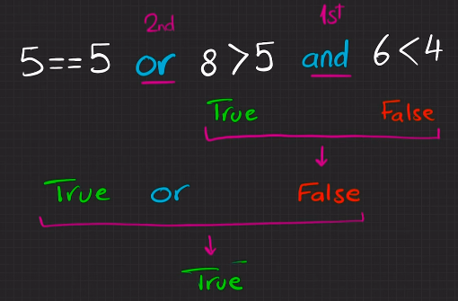

- use parenthesis to control the order
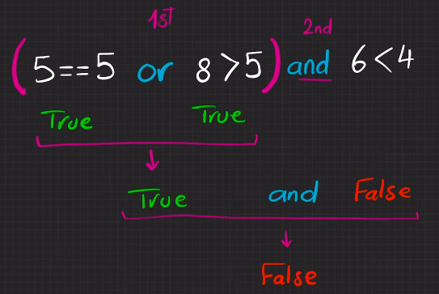

### Membership Operators - "in" and "not in"
- checks if a value is inside another value
```py
print("o" in "python")      # Result is True
print("f" not in "python")  # Result is True
print(3 not in [1, 2, 3])   # Result is False
# One of its use in real world is to validate a domain if it is in the banned list.
domain = "gmail.com"
banned_domains = ["spam.com", "fake.org", "bot.net"]
print(domain not in banned_domains]     # Result is True
```

### Identity Operators - "is" and "is not"
- checks if two variables refer to the same object in memory, python creates different IDs if the values are not simple

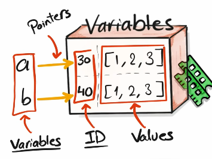
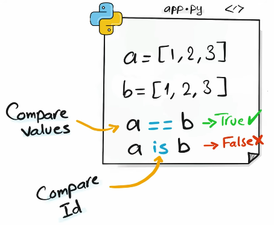

- But python will create same IDs if the values are simple

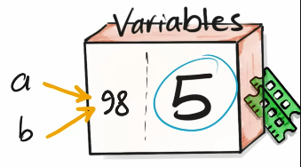
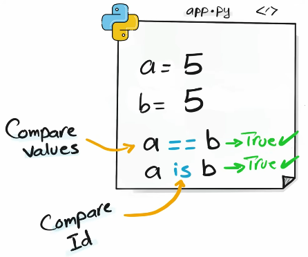

- And if you created a new variable from a previous variable, python will not create a new ID.
```py
x = [1, 2, 3]
y = x
print(x == y)   # Result is True
print(x is y)   # Result is True
```

<br>
<br>

## Chapter 5 - Python Conditional Statements
- checkpoint that checks a condition
    - True? Runs the Code
    - False? Skip it

### if (stand-alone)
- defines the first condition
- "if this is true, do this - otherwise, do nothing"
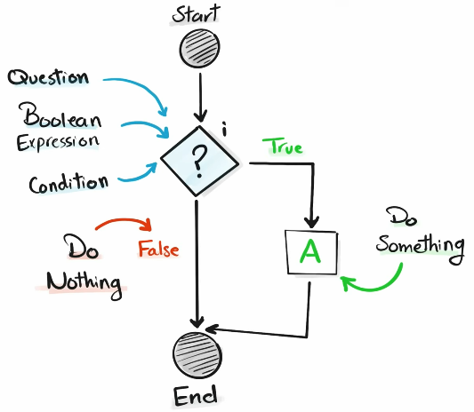

```py
score = 100
if score >= 90:
    print("A")   # Result is A. But if you change the score to a lower value like 89 or below, it will not print anything. 
```

### else (two-way decision)
- runs only if all previous conditions are false
- "if nothing was true, do this instead"
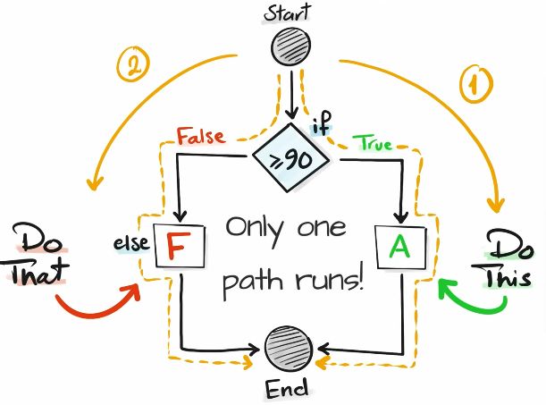

```py
score = 80
if score >= 90:
    print("A")
else:
    print("F")  # Result is F
```

### elif (multiple conditions)
- asks a follow-up question, and only runs if previous conditions were false
- "if the first wasn't true, try this one"
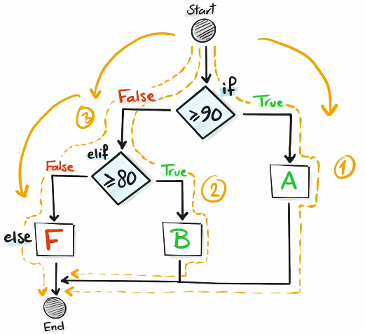

```py
score = 85
if score >= 90:
    print("A")
elif score >= 80:
    print("B")
else:
    print("F")  # Result is B
```

### elif elif (branching)
- you can have multiple elif
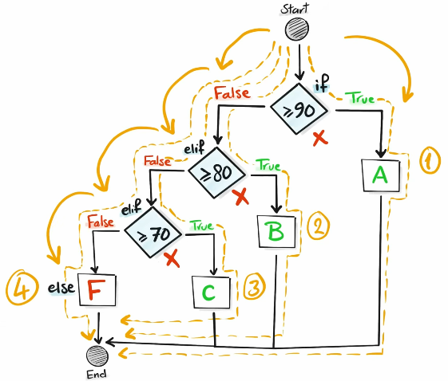

```py
score = 75
if score >= 90:
    print("A")
elif score >= 80:
    print("B")
elif score >= 70:
    print("C")
elif score >= 60:
    print("D")
else:
    print("F")  # Result is C
```

### nested if
- if statement inside another if
- "if the first is true, then check the second"
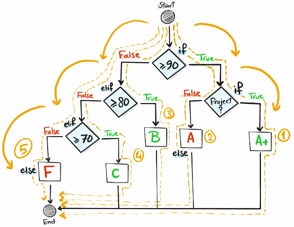

```py
score = 95
is_submitted_project = True
if score >= 90:
    if is_submitted_project:
        print("A+")
    else:
        print("A")
elif score >= 80:
    print("B")
elif score >= 70:
    print("C")
elif score >= 60:
    print("D")
else:
    print("F")  # Result is A+
```

### Connecting Conditions with "and" & "or"
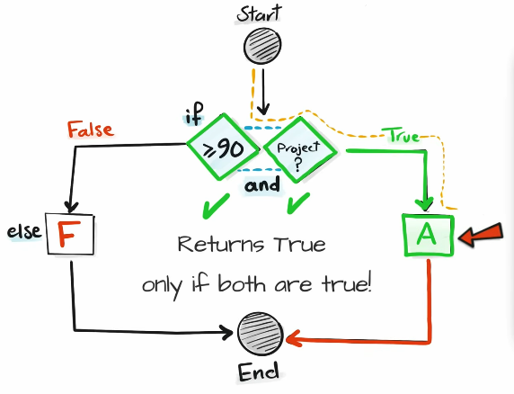
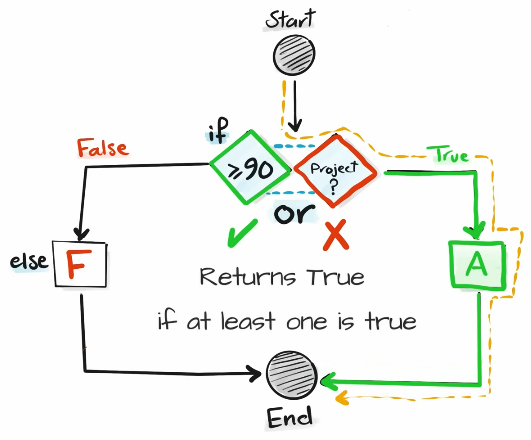

```py
score = 95
is_submitted_project = True
if score >= 90 and is_submitted_project:
    print("A+")
elif:
    print("A")
elif score >= 80:
    print("B")
elif score >= 70:
    print("C")
elif score >= 60 or is_submitted_project:
    print("D") 
else:
    print("F")  # Result is A+ if the student get 90+ & submitted a project. And students who got below 60 can still get a D as long as they submitted a project.
```

### Inline if (ternary)
- used only for simple logics
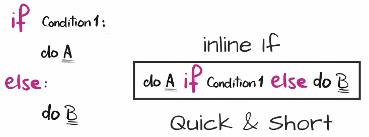
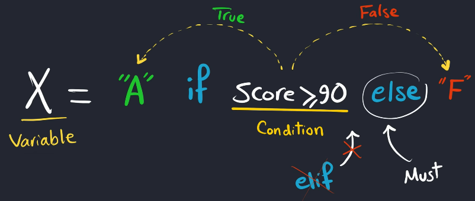

```py
# We will convert this to inline if
score = 80
if score >= 90:
    print("A")
else:
    print("F")

# This is the simplified version
score = 100
print("A" if score >= 90 else "F")

# Or we could put it in a variable
grade = ("A" if score >= 90 else "F")
print(grade)

# If the statement has an elif
score = 80
if score >= 90:
    print("A")
elif score >= 80:
    print("B")
else:
    print("F")
# This will be the simplified version
print("A" if score >= 90 else "B" if score >= 80 else "F")
```

### case-match
- evaluate a value against multiple values
- runs the code of the first match
- can be used only for matching values
```py
# Example: Convert the full country names into 2-letter abbreviations
country = "United States"

match country:
    case "United States"
        print("US")
    case "India"
        print("IN")
    case "Egypt"
        print("EG")
    case _:                 # this is the equivalent of "else"
        print("Unknown Country")
```

<br>
<br>

## Chapter 6 - Python Loops
- repeat a block of code over and over until a condition is met
- there two types - for and while

### "for" loops
```py
# Instead of writing this code this sample code:
print("Round: 1")
print("Round: 2")
print("Round: 3")
print("Round: 4")
print("Round: 5")
# We could simplify this using for loops:
for i in (1,2,3,4,5):
    print(f"Round: {i}")
# Or we could also put the tuple in a variable:
items = (1,2,3,4,5)
for item in items:
    print(f"Round: {item})
```
```py
# Another example:
scores = [80, 50, 60, 75]
total = 0
for score in scores:
    total += score
    print("Current Total:", total)
print("Final Total:", total)
```
```py
# Another example (cleaning data)
files = [' Report.csv ', 'DATA.csv ', ' final.TXT']
for file in files:
    file = file.strip().lower().replace(".txt", ".csv")
    print(f"Processing {file}")
# Result:
# Processing report.csv
# Processing data.csv
# Processing final.csv
```

#### Sequences that are used in "for" loops
- tuple or list like the examples above
- string

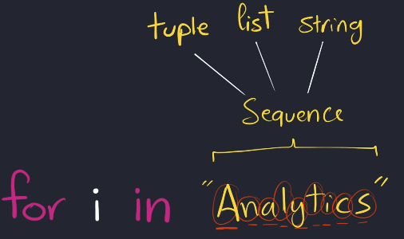

- range

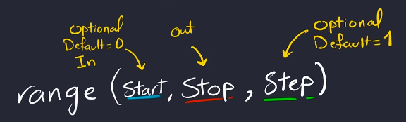

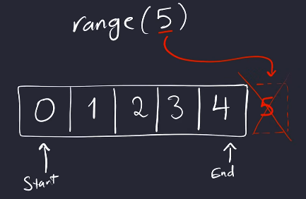

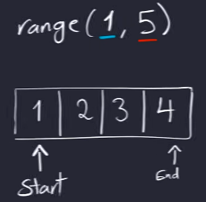

#### Special Loop Statements
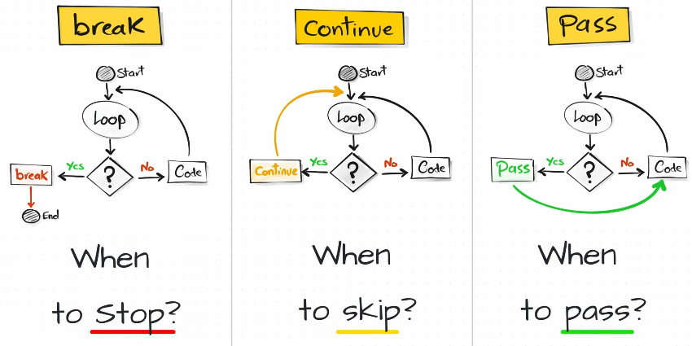

#### break
- it stops the loop immediately
- it jumps out and ends the loop right away
```py
name = ["john", "maria", "", "sam"]
for name in names:
    if name == "":
        print("Empty value detected!")
        break
    print(f"Name: {name}")
# The Result will be:
# Name: john
# Name: maria
# Empty value detected!
```
#### continue
- it skips one loop cycle without stopping the loop
```py
name = ["john", "maria", "", "sam"]
for name in names:
    if name == "":
        print("Empty value detected!")
        continue
    print(f"Name: {name}")
# The Result will be:
# Name: john
# Name: maria
# Empty value detected!
# Name: sam
```
#### pass
- it is a placeholder where nothing happens
- "for now, just keep going and do nothing"
```py
name = ["john", "maria", "", "sam"]
for name in names:
    if name == "":
        pass    # todo: handle empty value later
    print(f"Name: {name}")
# The Result will be:
# Name: john
# Name: maria
# Name:
# Name: sam
```

#### "else" in "for" loops
- runs a block of code only if the loop finishes naturally
- best used with "break", you'll know something went wrong if "else" didn't execute
```py
# Check for even number
items = [1, 3, 5, 7]
for i in items:
    if i % 2 == 0:
        print("Even number found:", i)
        break
else:
    print("All numbers are odd!")
```

#### nested "for" loops
- loop inside another loop
```py
letters = ["a", "b"]
numbers = [1, 2, 3]

for x in letters:       # outer loop
    for y in numbers:   # inner loop
        print(f"({x}, {y})")

# Result will be:
# (a, 1)
# (a, 2)
# (a, 3)
# (b, 1)
# (b, 2)
# (b, 3)
```

### "while" loops
- repeats a block of code over and over as long as the condition is **True**
- "while" loops have a risk of infinite loops

#### "while" condition (1st type of "while" loop)
- initialize the variable first (ex. i = 1)
- then make a condition (ex. i < 4)
- then update that value (ex. i +=1)
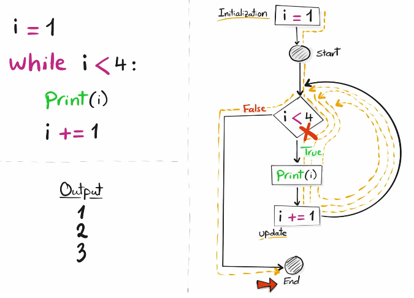

```py
# A program that will keep asking until you say "yes"
answer = ""
while answer != "yes":
    answer = input("Do you agree?(yes/no): ")
print("Thank You")
```
#### "while" True (2nd type of "while" loop)
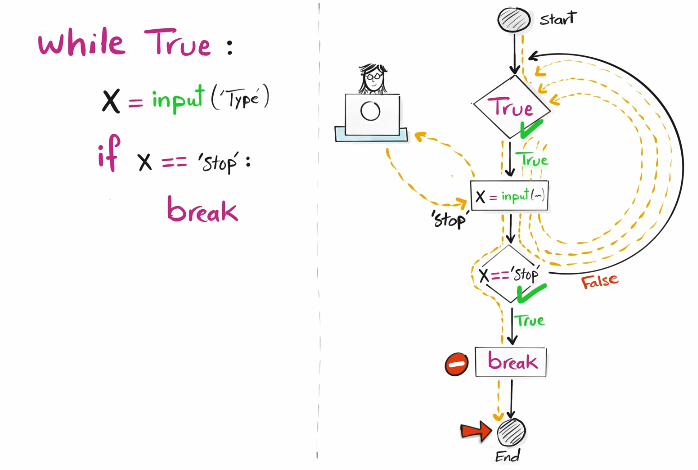

```py
# Let's recreate the "keep asking until you say yes program" above with "while True"
while True:
    answer = input("Do you agree?(yes/no): ")
    if answer == "yes":
        break
print("Thank You")
```
#### while condition vs while True
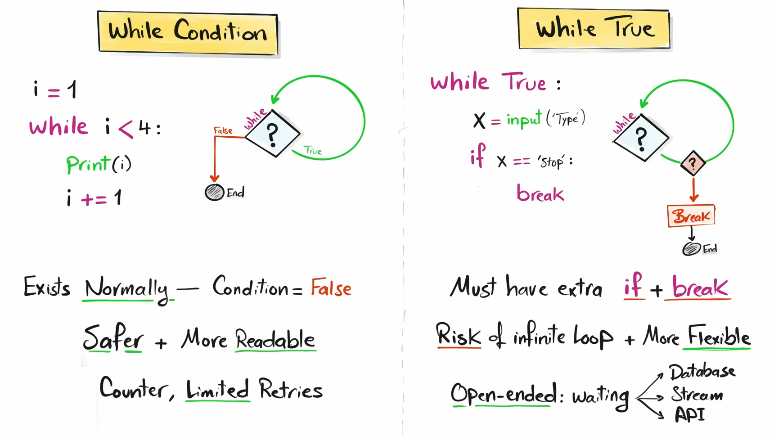

### for vs while
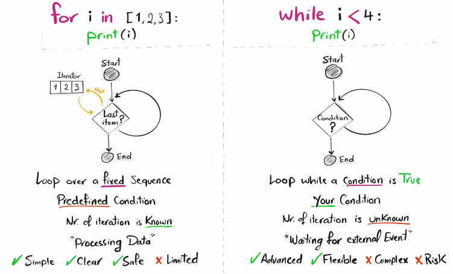


<br>
<br>

## Chapter 7 - Python Data Structures

<br>
<br>

## Chapter 8 - Python Functions 