# 𝗦𝗤𝗟 𝗳𝗼𝗿 𝗗𝗮𝘁𝗮 𝗘𝗻𝗴𝗶𝗻𝗲𝗲𝗿𝗶𝗻𝗴
- [Youtube Link: Data Engineer Bootcamp](https://www.youtube.com/watch?v=ol9_NnC9-cc)
- Contents:

1. Setup & Basics
2. Operators & Functions
3. Terminal Intro
4. Local DuckDB Intro
5. VS Code Intro
6. Data Modeling & JOINs
7. Data Types
8. DDL & DML
9. Subqueries & CTEs
10. Data Modeling Pt.2
11. Functions (Date, Text, & NULL)
12. Window Functions
13. Nested Functions

<br>

## 1. Setup & Basics

### Database Hierarchy


### Attaching a new database
- Go to your 'Notebooks' and select a notebook (example: 1.1 SQL & Database Setup)
- Click `+ Add Cell`
- Use the `ATTACH` command. Example: `ATTACH 'md:_share/data_jobs/a94f9b8a-2b8a-473f-bb86-de09552f052d' AS data_jobs;`
- Click `Run Cell` or press `ctrl + Enter`


- **Diagram**
    - **Main fact table** - the job postings fact table
    - **Dimension table** - the other 3 tables


<br>

### Basic Keywords


#### SELECT * / FROM

- **Select everything**
    - The asterisk means everything.
    - So this means we want to SELECT all the columns (everything) FROM job_postings_fact table


- **Select specific columns**


#### LIMIT
- limits the number of rows that will be shown
- better to put this on the bottom of your query
- better to end every query by a **semi-colon**


#### DISTINCT
- Let's say we have the scenario where we want to look at **distinct values or unique values inside of a column**
- Example: Look at the 'job_title_short' column


- We can get the distinct or unique keywords:


#### WHERE
- To get specific value.
- In this example, we want to get specific job titles


- Note: No need to put quotes if you're filtering number types. But put **quotes** if your filtering text types, in this example, 'Data Engineer' 

#### NULL / IS NOT NULL
- If you want to filter **NULL** values, DON't use the `=` sign, but use `IS`. Example:


- Obviously, if you want to filter and see everything that has values, use `IS NOT NULL`

#### Commenting Code

- `--` - used for single line comment


- `/*` `*/` - used for multi line comment


#### ORDER BY
- we can sort a column using this command


#### Order of Commands


<br>
<br>
<br>

## 2. Operators & Functions

### Where are operators used?


### Comparison Operators


#### `=`
- Example: Show the jobs that are work from home.


#### `!=` or `<>`
- Example: Show all the jobs schedule type except for the 'Contractor'.


#### `>` `<` / `>=` `<=`
- Example: Show the salary year average that are greater than 100,000.


#### `BETWEEN`
- Example: Show the salary average between 100_000 and 200_000. 
- Note: You can use underscore `_` to separate the zeros.
- Note: 100_000 and 200_000 are included if you use `BETWEEN`


- This can be written with `>=` and `<=` but it is less readable so we usually use `BETWEEN`


#### `IN`
- Instead of using a lot of `OR`, we can use `IN` instead.
- Example: Show jobs that are 'Data Analyst' or 'Data Engineer' or 'Senior Data Engineer'


#### Example (Putting it all together)
- Problem:


- Solution:


#### `LIKE` with wildcards `_` or `%`

##### Underscore`_` wildcard


- Example: Show job locations in Columbus, and on any of its state. Since the data has 2 characters provided for the state, put 2 underscores `_ _` to match


##### Percentage `%` wildcard


- Example: Show jobs that have the 'Data Analyst' in it.


#### ALIAS `AS`
- To change a name of a column, or the name of the table.
- Example: Change the column name 'job_title' to 'job_title_original'


#### Example (putting it all together)
- Problem:


- Solution:


<br>

### Logical Operators


#### `AND`
- Example: Show 'Data Engineer' jobs that are work from home.


#### `OR`
- Example: Show 'Data Engineer' jobs or 'Senior Data Engineer' jobs.


#### `NOT`
- Example: Show the jobs that are not work from home. We can put `NOT` instead of putting `FALSE`.


- Example: Use **parenthesis** if you want to use `NOT` on both conditions.


<br>

### Arithmetic Operators


#### Where else can we use these operators?


#### Addition & Subtraction
- Example:


#### Multiplication
- Example:


#### Division
- Example:


#### Modulus
- Example: Filter out all the values that are not ending with 3 zeros.


<br>

### Aggregate Functions


#### Used in conjunction with `GROUP BY` and/or `HAVING`
- `GROUP BY` allows you to segment by a certain condition. 
- `HAVING` allows you to filter.


#### COUNT()
- `COUNT(*)` Example:


- Example: Show the number of rows for 'Data Engineer'.


- Example: If we wanted to find out what data engineer jobs have a yearly salary listed.


#### COUNT(DISTINCT)
- Example: Show the number of rows with unique job title (short).


#### SUM()
- Example: Show the average salary.


#### AVG()
- Example: We can get the same result from the previous example by using `AVG()`


#### GROUP BY


- Example: Show the average salary grouped by country, and sort it from highest to lowest.


#### MIN() / MAX()
- Example: Show the minimum and maximum value for each average value.


#### MEDIAN()
- Example: Get the middle value (median) for each average salary.


#### HAVING


- Example: Show the median of the average salary that is greater than 100_000.


<br>
<br>
<br>

## 3. Terminal Intro

### Shell Types by Operating System

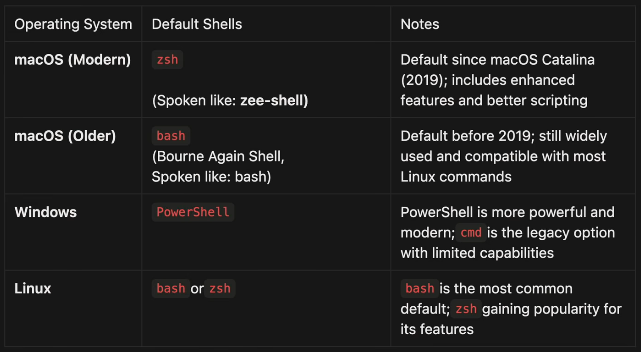

### Basic Commands

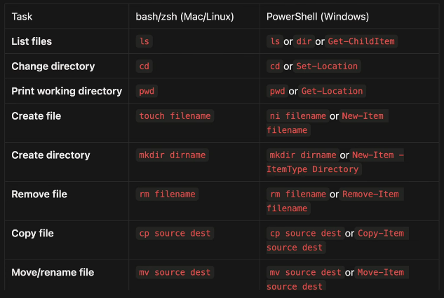
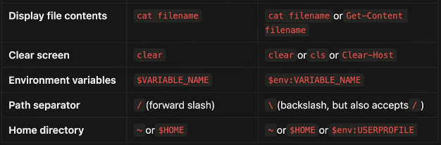

<br>
<br>
<br>

## 4. Local DuckDB Intro

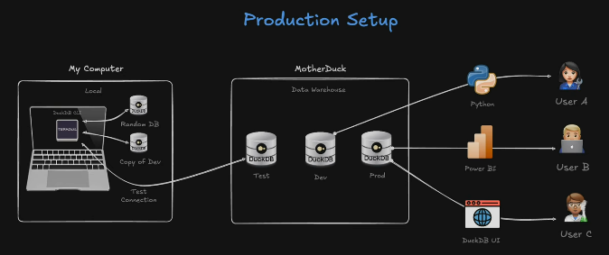

### Installation Website

- Install duckdb from this website: https://motherduck.com/docs/getting-started/interfaces/connect-query-from-duckdb-cli/
- The reason that we should install the version in this website is because it is the version that **MotherDuck** supports.
- Or install it using https://github.com/NiclasHaderer/duckdb-version-manager to easily manage the versions.

### Basic Commands (in Terminal)
- `duckdb` - to run duckdb locally
- `.quit` or `.exit` - to exit duckdb
- `.help` - for usage hints
- `-c` - is used so that we don't need to enter duckdb cli, and we can just run a command. Example: `duckdb -c "SELECT 42 as answer"`

### Local DuckDB Databases
- `duckdb <FILENAME>` - to create a database file. Make sure that you go to the folder first that you want your database file to be created in. Example:
```bash
cd ~/Desktop/Notes/QA/duckdb-practice/
duckdb jobs.duckdb

# Now you created a database and your inside a duckdb session
# You can create a simple table named 'jobs' with 2 columns 'id' and 'job'
CREATE TABLE jobs (
       id INTEGER,
       job VARCHAR
       );

# You can check and see your newly created table
.tables

# You can make a simple query
SELECT * FROM jobs;

# To insert values inside the columns
INSERT INTO jobs VALUES
(1, 'Data Analyst'),
(2, 'Data Scientist'),
(3, 'Data Engineer');

# You can now exit and everything will be saved
.quit

# To open again this database file
duckdb jobs.duckdb
```

### Local DuckDB UI
- `duckdb -ui` - to open the duckdb UI in a new browser.
- `duckdb -ui <FILENAME>` - to open a database file with UI. Example: `duckdb -ui jobs.duckdb`. Now you can create a new notebook then query. `SELECT * FROM jobs;`
- **Sign In to MotherDuck** using the account that you created earlier.

### Local DuckDB Connect to MotherDuck
- `duckdb md:<DATABASE>` - run this in your terminal to open a database from your MotherDuck account. Example: `duckdb md:data_jobs`. Accept and confirm the token for now.
- To test, run:
```bash
SELECT DISTINCT(job_title_short)
    FROM job_postings_fact;
```

<br>
<br>
<br>

## 5. VS Code Intro

### Installation Website
- Go to https://code.visualstudio.com/ to download the right installer for your OS.

### VS Code SQL Setup
#### Create a key binding
- Press `ctrl + shift + P`
- The select **Preferences: Open Keyboard Shortcuts**
- Select **Terminal: Run Selected Text In Active Terminal**
- Assign for Keybinding `shift + enter`

#### Setting up DuckDB & MotherDuck
- Go to your MotherDuck account (app.motherduck.com)
- Click your 'Organization' on the top left corner then click **Settings**.
- On the left side, under INTEGRATIONS, click **Access Tokens**
- Click "**+ Create token**" to create a token that does not expire.
- Click **Copy** to copy the characters, then click 'Close'.
- Temporary Authentication (NOT RECOMMENDED):
    - Go back to VS Code Terminal.
    - Run `export motherduck_token="paste_your_token_here"`
    - You can now run `duckdb md:<DATABASE>` and you will be authenticated. But if you close the terminal, you have to repeat the whole process again.
- Permanent Authentication (RECOMMENDED):
    - Open your `.bashrc` file in ~
    - Put the `export motherduck_token="paste_your_token_here"`
    - Save then run `source .bashrc`

### How to run a SQL file in VS Code
- Open VS Code, then open your project folder.
- Open your sql file (*.sql) by clicking it.
- Open a terminal inside VS Code (**ctrl + `**).
- For example, run `duckdb md:data_jobs` to connect to your database in MotherDuck.
- Once you're connected in duckdb, select all the code from your sql file, then press `Shift + Enter` to automatically run it in the terminal.

<br>
<br>
<br>

## 6. Data Modeling & JOINs

### Database Hierarchy

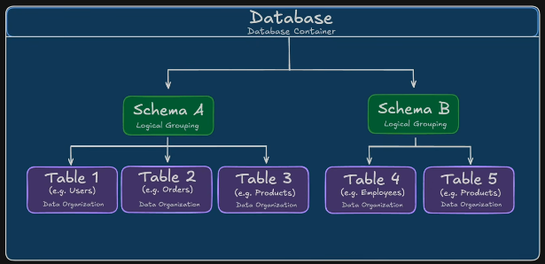

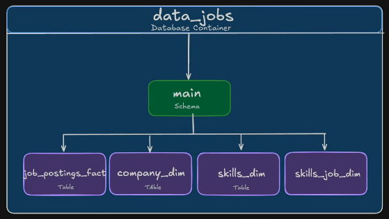

#### Tables

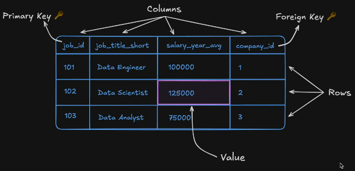

#### Schema

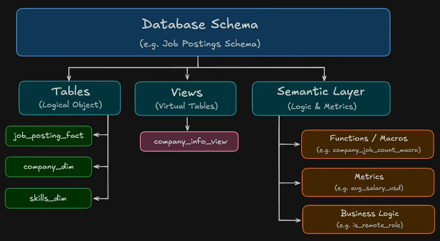

#### Database

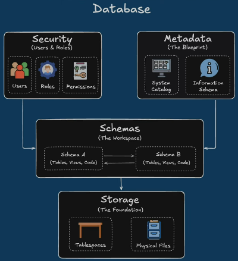

<br>

### Entity Relationship Diagram (ERD)

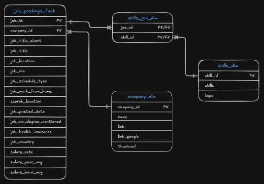

#### Table Diagram

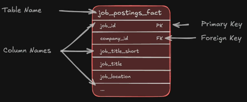

#### Relationship Diagram

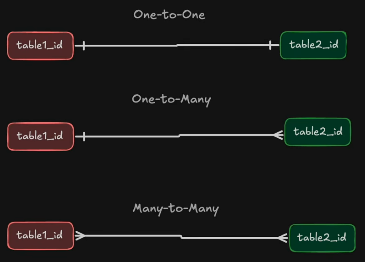

- **One-to-One**

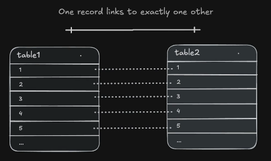

- **One-to-Many** (Most Common)

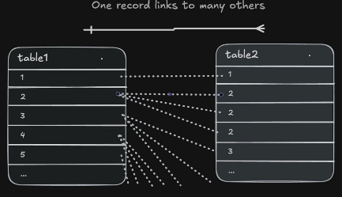

- **Many-to-Many** (Least Common)

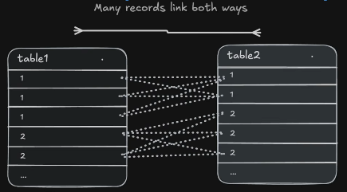

<br>

### Database Metadata

#### Information Schema
- Information schema is basically a collection of read-only views that tells us information about the metadata inside of our database. We can look at things like tables, columns, views, or table constraints.

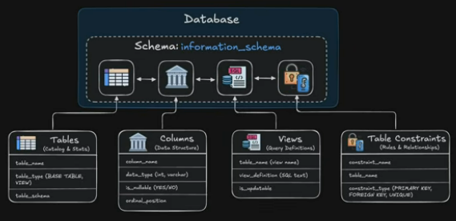

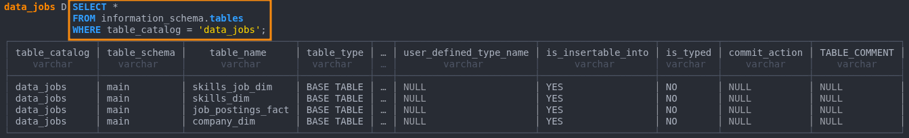

- **DESCRIBE** - run `DESCRIBE <table_name>` to see the different columns associated with that table. Example:

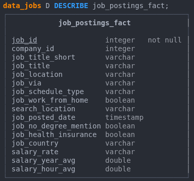

<br>

### JOINs
- used to join the tables together and perform analysis with that.
- most commonly used are **LEFT JOIN** and **INNER JOIN**


#### LEFT JOIN (most common)
- Returns all rows from LEFT and only matching from RIGHT.
- Example: 
    - Table A: job_postings_fact
    - Table B: company_dim

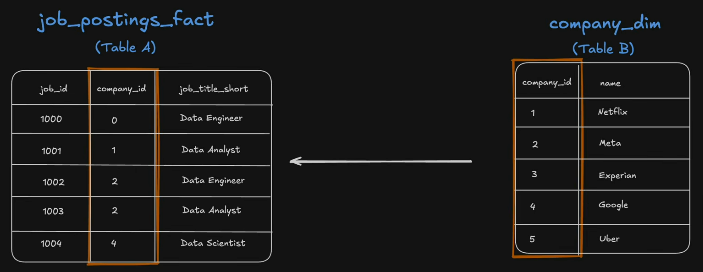

```sql
SELECT
    jpf.job_id,              -- get 'job_id' column from 'job_postings_fact' table
    cd.name AS company_name, -- get 'name' column from 'company_dim' table
    jpf.job_title_short      -- get 'job_title_short' column from 'job_postings_fact' table
FROM
    job_postings_fact AS jpf -- alias for 'job_postings_fact' table 
LEFT JOIN company_dim AS cd
    ON jpf.company_id = cd.company_id; -- joining them using their related columns 'company_id'
```

- Same query as above WITHOUT the aliases:
```sql
SELECT
    job_postings_fact.job_id,
    company_dim.name,
    job_postings_fact.job_title_short
FROM
    job_postings_fact
LEFT JOIN company_dim
    ON job_postings_fact.company_id = company_dim.company_id;
```

#### RIGHT JOIN (least common)
- Preserving or keeping all records from Table B.

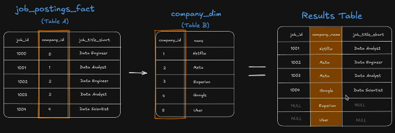

#### INNER JOIN (also most common)
- The original default join in SQL, so some people just use `JOIN` instead of `INNER JOIN`.
- Returns only matching rows from both tables.

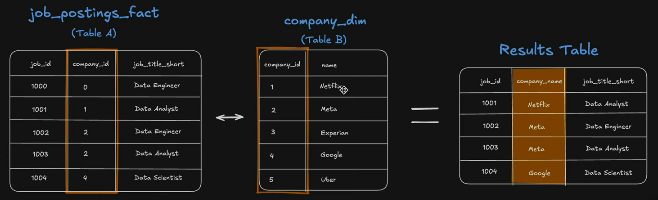

#### FULL OUTER JOIN
- Some people just use `FULL JOIN`

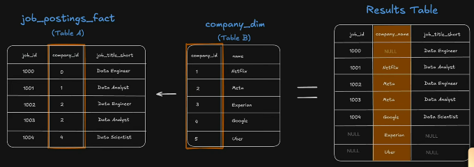

<br>

### SQL Clause Order 

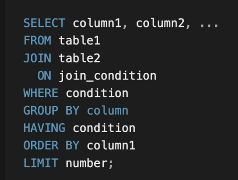

### SQL Execution Order

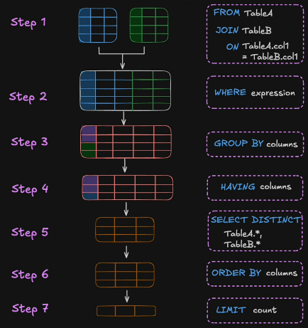