# 𝗦𝗤𝗟 𝗳𝗼𝗿 𝗗𝗮𝘁𝗮 𝗘𝗻𝗴𝗶𝗻𝗲𝗲𝗿𝗶𝗻𝗴
- [Youtube Link: Data Engineer Bootcamp](https://www.youtube.com/watch?v=ol9_NnC9-cc)
- Contents:

1. Setup & Basics
2. Operators & Functions
3. Terminal Intro
4. Local DuckDB Intro
5. VS Code Intro
6. Data Modeling & JOINs
7. Data Types
8. DDL & DML
9. Subqueries & CTEs
10. Data Modeling Pt.2
11. Functions (Date, Text, & NULL)
12. Window Functions
13. Nested Functions

 

## 1. Setup & Basics

### Database Hierarchy

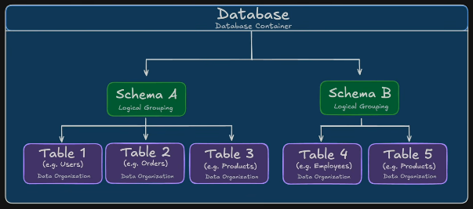

### Attaching a new database
- Go to your 'Notebooks' and select a notebook (example: 1.1 SQL & Database Setup)
- Click `+ Add Cell`
- Use the `ATTACH` command. Example: `ATTACH 'md:_share/data_jobs/a94f9b8a-2b8a-473f-bb86-de09552f052d' AS data_jobs;`
- Click `Run Cell` or press `ctrl + Enter`

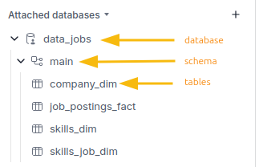

- **Diagram**
    - **Main fact table** - the job postings fact table
    - **Dimension table** - the other 3 tables

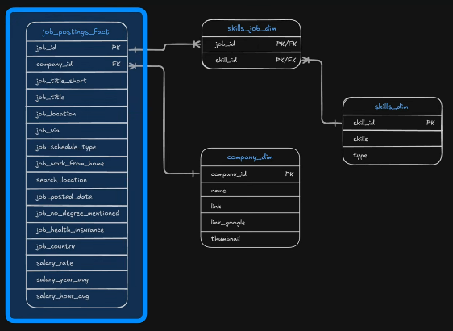

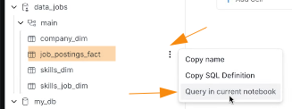

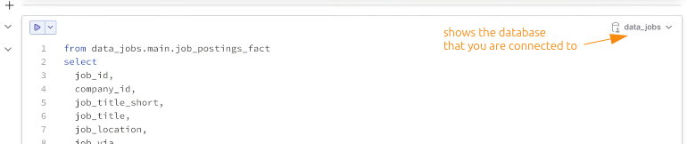

 

### Basic Keywords
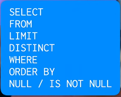

#### SELECT * / FROM

- **Select everything**
    - The asterisk means everything.
    - So this means we want to SELECT all the columns (everything) FROM job_postings_fact table

- **Select specific columns**

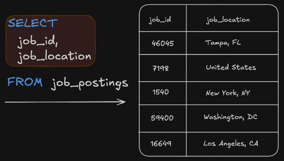

#### LIMIT
- limits the number of rows that will be shown
- better to put this on the bottom of your query
- better to end every query by a **semi-colon**

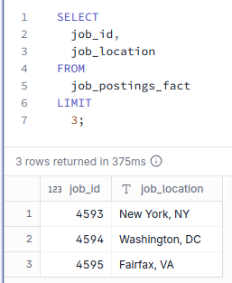

#### DISTINCT
- Let's say we have the scenario where we want to look at **distinct values or unique values inside of a column**
- Example: Look at the 'job_title_short' column

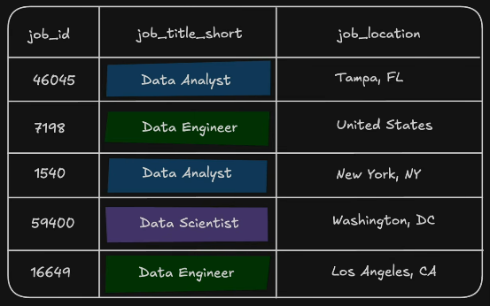

- We can get the distinct or unique keywords:

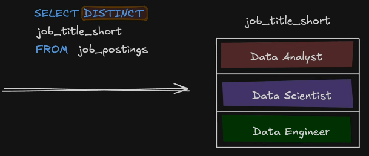

#### WHERE
- To get specific value.
- In this example, we want to get specific job titles

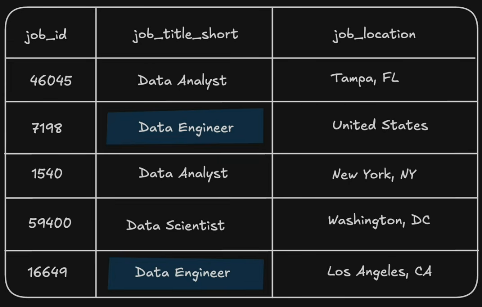

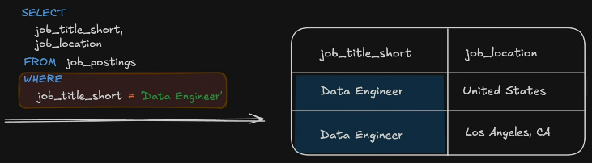

- Note: No need to put quotes if you're filtering number types. But put **quotes** if your filtering text types, in this example, 'Data Engineer' 

#### NULL / IS NOT NULL
- If you want to filter **NULL** values, DON't use the `=` sign, but use `IS`. Example:

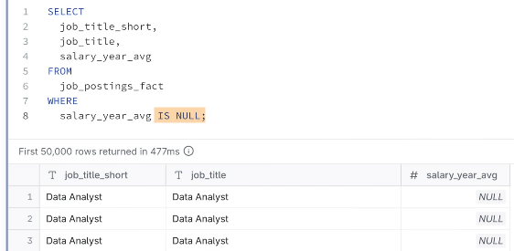

- Obviously, if you want to filter and see everything that has values, use `IS NOT NULL`

#### Commenting Code

- `--` - used for single line comment

- `/*` `*/` - used for multi line comment

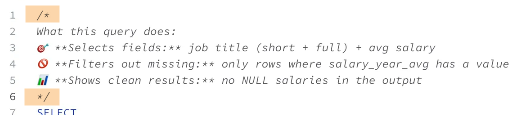

#### ORDER BY
- we can sort a column using this command

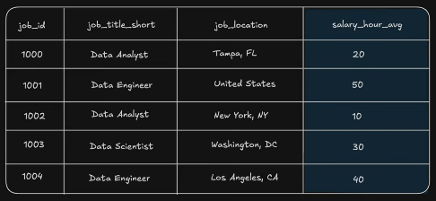

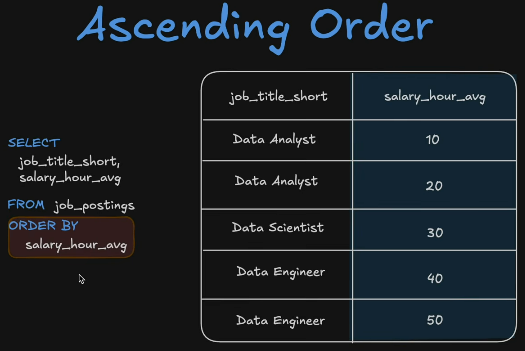

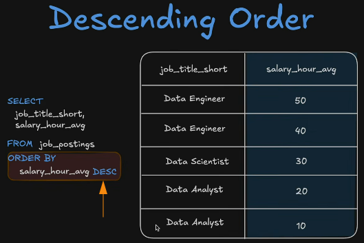

#### Order of Commands

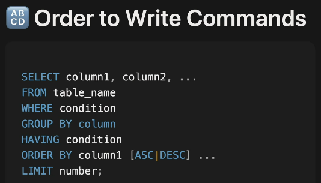

 
 
 

## 2. Operators & Functions

### Where are operators used?

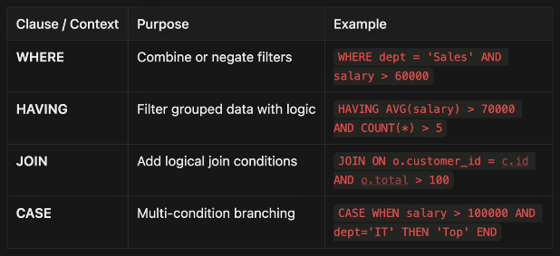

### Comparison Operators

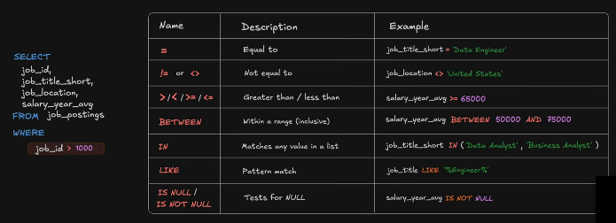

#### `=`
- Example: Show the jobs that are work from home.

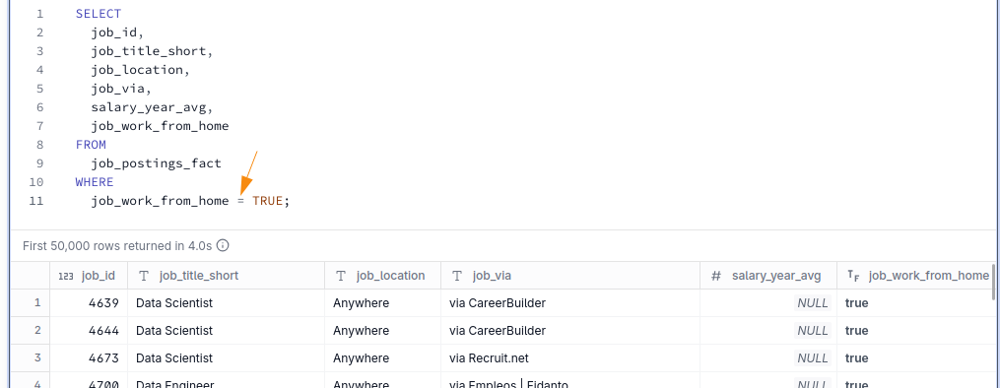

#### `!=` or `<>`
- Example: Show all the jobs schedule type except for the 'Contractor'.

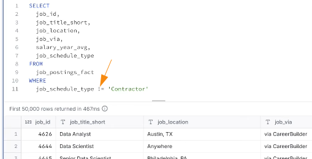

#### `>` `<` / `>=` `<=`
- Example: Show the salary year average that are greater than 100,000.

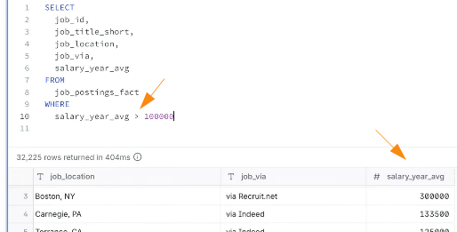

#### `BETWEEN`
- Example: Show the salary average between 100_000 and 200_000. 
- Note: You can use underscore `_` to separate the zeros.
- Note: 100_000 and 200_000 are included if you use `BETWEEN`

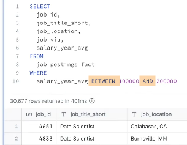

- This can be written with `>=` and `<=` but it is less readable so we usually use `BETWEEN`

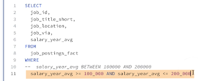

#### `IN`
- Instead of using a lot of `OR`, we can use `IN` instead.
- Example: Show jobs that are 'Data Analyst' or 'Data Engineer' or 'Senior Data Engineer'

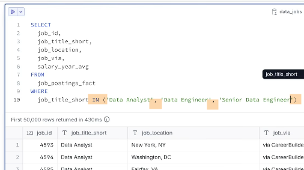

#### Example (Putting it all together)
- Problem:

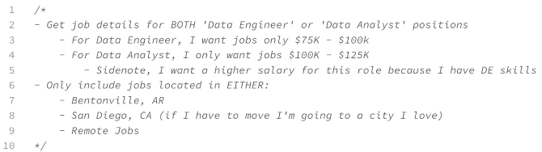

- Solution:

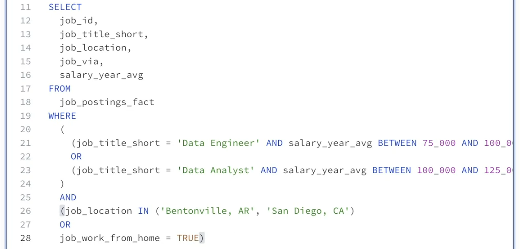

#### `LIKE` with wildcards `_` or `%`

##### Underscore`_` wildcard

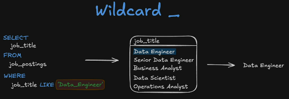

- Example: Show job locations in Columbus, and on any of its state. Since the data has 2 characters provided for the state, put 2 underscores `_ _` to match

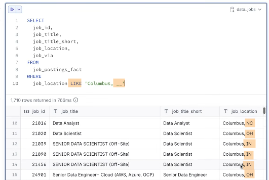

##### Percentage `%` wildcard

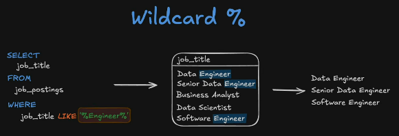

- Example: Show jobs that have the 'Data Analyst' in it.

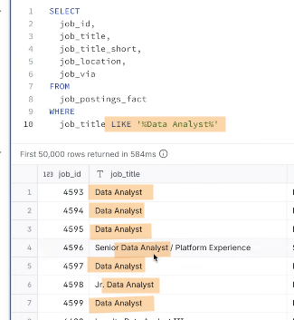

#### ALIAS `AS`
- To change a name of a column, or the name of the table.
- Example: Change the column name 'job_title' to 'job_title_original'

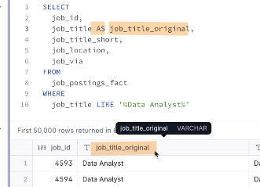

#### Example (putting it all together)
- Problem:

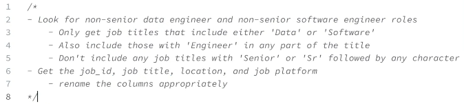

- Solution:

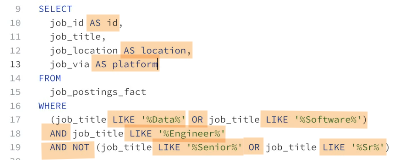

 

### Logical Operators

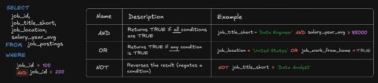

#### `AND`
- Example: Show 'Data Engineer' jobs that are work from home.

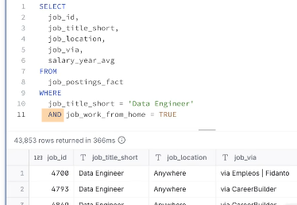

#### `OR`
- Example: Show 'Data Engineer' jobs or 'Senior Data Engineer' jobs.

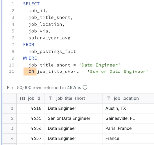

#### `NOT`
- Example: Show the jobs that are not work from home. We can put `NOT` instead of putting `FALSE`.

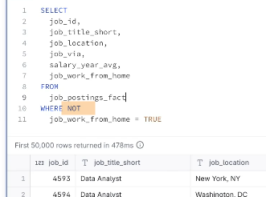

- Example: Use **parenthesis** if you want to use `NOT` on both conditions.

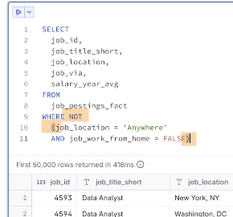

 

### Arithmetic Operators

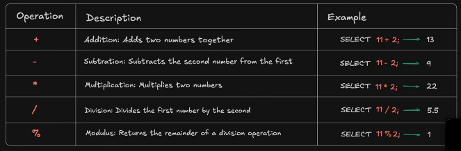

#### Where else can we use these operators?

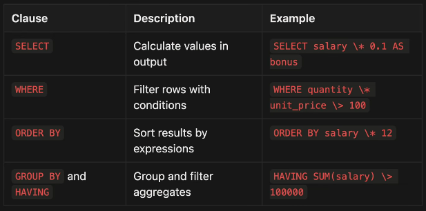

#### Addition & Subtraction
- Example:

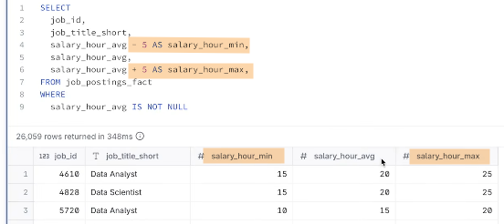

#### Multiplication
- Example:

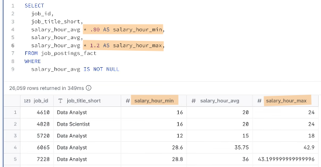

#### Division
- Example:

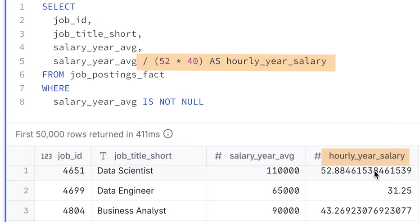

#### Modulus
- Example: Filter out all the values that are not ending with 3 zeros.

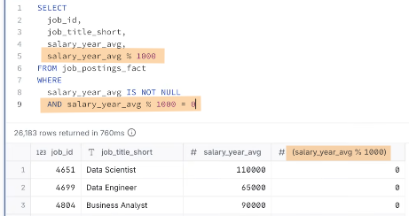

 

### Aggregate Functions

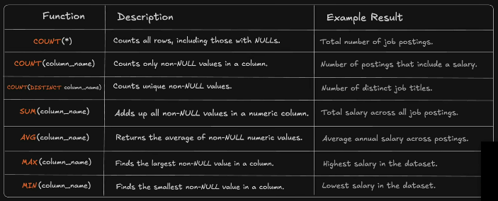

#### Used in conjunction with `GROUP BY` and/or `HAVING`
- `GROUP BY` allows you to segment by a certain condition. 
- `HAVING` allows you to filter.

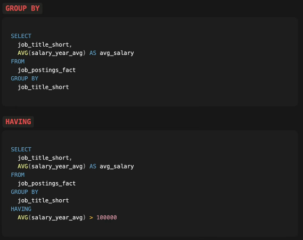

#### COUNT()
- `COUNT(*)` Example:

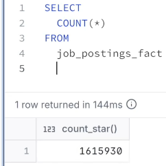

- Example: Show the number of rows for 'Data Engineer'.

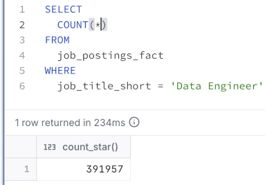

- Example: If we wanted to find out what data engineer jobs have a yearly salary listed.

#### COUNT(DISTINCT)
- Example: Show the number of rows with unique job title (short).

#### SUM()
- Example: Show the average salary.

#### AVG()
- Example: We can get the same result from the previous example by using `AVG()`

#### GROUP BY

- Example: Show the average salary grouped by country, and sort it from highest to lowest.

#### MIN() / MAX()
- Example: Show the minimum and maximum value for each average value.

#### MEDIAN()
- Example: Get the middle value (median) for each average salary.

#### HAVING

- Example: Show the median of the average salary that is greater than 100_000.

