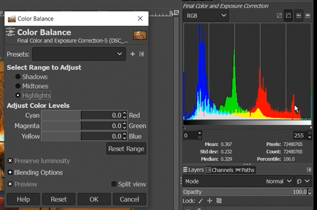
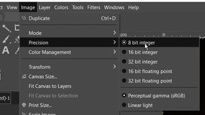
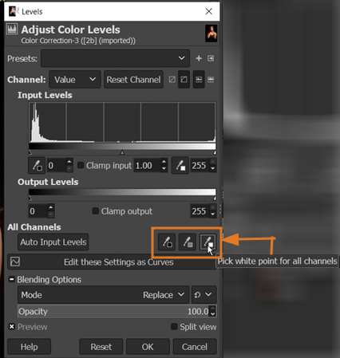
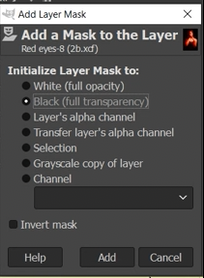
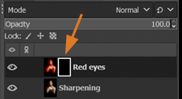

# Gimp Photo Editing

---

## Table of Contents
* [Navigation](#navigation)
* [Rotating, Cropping, and Layers](#rotating-cropping-and-layers)
* [Exposure and Shadows-Highlights Function](#exposure-and-shadows-highlights-function)
* [Color Temperature and Hue-Saturation Functions](#color-temperature-and-hue-saturation-functions)
* [Histogram and Color Balance Functions](#histogram-and-color-balance-functions)
* [Clone Tool to Remove Distractions](#clone-tool-to-remove-distractions)
* [Adding a Watermark and Exporting the Final Edit](#adding-a-watermark-and-exporting-the-final-edit)
* [How to Open RAW Images in GIMP](#how-to-open-raw-images-in-gimp)
* [Different Precision Modes of Editing](#different-precision-modes-of-editing)
* [Levels Function to Correct the Colors - White Balance](#levels-function-to-correct-the-colors---white-balance)
* [Color Balance Function to Fine-tune the Colors](#color-balance-function-to-fine-tune-the-colors)
* [Healing Tool to Retouch the Skin](#healing-tool-to-retouch-the-skin)
* [Unsharp Mask Function to Sharpen Texture](#unsharp-mask-function-to-sharpen-texture)

---

## Navigation
* Open a file: drag photo file in Gimp
* Zoom in/out: `ctrl + mouse wheel`
* Move around: hold `spacebar`
* Zoom fit: `ctrl + shift + J`
* Undo history window: `Window -> Dockable Dialogs -> Undo History`
* Tool Options window: `Window -> Dockable Dialogs -> Tool Options`
* Save the project as an **xcf** to save your layers

---

## Rotating, Cropping, and Layers
* Rotate: `shift + R`
* Crop: `shift + C`
* Duplicate layer: `ctrl + shift + D`

---

## Exposure and Shadows-Highlights Function
* **Note:** Create a new layer first before adjusting the brightness/exposure of an image.

* To adjust the **overall** brightess or exposure of the whole image:
    - `Colors -> Exposure...`
        - Increase the **Exposure** option to increase the brightness of the whole image.

* To adjust the brightness of just a **part** of the image:
    - `Colors -> Shadows-Highlights...`
        - Increase the value of **Shadows** option to increase the brightness of the dark parts
        - Optional: Lower the **Highlights** value to make the bright parts darker
        - **Note**: It is better to increase the brightness of the photo as lowering it too much will lose its quality.

---

## Color Temperature and Hue-Saturation Functions
* **Note:** Create again a new layer first before adjusting the temperature and saturation of an image.

* Adjust the **Color Temperature** to adjust the **warmness** of an image (increase or decrease orange/red)
    - `Colors -> Color Temperature...`
        - Play with the **Original temperature** and **Intended temperature** options to eyeball the desired warmness.

* Adjust the **Hue-Saturation** to select a primary color to adjust.
    - `Colors -> Hue-Saturation...`

---

## Histogram and Color Balance Functions
* **Note:** Create a new layer.

* `Colors -> Info -> Histogram` - to view the image balance (if the luminance is balanced, which color is dominating, etc.)
    - Left side - dark tones
    - Right side - light tones
    - Middle - middle tones

* You can then adjust and balance them using `Colors -> Color Balance...`

---

## Clone Tool to Remove Distractions
* **Note:** Create a new layer.
* Press `C`
    - Adjust the brush size in the **Tool Options** (or press-hold `[]`)
    - Hold `ctrl` then click the part that you want to clone
    - Then click on the areas that you want to be painted.

---

## Adding a Watermark and Exporting the Final Edit
* Open your watermark image (png) in Gimp.
* Drag its **tab** to your target image.
* Resize / scale it - `shift + S`
* Use the move tool (press `M`) to your desired location.
* On the layer window, adjust its opacity.
* `File -> Export As...` then choose a file type (example: jpg)

---

## How to Open RAW Images in GIMP
- Edit the image RAW file (**.NEF**) for better result.
- Install **darktable**: https://www.darktable.org/
- Open the RAW file using Gimp, it will open first in darktable, close darktable and it will continue to open in Gimp.

---

## Different Precision Modes of Editing

* It is better to do **color correcting using 16-32 bit** integer if you are using a powerful computer.
* Leave it at **8 bit** if you have a weak computer.

---

## Levels Function to Correct the Colors - White Balance
* Duplicate the layer: `ctrl + shift + D`

* Fast method (usually not good result):
    - `Colors -> Auto -> White Balance`

* Auto Method using **Levels**:
    - `Colors -> Levels...`
        - Then try the 3 options below to see which will give the best result. How this works:
            - Click the **Pick white point** then click a **white** color on your image. (Just keep on clicking the image until it adjusts.) Hit **Reset** then try the next one.
            - Click the **Pick gray point** then click a **gray** color on your image.
            - Click the **Pick black point** then click a **black** color on your image.
            - **Note:** Use the bracket keys `[]` to adjust the size of the brush.

            
        
        - If none of the 3 options gave you a good result, you could also try clicking the **Auto Input Levels** button (button located on their left side). Then try different modes on the **Blending Options** (example: HSL Color)

---

## Color Balance Function to Fine-tune the Colors
* Duplicate the layer: `ctrl + shift + D`

* `Colors -> Color Balance...`
    - Select Range to Adjust:
        - **Shadows:** If you want to adjust the darkness of a color.
        - **Midtones:** If you want to adjust the colors/hue - which we will use mostly to correct the colors.
        - **Highlights:** If you want to adjust the brightness of the color.
    - After clicking the radio button that you want, **Adjust Color Levels** to eyeball the needed adjustment.

---

## Healing Tool to Retouch the Skin
* Duplicate the layer: `ctrl + shift + D`
* Healing tool (press `H`)
    - Adjust the brush size in the **Tool Options** (or press-hold `[]`)
    - Hold `ctrl` then click a good sampling area.
    - Then click on the areas that you want to heal.

---

## Unsharp Mask Function to Sharpen Texture
* Duplicate the layer: `ctrl + shift + D`
* `Filters -> Enhance -> Sharpen (Unsharp Mask)...`
    - It will automatically unsharp your image but you can manually adjust it more:
        - **Radius:** Increasing this will affect the bigger curves, lowering it will affect just the small edges (textures).
        - **Amount:** Increasing this will sharpen the image.
        - Threshold: Leave this to 0.

---

## Layer Masking to do Localized Editing
We use layer masking **to edit just a part of the image** (to avoid editing the whole image). **White reveals, Black conceals** - which means white reveals the top image layer, while painting black reveals the bottom image layer.

- Example: Make the color of the eyes red:

1. Duplicate the layer: `ctrl + shift + D`
2. Increase the color red of this new layer, this adjustment will be applied on the whole image.
3. Click the **Add layer mask** button on the lower right corener (beside the X).
4. If you want to show just a small part of the image, it is better to choose the **Black** radio button here:

5. Click the black rectangle layer mask that you just created.

6. Use paintbrush (white color) to paint the parts that you want to reveal (in this example, the eyes).

---