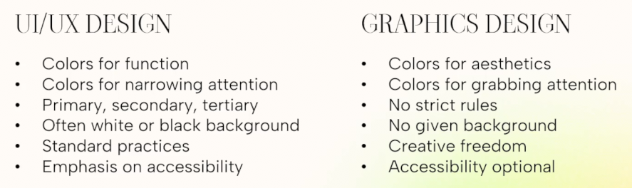
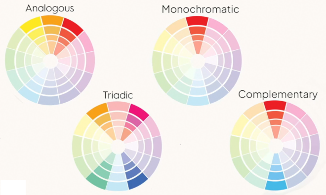
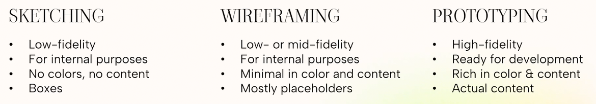
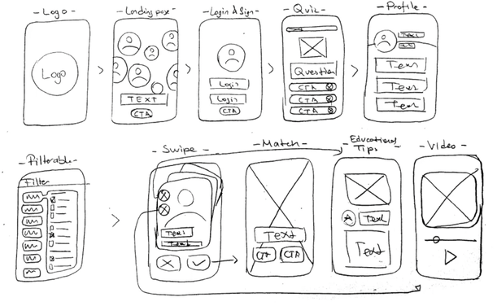
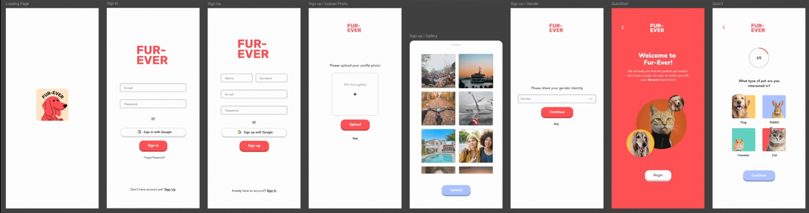
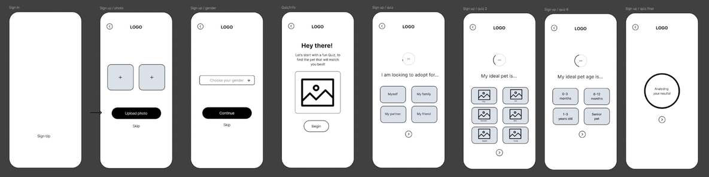

# Principles and Practices for Great UI UX Design
---
 

## Table of Contents
* [Introduction](#introduction)
    - [User Interface (UI)](#user-interface-ui)
    - [User Experience (UX)](#user-experience-ux)
* [Basic UX in Theory](#basic-ux-in-theory)
    - [Design Thinking](#design-thinking)
    - [UX Principles](#ux-principles)
    - [Laws of UX](#laws-of-ux)
    - [UX Heuristics](#ux-heuristics)
    - [Research & Analysis](#research--analysis)
    - [Ideation, Personas, and Journeys](#ideation-personas-and-journeys)
* [Basic UI in Practice](#basic-ui-in-practice)
    - [Colors & Functionality](#colors--functionality)
    - [Design Process](#design-process)

 

---

 

## Introduction

### User Interface (UI)
UI is the literal **"face" of a website or app**. It handles everything a user sees, hears, or clicks.

- **Visuals:** Typography, color schemes, graphics, and images.
- **Interactivity:** Buttons, scrolling effects, animations, and form dropdowns.
- **Goal:** To make the interface visually beautiful, clear, and brand-consistent.

### User Experience (UX)
UX is the **structural blueprint and internal framework** of the product. It encompasses a person's entire experience from start to finish.

- **Research:** Mapping user needs, analyzing behaviors, and testing logical flows.
- **Structure:** Wireframes, information layout, and step-by-step navigation.
- **Goal:** To make the application intuitive, efficient, accessible, and frustration-free.

 

---

 

## Basic UX in Theory

### Design Thinking

#### Empathize - Understand your user.
- **De-center:** You are not the user!
- **Be aware:** It's never the user's fault.
- **Diagnose:** If they are struggling, there must be an underlying issue in the design.
- **Contextualize:** Understand how they go about their day-to-day - who, where, when, how, why
- **Research:** Interviews and surveys to better understand users' behaviors, problems, needs

#### Define & Validate
- **Gather the facts:** Who is your user, their needs, wants, processes, behaviors.
- **Build personas:** Fictitious representations of your target user base.
- **Understand the journey:** Draw a clear user journey map from start to finish.

#### Ideate - Brainstorm solutions.
- **Freeflow of ideas:** Don't constrain your ideas, no idea is 'bad' (yet).
- **Visualize:** Use sketches or pictures to illustrate your ideas better.
- **Purely solution-oriented:** Think of direct solutions that deal with the problems.

#### Prototype - Get to work.
- **Low-fidelity Wireframes:** Use bare bones to show basic functionality and user flows (no colors and visuals yet).
- **High-fidelity prototypes:** Build final designs full with color, images, text, etc.
- **Hand-over:** Deliver to production.

#### Test - Validate your work.
- **Validate solutions:** Does the product help solve the problem?
- **User feedback:** Listen to your users then make adjustments or add features.
- **Minimum Viable Product (MVP):** Build fast, optimize later.
- **Fix & Improve:** Find and fix bugs, improve workflows.

 

### UX Principles

 

### Laws of UX

 

### UX Heuristics

 

### Research & Analysis

 

### Ideation, Personas, and Journeys

#### Ideation
- No idea is 'bad' or 'crazy'.
- Think of the 'one main feature'.
- Dream of ideas first, get the details later.
- No criticism or feedback until the end.

#### Creating Personas
- We make up several characters similar to a real person, that are relevant to our app. So that we'll have ideas what are the important options, features or functions of our app/product.

#### Journey
- After creating a persona, is to map their user journey. Planning or creating the user journey in UX design is the process of **mapping out the step-by-step path a user takes to achieve a specific goal** within a digital product or service. It focuses on understanding the holistic user experience over time by **analyzing behavior, identifying friction points, and tracking emotional shifts** to make digital interactions seamless and intuitive.

 

---

 

## Basic UI in Practice

### Colors & Functionality

#### UI/UX Design vs. Graphics Design

#### How to Use the Color Wheel to Build Color Schemes

 

### Design Process

#### Sketching

#### Wireframing

#### Prototyping

