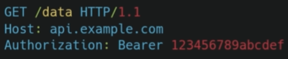
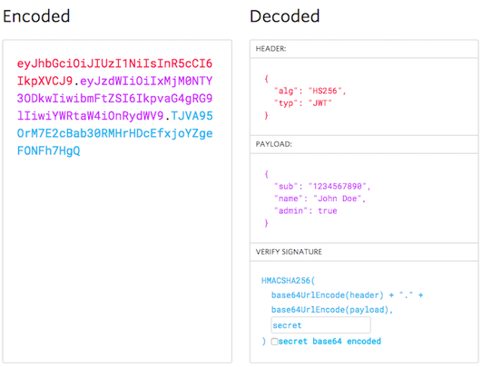

# HTTP Cookies and Sessions Authentication
- [Youtube Link: Web App Pentesting - HTTP Cookies & Sessions](https://www.youtube.com/watch?v=zHBpJA5XfDk&list=WL&index=158)

## HTTP
- **HTTP** is a stateless protocol.

- Stateless protocols do not retain or store client sessions and as a result, the client is responsible for storing session information for future requests.

- Client must include their session information in requests made to the server for authentication and validation, so this is where **cookies** come into play.

## Cookies

- Cookies are used **to store session information** and other data sent from the server on the client side.

- Cookies are typically used **to uniquely identify clients** interacting with the server.

- Cookies are **stored in a temporary directory on the client browser**.

- Cookies are typically used for state management as they can contain:
    - **Session IDs**
    - **Other cookie attributes**

- When communicating with a web server the server will send a cookie to the client with the "Set-Cookie" header.

### Cookie Attributes

- **Session IDs** - Random string that is used for session management.

- **Expires** - Specifies an expiration date for the cookie.

- **Domain** - Specifies the domain(s) where this cookie can be used.

- **Path** - Resource or path where this cookie is valid.

- **HttpOnly** - If enabled, this prevents the cookie from being accessed via JS on the client side.

- **Secure** - If enabled, the cookie will only be sent over HTTPS.

## Session ID

- **Session IDs** are unique identifiers that are used **to identify users from their respective sessions**.

- Where are Session IDs stored?
    - **Cookies**
    - **URL**

- Given the use case of Session IDs, Session IDs should abide by the following guidelines:
    - Must be random and unique
    - They need to be sent securely
    - They should be lengthy
    - Should never be reused

 
 
 

# API Authentication

- [Youtube Link: API Authentication EXPLAINED! OAuth vs JWT vs API Keys](https://www.youtube.com/watch?v=GcVtElYa17s&t=319s)

## API Keys
- if you’re **building a small internal service**, API keys might be enough
- it’s a **simple unique identifier** that allows access to an API
- is a **long-generated string of characters** that access a secret token, when an application wants to access an API, it includes this key in the request (see example below)

- API keys are usually **sent as part of the request to the API**
- Common ways to include the API keys:
    - In URLs, this is not recommended because they are not secured.

    

    - In HTTP Request Headers, which is more secured.

    

- API keys work best when you need **basic authentication without user specific data** (examples below):
    - Public APIs - weather, maps, stock market data
    - Internal microservices
    - Rate-limiting & analytics - Tracking API usage

 

## JSON Web Token (JWT)
- this is a great option if you need **scalable stateless authentication** 
- JWT is a **compact self-contained way** to securely transmit information between parties
- is **widely used authentication in web and mobile apps** allowing users to log in once and remain authenticated without sending their credentials repeatedly
- unlike API keys which are just static keys, JWTs **contain structured information** that can be verified and trusted
- are commonly used in applications **where authentication needs to be fast and scalable** 

#### 3 main parts separated by dots

1. **Header** – specifies the type of token and the algorithm used for encryption

2. **Payload** – contains the actual data like user ID, role or expiration time
			
3. **Signature** – ensures the token is authentic and hasn’t been tampered with. JWTs are signed using a secret key or public private key pair they can be verified without storing session data on the server making them stateless & scalable.

#### How does JWT authentication work?
1. **User logs in** – enters their credentials

2. **Server generates a JWT** – if the credentials are correct the server generates a JWT containing user details and sends it back 

3. **Client stores the JWT** – the client’s web browser or mobile app stores this token usually in local storage or cookies

4. **Sending requests with JWT** – every time the user makes a request to a protected route the token is sent in the authorization header

5. **Server validates the JWT** – the server checks if the token is valid and hasn’t expired, if everything is good the request is processed

 

## Open Authorization (OAuth)
- if you want to allow users **to log in with external accounts**

- is a protocol that allows secure access to resources **without exposing user credentials**

- **instead of entering your username and password everywhere** oauth lets you grant permission to apps

- **OAUTH 2.0 is the most widely used version** is designed to work across web, mobile, and API based apps

#### How does OAuth work?
1. **User requests access** – ex. you’re signing up for a new app and instead of creating a new account you click log in with Google

2. **Redirect to Authorization Server** – you’re redirected to Google where you see a prompt asking if you want to grant this app access to your email and profile 

3. **User grants permission** – you approve the request and Google generates an authorization code which it sends back to the app

4. **App exchanges code for a token** – the app sends this code to Google’s Authentication server which then provides an access token, this token allows the app to fetch your profile data securely

5. **Accessing resources** – now whenever the app needs access to your data it uses the access token instead of storing your password 

 

### Summary
- **API keys** - best for simple server to server communication if you need a quick and easy way to authenticate requests, but be careful, they don’t offer built-in security measures like expiration or access control

- **JWT** - great for stateless authentication in web and mobile apps. And if you want to manage user sessions without storing credentials on the server

- **OAuth** - perfect when users need to authenticate through third party services like Google