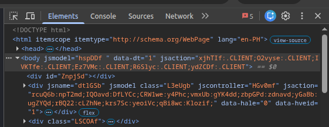
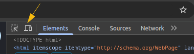
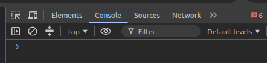
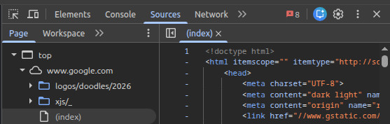
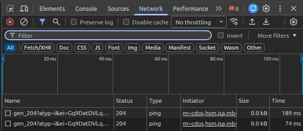
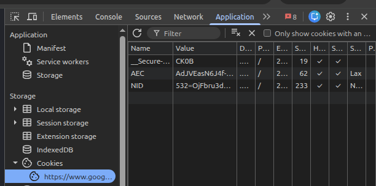

# Chrome Dev Tools
**Chrome DevTools** is a powerful set of web developer tools built directly into the Google Chrome browser. It allows you to inspect HTML/CSS, debug JavaScript, analyze network activity, and optimize website performance in real time.

 

## Essential Panels and Workflows

### Getting Started: How to Open DevTools
You can access the Chrome DevTools interface using several quick methods:

- `Right-Click & Inspect`: Right-click any element on a webpage and select Inspect to open directly to that element's HTML.

- Keyboard Shortcuts:
    - Mac: `Cmd + Option + I` (or `Cmd + Option + J` to open directly to the Console)
    - Windows/Linux: `Ctrl + Shift + I` (or `Ctrl + Shift + J` for the Console)

- Main Menu: Click the `three-dot icon` in the top-right corner of `Chrome → More Tools → Developer Tools`.

#### Changing DevTools Placement
Click the `three-dot settings icon` inside the DevTools panel (not the browser menu) to change the **Dock Side**. You can dock it to the Right, Left, Bottom, or separate it into an Undocked Window.

 

### The Elements Panel: Inspecting & Editing HTML/CSS
The **Elements panel** lets you view and temporarily modify the live Document Object Model (DOM) tree and CSS styles of a webpage.

#### Live DOM Editing
- **Select Elements**: Click the Inspect Element mouse icon (top-left of DevTools) and hover over any item on the page to target it instantly.

- **Edit Content**: Double-click any text or HTML tag in the DOM tree view to type over it. Press `Enter` to see the change apply instantly to your screen.

- **Delete/Reorder**: Right-click any node to delete it, or drag and drop items to restructure the page layout.

#### Real-Time CSS Tweaks
- **Toggle Properties**: In the right-hand Styles pane, check or uncheck boxes next to CSS rules to quickly test or disable specific styles.

- **Add New CSS**: Click inside an existing rule block or click the `+` (New Style Rule) icon to write custom CSS directly into the live preview.

- **Simulate Component States**: Right-click an element or use the `:hov` button in the Styles pane to force active states like `:hover`, `:active`, or `:focus`.

 

### The Device Mode: Mobile Simulation
To test how a webpage scales on mobile layouts, activate **Device Mode**:
1. Click the **Device Toolbar icon** (the tablet and smartphone symbol) or use `Ctrl + Shift + M` (Cmd + Shift + M on Mac).

2. Use the top dropdown menu to switch between a **Responsive** viewport or explicit device presets like an iPhone or Pixel.
3. Drag the borders to test custom screen dimensions, or toggle the **Rotate** icon to test landscape orientation.

 

### The Console Panel: JavaScript & Errors
The **Console panel** logs execution data and serves as a command-line Read-Eval-Print Loop (REPL) environment to evaluate JavaScript expressions.

- **View Logged Output**: Errors appear in red, warnings in yellow, and general runtime logs (such as `console.log()`) in clean text.

- **Execute Script On the Fly**: Type any standard JavaScript expression directly into the bottom line prompt (e.g., `alert('Hello!')` or `document.querySelector('h1')`) and hit `Enter` to run it against the active window.

- **Target Elements ($0)**: Select any item in the **Elements** panel first, then switch back to the Console and type `$0`. The console uses this shortcut to return that exact element for variable testing.

 

### The Sources Panel: Debugging Code
The **Sources panel** provides a secure view of all directory file assets loaded by the host site (HTML, JS, CSS) and contains robust debugging controls.

- **Set Breakpoints**: Instead of cluttering your production scripts with temporary code flags, click directly on any script line number inside the file viewer to create a breakpoint. Chrome will pause script operations exactly when it hits that line.

- **Watch Variables**: Add custom tracker terms into the Watch pane to observe real-time variable shifts while stepping through code steps.

- **Execution Controls**: When paused at a breakpoint, use the navigation controls overlay to step over the next command, step into functions, or resume script execution.

 

### The Network Panel: Performance & Assets
The **Network panel** records every server request the website initiates to pull in images, APIs, fonts, and script bundles.

- **Track Request Timelines**: Refresh the page while the Network panel is active to generate a complete cascade chart showing asset files, loading order, HTTP status codes (e.g., 200, 404), and file size overhead.

- **Inspect API Payloads**: Click any network row entry to open detailed resource tabs including the **Headers** (request metrics), **Payload** (form/JSON query keys), and **Response** (data returned by the backend api).

- **Simulate Network Throttling**: Use the throttling dropdown (defaults to "No throttling") to forcefully downshift your browser speed to simulated profile links like **Fast 3G, Slow 3G, or Offline** to observe fallback states.

 

### The Application Panel: Storage & Cookies
The **Application panel** lets you manage browser memory resources, cached data, and storage environments.

- **Local & Session Storage**: Inspect or manually edit Key-Value string pairs stored locally by web apps.

- **Cookies**: View, edit, or wipe away individual security cookie keys linked to the active domain address.

- Clear Storage: Use the top-level **Storage** tab and click **Clear site data** to quickly purge caches, databases, and cookies for a completely fresh testing environment.

 

### DevTools Pro Tip: The Command Menu
If you can't remember where a feature lives, open the central **Command Menu** by pressing `Ctrl + Shift + P` (Cmd + Shift + P on Mac). Type any keyword (such as "Screenshot", "Network", or "Dark mode") to locate and run the underlying feature instantly!

 
 

## How Automation Testers Use DevTools
- QA (Quality Assurance) Automation Engineers use Chrome DevTools extensively to **inspect elements, debug flaky automated tests, intercept API calls, and simulate user environments**. DevTools serves as the bridge between your automation script and the browser.
- Here is a breakdown of how automation testers use DevTools, categorized by their main daily tasks.

### Generating and Verifying Reliable Locators (XPath/CSS)
Writing bulletproof selectors is the foundation of automation. Testers use the **Elements panel** and **Console** to find and validate locators before pasting them into tools like Selenium, Playwright, or Cypress.

- **Verifying Selectors in Console**: Instead of guessing if an XPath or CSS selector works, testers use native DevTools Console functions to test them:
    - `$$('css-selector')` evaluates a CSS selector and returns all matching elements.
    - `$x('xpath-expression')` evaluates an XPath expression.
    - Tip: If `$x("//button")` returns more than 1 result, the locator is not unique and might cause your test to click the wrong button.

- **Inspecting Dynamic IDs**: Automation engineers check if element attributes change on page refresh (e.g., `id="button-492a7"`). If the ID is dynamic, they know to use partial matching tools like `contains()` in XPath instead.

 

### Mocking and Intercepting API Responses
When testing a frontend application, you often need to handle missing backend services, slow APIs, or specific error states (like a `500 Internal Server Error`). Testers use the **Network panel** to mock these.

- **Network Request Overrides**: Right-click a network request in the **Network** tab and select **Override content**. DevTools allows you to edit the JSON response payload directly. Your automation test can then verify how the UI renders data without a live database.

- **Blocking Requests**: Right-click a script or an image tracking pixel and select **Block request URL**. This lets you test how your application behaves when a third-party service fails to load.

 

### Debugging Flaky Tests & Synchronization Issues
Flaky tests often happen because a script tries to click an element before it is fully loaded or interactable.

- **DOM Breakpoints**: In the **Elements panel**, right-click an HTML node, hover over **Break on**, and select **Subtree modifications** or **Attribute modifications**. The browser will pause exactly when your application's JavaScript tries to change that element. This helps you figure out what script is causing unexpected UI behavior.

- **Pause Script Execution**: If a test fails at a specific step, testers can pause the execution using the pause button in the **Sources panel** to look at the exact state of the DOM at that millisecond.

 

### Simulating Adverse Environments & Edge Cases
Automation includes testing how the software runs under bad conditions.

- **Network Throttling**: Testers switch the Network profile to **Slow 3G** or **Offline** to ensure their automation framework's implicit or explicit wait conditions (like `WebDriverWait`) handle slow loading gracefully without crashing.

- **Geolocations and Sensors**: Open the Command Menu (`Ctrl+Shift+P` or Cmd+Shift+P), type **Sensors**, and press Enter. Testers use this panel to mock different GPS coordinates, testing if location-based automation scripts display the correct localized content.

- **Emulating Preferences**: In the same Sensors/Rendering tabs, testers can force `prefers-color-scheme: dark` or emulate different device pixel ratios to verify responsive design automation workflows.

 

### Inspecting Application State (Tokens & Cookies)
Many automated login scripts bypass the UI entirely by injecting an authentication token directly into the browser to save time.

- **Extracting Auth Tokens**: Testers open the **Application panel**, look under **Local Storage** or **Cookies**, and find the exact `JWT Bearer Token` or session ID.

- **State Injection**: They can then copy these keys into their automation hooks (like a `beforeAll` block in Playwright) to log into the application instantly without going through the username/password UI typing steps for every single test.

 

### Headless Browser Emulation via CDP
Advanced automation engineers use the **Chrome DevTools Protocol (CDP)** directly inside their code. Tools like Selenium 4, Puppeteer, and Playwright have native CDP integrations.

- This allows your code to programmatically talk to DevTools to capture console logs, measure performance metrics, listen to network requests, and securely fetch console errors while running in a "headless" (invisible) browser mode on a CI/CD server like Jenkins or GitHub Actions.