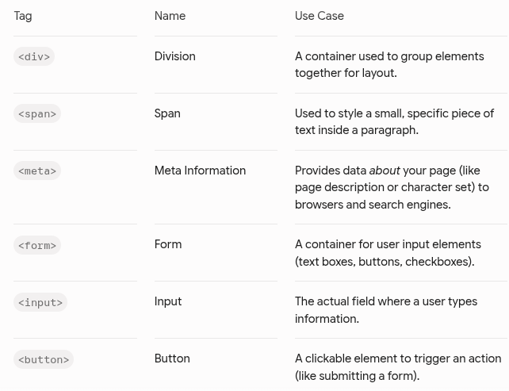
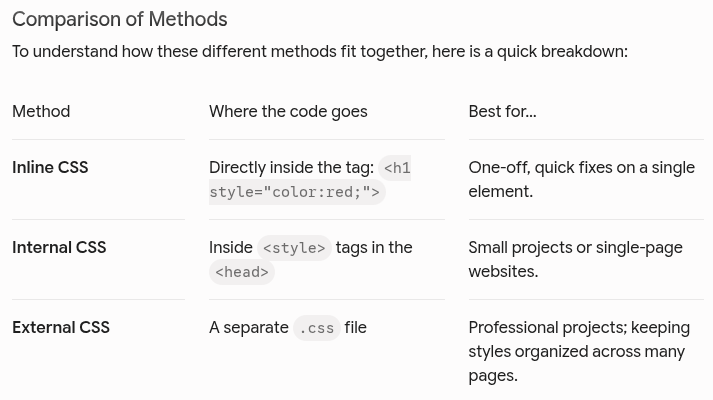
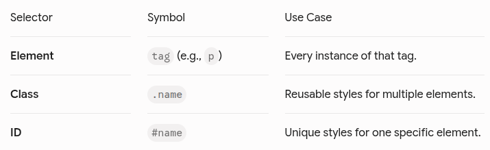
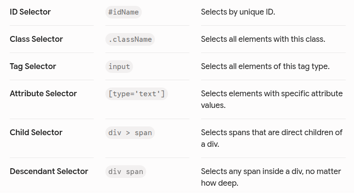

# HTML & CSS

## HTML
- **HTML** stands for **HyperText Markup Language**. Think of it as the skeleton of a website. It defines where the headings, paragraphs, images, and buttons go.

### Basic Structure
- Every HTML document follows a standard template:
```html
<!DOCTYPE html>
<html>
<head>
    <title>My First Page</title>
</head>
<body>
    <h1>Hello World!</h1>
    <p>This is my first paragraph.</p>
</body>
</html>
```

### Essential Tags for Content
- `<h1>` to `<h6>`: Headings (1 is largest, 6 is smallest)

- `<p>`: Paragraphs

- `<a>`: Links (requires `href="URL"`)

- ``: Images (requires `src="image.jpg"` and `alt="description"`)

- `<ul>` and `<ol>`: Unordered (bulleted) and Ordered (numbered) lists

- `<li>`: List items

Example:
```html
<h1>My Daily Checklist</h1>

<p>Here are the things I need to do today:</p>

<ul>
    <li>Buy groceries</li>
    <li>Finish homework</li>
</ul>

<ol>
    <li>Open VS Code</li>
    <li>Start coding</li>
</ol>

<p>For more help, visit <a href="https://www.google.com">Google</a>.</p>


```

#### Key Notes for Beginners:
- **Attributes:** Tags like `<a>` and `` have "attributes" (like href or src). These provide extra information. For example, href tells the link where to go, and src tells the image where the picture file is located.

- **Closing Tags:** Notice that most tags come in pairs (e.g., `<h1>` ... `</h1>`). The slash `/` indicates the closing tag.

- **Self-Closing Tags:** The `` tag is unique; it does not have a closing tag because it doesn't contain text—it only displays an object.

<br>

### Essential Tags for Structure and Interactivity



#### Understanding Containers: `<div>` vs `<span>`
These are the most important building blocks for web design.
- `<div>` (Block-level): It takes up the full width available. It's like a "box" that creates a new line. You use this to group big sections of your page (e.g., a header, a footer, or a sidebar).
- `<span>` (Inline): It only takes up as much width as its content. It's used for smaller things. You can use it to highlight a specific word inside a sentence without breaking the sentence onto a new line.
- Example:
```html
<div style="background-color: lightgrey; padding: 20px;">
    <h1>My Website</h1>
    <p>This is a <span>highlighted word</span> inside a paragraph.</p>
</div>
```

#### The Power of `<meta>`
The `<meta>` tag goes inside the `<head>` and doesn't have a closing tag. It's crucial for how your site appears to the world. Example:
```html
<head>
    <meta charset="UTF-8">
    
    <meta name="viewport" content="width=device-width, initial-scale=1.0">
    
    <meta name="description" content="A simple beginner's guide to HTML.">
</head>
```

#### Creating Interactive Forms
Forms are how you get information from users. They are always wrapped in a `<form>` tag. See example below for label, form, input, and button:
```html
<form>
    <label for="name">Name:</label>
    <input type="text" id="name" name="user_name">
    
    <label for="email">Email:</label>
    <input type="email" id="email" name="user_email">
    
    <button type="submit">Send</button>
</form>
```

### Quick Reference: Other Must-Know Tags
- `<header>`, `<footer>`, `<nav>`, `<section>`: These are called **Semantic Tags**. They tell the browser exactly what part of the page they represent (e.g., this is the navigation bar, this is the footer), which is very important for accessibility and SEO (Search Engine Optimization).

- `<br>`: A line break (forces text to the next line).

- `<hr>`: A horizontal rule (creates a horizontal line across the page).

<br>
<br>
<br>

## CSS
- **CSS** stands for **Cascading Style Sheets**. It tells the browser what your HTML elements should look like (colors, fonts, spacing).



### Inline CSS
- You can apply styles to individual elements by using the style attribute directly in the HTML tag. Example:
```html
<h1 style="color: blue; text-decoration: underline;">This is a title</h1>
```
- **Warning:** Try to avoid Inline CSS whenever possible. It makes your code very hard to read and difficult to update later because you have to change it tag by tag instead of in one central place.


### Internal CSS
- You can write CSS directly inside your HTML file. To do this, you place your CSS rules inside `<style>` tags within the `<head>` section of your HTML document. Example:
```html
<!DOCTYPE html>
<html>
<head>
    <title>Internal CSS Example</title>
    
    <style>
        body {
            background-color: #f0f0f0;
            font-family: sans-serif;
        }

        h1 {
            color: darkblue;
            text-align: center;
        }

        p {
            font-size: 18px;
            color: #333;
        }
    </style>
</head>
<body>

    <h1>Welcome to My Page</h1>
    <p>This page is styled using Internal CSS.</p>

</body>
</html>
```

### External CSS
- Using a separate `.css` file is considered "best practice" because it keeps your code clean and organized.

#### How to Link CSS
- You link CSS to your HTML inside the `<head>` section: `<link rel="stylesheet" href="style.css">`

#### Basic Syntax
- CSS works by selecting an HTML element and applying properties to it:
```css
h1 {
    color: blue;
    font-size: 32px;
}

p {
    color: gray;
    line-height: 1.5;
}
```

#### The Box Model
Every element in HTML is essentially a rectangular box. Understanding the "Box Model" is the key to layout control:
- **Content**: The actual text or image.
- **Padding**: Space inside the border.
- **Border**: The line surrounding the padding.
- **Margin**: Space outside the border.

#### Classes vs. IDs: The Difference
Think of these as name tags for your elements:
- **Class** (`.`): Used for multiple elements. If you have three buttons that should all look blue, you give them all the same class name.

- **ID** (`#`): Used for one unique element per page. Think of an ID like a Social Security number—it should only belong to one specific thing (like a main header or a specific sidebar).

- How to write them in HTML:
```html
<p class="text-highlight">This is a paragraph.</p>
<p class="text-highlight">This is another paragraph with the same style.</p>

<div id="main-header">Welcome to my site!</div>
```

#### Targeting them in External CSS (`style.css`)
- In your external CSS file, you use a period (`.`) for **classes** and a hash (`#`) for **IDs**. Example:
```css
/* Styling the class (applies to all elements with class="text-highlight") */
.text-highlight {
    color: orange;
    font-weight: bold;
}

/* Styling the ID (applies ONLY to the element with id="main-header") */
#main-header {
    background-color: black;
    color: white;
    padding: 20px;
}
```
<br>

### The "Full Picture" Example
Here is how you organize your files to make this work.
#### File 1: `index.html`
```html
<link rel="stylesheet" href="style.css">

<header id="main-header">
    <h1>My Awesome Website</h1>
</header>

<p class="intro-text">Hello! Welcome to my site.</p>
<p class="intro-text">Everything here is built with HTML and CSS.</p>
```

#### File 2: `style.css`
```css
/* Targeting the tag directly */
header {
    text-align: center;
}

/* Targeting the ID */
#main-header {
    background-color: navy;
    color: white;
}

/* Targeting the Class */
.intro-text {
    font-size: 20px;
    color: #555;
}
```
#### Summary Cheat Sheet



#### Pro-Tips:
- **Naming**: Use lowercase names and hyphens (e.g., main-container, footer-link). Do not use spaces.

- **Specificity**: ID selectors are "stronger" than Class selectors. If you apply conflicting styles, the browser will prioritize the ID.

- **Organization**: Don't go overboard with IDs. Use classes for almost everything—they are more flexible if you decide to change your design later!

<br>
<br>
<br>

## HTML & CSS for QA Automation
As a QA Automation Engineer, you don't need to be a front-end developer, but you do need to be a **DOM master**. Your ability to automate tests relies entirely on how well you can identify, locate, and interact with elements on a web page.

### HTML — The Skeleton of the Web
Think of HTML as the blueprint of a house. It tells the browser what components exist (a button, a text box, a link).

#### The Core Concepts
- The **DOM (Document Object Model)**: The tree-like structure of the web page. Every element is a "node."

- **Tags & Attributes**: These are your best friends for locators.
    - **Tag**: The type of element (e.g., `<div>, <button>, <a>, <input>`).
    - **Attributes**: Metadata about the element (e.g., `id="login-btn", name="username", class="btn-primary"`).

#### The Golden Rules for Locators
When choosing locators for your automation scripts (Selenium, Playwright, Cypress), prioritize them in this order:
1. **ID**: Always the first choice. They are meant to be unique. (`#login-btn`)
2. **Name/Data-Test-ID**: Modern apps often use specific data- attributes for testing (e.g., `data-testid="submit-form"`). Use these!
3. **CSS Selectors**: Faster and more robust than XPath.
4. **XPath**: The "nuclear option." Powerful for traversing the DOM (finding parents/siblings), but slower and brittle if the UI layout changes.

<br>

### CSS — The Style (and the Locators)
CSS (Cascading Style Sheets) controls how things look, but for QA, CSS Selectors are your primary tool for finding elements on the page.

#### Essential CSS Selectors Cheat Sheet



#### Pseudo-Classes: The QA Secret Weapon
Sometimes you need to find elements based on their state.
- `:hover` - Useful for checking if menus appear.

- `:disabled` - Essential for verifying if a button is locked when a form is incomplete.

- `:checked` - Perfect for verifying radio buttons or checkboxes.

<br>

### The QA Automation Workflow
To bridge HTML/CSS with your code, follow this mental loop:

1. `Inspect`: Right-click an element in the browser and select Inspect.

2. `Verify`: Open the "Elements" tab, press Ctrl+F (or Cmd+F), and type your CSS selector to see if the browser highlights the correct element.

3. `Evaluate`: If there are multiple matches, your locator is not unique. Refine it!

4. `Implement`: Drop the verified selector into your automation framework.

**Pro Tip**: Never rely on generated IDs that look like id="ember-12345". These are usually dynamic and will break your tests the moment the page reloads.

<br>

### Summary Checklist

[ ] Can I identify a unique ID?

[ ] Can I use attribute selectors to handle dynamic classes?

[ ] Do I know when to use CSS Selectors vs. XPath? (Hint: Use CSS whenever possible!)

[ ] Can I verify a state (enabled/disabled/checked) using CSS?