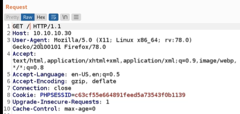
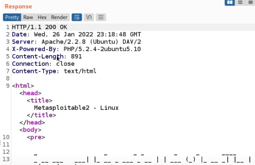

# HTTP
## HTTP & HTTPS
### What is HTTP?
- **Hyper Text Transfer Protocol** is a stateless application layer protocol used for the transmission of resources like HTML and runs on top of TCP
- Communication between web browsers & web servers
- HTTP Requests / Responses
- Every request is completely **independent**
- HTTP utilizes the typical cleint-server architecture for communication, whereby the browser is the client, and the web server is the server
- Resources are uniquely with a URL/URI

### What is HTTPS?
- Hyper Text Transfer Protocol Secure
- Data sent is encrypted
- SSL / TLS
- Install certificate on web host

 
 

## HTTP Requests
- Clients communicate with servers via **requests** and servers respond to client requests with **responses**.
- Data transmitted with HTTP can also be encrypted with TLS (HTTPS)
- HTTP Request example:

- **HTTP Request:**
    - `GET` - method
    - `/` - path to the resource
    - `HTTP/1.1` - HTTP protocol version

- **HTTP Request Headers:**
    - `Host` - host name, in certain cases, a web server could be hosting more than 1 website on the same IP address
    - `User-Agent` - specifies the browser that the client is using. Providing this information is very useful for the server because it then knows what type of data to send in regards to the actual browser that the client is using (ex. desktop browser or mobile browser)
    - `Accept` - specifies what type of content the client will accept in regards to file formats for both the actual webpage itself as well as images, etc.
    - `Accept-Language` - the language that the browser is requesting
    - `Accept-Encoding` - specifies the type of encoding that the client accepts based on the browser
    - `Connection` - refers to TCP connection (it’s like saying to the server “after I make a request, I want you to close or stop the TCP connection between us, and if I need another resource, I’ll make another GET request”)
    - `Cookie` - contains the Cookie that will be sent to the server or that the server sent for the client to use
    - `Upgrade-Insecure-Requests` - it specifies whether or not the browser wants to upgrade from http to https. In this example it is set to 1 which means yes, so if the server supports or has an SSL certificate then the client is saying I want you to upgrade my insecure request into https.
    - `Cache-control` - specifies the actual caching option for the server and in case it’s part of a response header it’s essentially used to specify the actual caching option for the client

 
 

## HTTP Responses
- An HTTP response is the server's reply to a client's (like a web browser) request. It delivers the requested data, such as a webpage or an image, or informs the client of the request's outcome.
- HTTP Response example:

- **HTTP Response:**
    - `HTTP/1.1` - HTTP protocol version
    - `200 OK` - Status Code (200 means okay and the resource we are looking for exists)

- **HTTP Response Headers:**
    - `Date` - the exact date the server responded
    - `Server` - the server version or software that processing the request in this example Apache/2.2.8
    - `X-Powered-By` - this tells you what a server-side language is processing your requests (in this ex. PHP/5.2.4)
    - `Content-Length` - is used to specify the length of the body so that the client knows how much data is being sent
    - `Connection` - refers to TCP connection
    - `Content-Type` - it’s telling the client I’m sending over (ex. text/html) and I know you support it because you told me within your Accept header that you support text/html
    - `Pragma` - not shown on this example but this tells the client not to store the response within the browser cache

 
 

## HTTP Methods
- An **HTTP method** is a standardized command that tells a web server exactly what action a client (like a web browser or app) wants to perform on a specific resource.

### Primary HTTP Methods
- `GET` - Requests data from a specified resource. It only retrieves data and should not change any state.
- `POST` - Submits data to be processed to a specified resource. It often creates a new resource or triggers side effects.
- `PUT` - Uploads a representation of a resource to replace the target resource. It creates a new resource or overwrites the existing one.
- `DELETE` - Deletes the specified resource.
- `PATCH` - Applies partial modifications to a resource instead of replacing the entire resource.

### Secondary HTTP Methods
- `HEAD` - Asks for a response identical to a GET request, but without the response body. Useful for checking headers or resource existence.
- `OPTIONS` - Describes the communication options for the target resource. It is commonly used to check CORS permissions.
- `CONNECT` - Establishes a tunnel to the server identified by the target resource, usually to facilitate HTTPS communication through a proxy.
- `TRACE` - Performs a message loop-back test along the path to the target resource. Useful for debugging what intermediate servers modify.

 
 

## HTTP Status Codes
- **HTTP status codes** are standard three-digit numbers sent by a web server to a browser or client application. They function as a shorthand note indicating whether a specific web request succeeded, failed, or required a different action.

### 2xx Success (The request worked)
- `200 OK` - The request succeeded, and the server returned the expected payload.
- `201 Created` - A new resource was successfully created (common after a POST request).
- `204 No Content` - The request succeeded, but there is no body to return (common after a DELETE request).

### 3xx Redirection (Further action needed)
- `301 Moved Permanently` - The URL of the requested resource has changed permanently.
- `302 Found / Found` - The resource resides temporarily under a different URL.
- `304 Not Modified` - The cached version on the client side is still valid; no data transfer is needed.

### 4xx Client Errors (The automation script or client made a mistake)
- `400 Bad Request` - The server cannot process the request due to malformed syntax or bad data payload.
- `401 Unauthorized` - Authentication is required and has failed or has not yet been provided (missing token/credentials).
- `403 Forbidden` - The client is authenticated but does not have permission to access the resource.
- `404 Not Found` - The server cannot find the requested resource or endpoint URL.
- `405 Method Not Allowed` - The endpoint exists, but it does not support the HTTP method used (e.g., POSTing to a GET-only endpoint).
- `409 Conflict` - The request conflicts with the current state of the server (e.g., trying to register an existing username).
- `422 Unprocessable Entity` - The request syntax is correct, but semantic errors prevent processing (e.g., missing required fields in a JSON body).
- `429 Too Many Requests` - It means you have exceeded the allowed rate of requests to a server within a specific time window.

### 5xx Server Errors (The API backend failed)
- `500 Internal Server Error` - The server encountered an unexpected condition that prevented it from fulfilling the request (usually a crash or unhandled exception in backend code).
- `502 Bad Gateway` - The server acting as a gateway received an invalid response from the upstream server.
- `503 Service Unavailable` - The server is temporarily unable to handle the request due to maintenance or overloading.
- `504 Gateway Timeout` -  The server acting as a gateway did not receive a timely response from the upstream server.